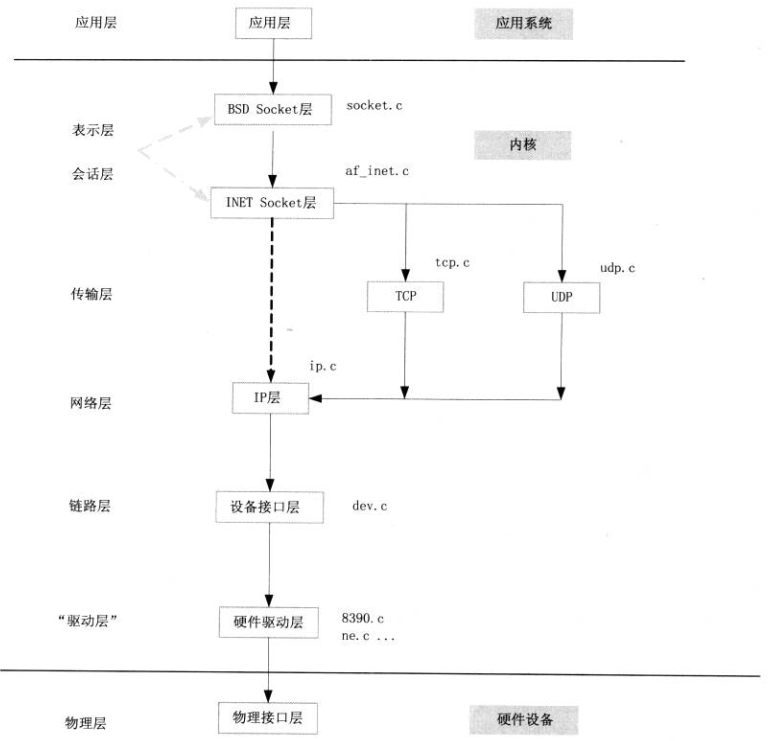

# 基于eBPF分析Linux网络子系统——重要结构体

网络协议栈的内核实现和理论上的分层有些不一样，在代码里面的分层如下图：




Linux内核网络源码中经常看到的几个与TCP相关的关键结构体如下图所示，


四个结构的关系具有面向对象的特征，通过层层继承，实现了类的复用。内核中网络相关的很多函数，参数往往都是struct sock，函数内部依照不同的业务逻辑，将struct sock转换为不同的业务结构。struct sock *sk是贯穿并连接于L2～L5各层之间的纽带，也是网络中最核心的结构体。

<!-- socket是传输层使用的数据结构，用于声明、定义套接字，网络层会调用sock结构体，其中sock会用到了通用sock_common结构体。而sk_buff则是内核中使用的套接字缓冲区结构体。 -->

## sock 结构体

``` C
// include/net/sock.h
struct sock {
    struct sock_common	__sk_common; // sock通用结构体
    
    socket_lock_t	sk_lock; // 套接字同步锁
	atomic_t		sk_drops; // IP/UDP包丢包统计
	int			    sk_rcvlowat; // SO_SO_RCVLOSO_RCVLOWAT标记位
    
    struct sk_buff_head	sk_error_queue;
	struct sk_buff		*sk_rx_skb_cache;
	struct sk_buff_head	sk_receive_queue; //接收数据包队列
    
    int sk_forward_alloc;
    int sk_rcvbuf; //接收缓存大小
    int sk_sndbuf; //发送缓存大小

	union {
		struct socket_wq __rcu	*sk_wq; // 等待队列
		struct socket_wq	*sk_wq_raw;
	};

    /* ===== cache line for TX ===== */
	int	sk_wmem_queued; //传输队列大小
	refcount_t sk_wmem_alloc; //已确认的传输字节数
	unsigned long sk_tsq_flags; //TCP Small Queue标记位
	union {
		struct sk_buff	*sk_send_head; //发送队列队首
		struct rb_root	tcp_rtx_queue;
	};
	struct sk_buff_head	sk_write_queue; //发送队列
    
	u32			sk_pacing_status; /* see enum sk_pacing */
	long			sk_sndtimeo; //SO_SNDTIMEO标记位
	struct timer_list	sk_timer; //套接字清空计时器
	__u32			sk_priority; //SO_PRIORITY标记位
   
    unsigned long		sk_pacing_rate; /* bytes per second */
	unsigned long		sk_max_pacing_rate; //最大发包速率
	struct page_frag	sk_frag; //缓存页帧
	
    int			sk_err, //上次错误
				sk_err_soft; 
	u32			sk_ack_backlog; //ack队列长度
	u32			sk_max_ack_backlog; //最大ack队列长度
	kuid_t			sk_uid; //user id
	struct pid		*sk_peer_pid; //套接字对应peer id
	const struct cred	*sk_peer_cred;
	long			sk_rcvtimeo; //接收超时
	ktime_t			sk_stamp; //时间戳
}; 
```

``` C
struct sock_common {
	/* skc_daddr and skc_rcv_saddr must be grouped on a 8 bytes aligned
	 * address on 64bit arches : cf INET_MATCH()
	 */
	union {
		__addrpair	skc_addrpair;
		struct {
			__be32	skc_daddr; //目标IPv4地址
			__be32	skc_rcv_saddr; //源IPv4地址
		};
	};
	union  {
		unsigned int	skc_hash; //根据协议查找表获取的哈希值
		__u16		skc_u16hashes[2]; //2个16位哈希值，UDP专用
	};
	/* skc_dport && skc_num must be grouped as well */
	union {
		__portpair	skc_portpair;
		struct {
			__be16	skc_dport; //目标端口
			__u16	skc_num; //源端口
		};
	};

	unsigned short		skc_family; //网络地址family
	volatile unsigned char	skc_state; //连接状态
	unsigned char		skc_ipv6only:1; //IPv6标记位
	int			skc_bound_dev_if; //bound device index if != 0

	unsigned short		skc_tx_queue_mapping; //连接的传输队列
	unsigned short		skc_rx_queue_mapping; //连接的接受队列

	union {
		int		skc_incoming_cpu;
		u32		skc_rcv_wnd; //接收窗口大小
		u32		skc_tw_rcv_nxt; /* struct tcp_timewait_sock  */
	};
};
```


## tcp_sock 结构体

```C
struct tcp_sock {
	struct inet_connection_sock	inet_conn;
	u16	tcp_header_len;	//tcp头部长度
	__be32	pred_flags; //首部预测标志
 	u32	rcv_nxt;	// 等待接收的下一个序列号
 	u32	snd_nxt;	// 等待发送的下一个序列号
 	u32	snd_una;	//最早一个未被确认的序号
 	u32	lsndtime;	//最近一次发送数据包时间
	u32	snd_wnd;	//发送方窗口大小
	u32	max_window;	//接收方的最大窗口
	u32	mss_cache;	//发送方当前有效的mss
	u32	window_clamp; //滑动窗口最大值
	u32	rcv_ssthresh;	//当前接收窗口的ssthresh阈值
	u16	advmss;		//本端能接收的MSS上限


/* RTT measurement */
	u32	srtt_us;	// smoothed round trip time << 3 in usecs 平滑rtt
	u32	mdev_us;	// medium deviation rtt平均偏差
	u32	mdev_max_us;	// maximal mdev for the last rtt period	rtt平均偏差最大值
	u32	rttvar_us;	/* smoothed mdev_max			*/
	u32	rtt_seq;	/* sequence number to update rttvar	*/
	struct  minmax rtt_min;

	u32	packets_out;	// Packets 发送出去没有被ack的数量
	u32	retrans_out;	// 重传还未得到确认的tcp段
	u32	max_packets_out;  /* max packets_out in last window */
	u32	max_packets_seq;  /* right edge of max_packets_out flight */

/* Slow start and congestion control (see also Nagle, and Karn & Partridge) */
 	u32	snd_ssthresh;	// 拥塞控制 慢启动门限
 	u32	snd_cwnd;	// 当前发送拥塞窗口的大小
	u32	snd_cwnd_cnt;	/* Linear increase counter		*/
	u32	snd_cwnd_clamp; // snd_cwnd的最大值
	u32	snd_cwnd_used; //记录已经从队列发送而没有被ack的段数
	u32	snd_cwnd_stamp; //记录最近一次检验cwnd 的时间
	u32	prior_cwnd;	// 进入Recovery状态时的拥塞窗口

 	u32	rcv_wnd;	// 当前接收窗口的大小
	u32	write_seq;	// 已加入发送队列中的最后一个字节序号
	u32	lost_out;	// Lost packets丢失的数据报

	int	undo_retrans;	// 在恢复拥塞控制之前可进行撤销的重传段数
};
```


## tcphdr 结构体

内核在函数`tcp_transmit_skb()`中建立tcp头部。eBPF开发中常用下方的结构体转换函数获得`tcphdr`：

```C
static struct tcphdr *skb_to_tcphdr(const struct sk_buff *skb){
    return (struct tcphdr *)(skb->head + skb->transport_header);
} 
```

                    TCP头结构 
     |----------------|----------------|-------------
     |     source     |     dest       |
     |----------------|----------------|
     |               seq               |
     |---------------------------------|
     |               ack_seq           | 20 Bytes
     |----|----|------|----------------|
     |doff|res1|      |     window     |
     |----|----|------|----------------|
     |     check      |     urg_ptr    |
     |----------------|----------------|-------------
     |             options             | 4 Bytes
     |---------------------------------|   

```C
struct tcphdr {
	__be16	source; // 16位源端口号
	__be16	dest; // 16位目的端口号
	__be32	seq; // 此次发送的数据在整个报文段中的seq
	__be32	ack_seq; // 下一个期望接收的字节
#if defined(__LITTLE_ENDIAN_BITFIELD)
	__u16	res1:4, // 保留位
		doff:4, // TCP头长度，指明在TCP头部包含多少个32位字
		/* 6个标志位 */
		fin:1, // 用于释放一个连接
		syn:1, // 同步序号，用于发起一个连接
		rst:1, // 用于重置一个已经混乱的连接
		psh:1, // 接收方在收到数据后应立即请求将数据递交给应用程序
		ack:1, // 设为1表示tcphdr->ack_seq是有效的
		urg:1, // 紧急指针有效

		ece:1,
		cwr:1;
#elif defined(__BIG_ENDIAN_BITFIELD)
	__u16	doff:4,
		res1:4,
		cwr:1,
		ece:1,
		urg:1,
		ack:1,
		psh:1,
		rst:1,
		syn:1,
		fin:1;
#else
#error	"Adjust your <asm/byteorder.h> defines"
#endif	
	__be16	window; // 滑动窗口的大小
	__sum16	check; // 检验和
	__be16	urg_ptr; // 用来指示紧急数据在当前数据段中的位置
}; 
```


## iphdr 结构体

eBPF开发中常用下方的结构体转换函数获得`iphdr`：

```C
static inline struct iphdr *skb_to_iphdr(const struct sk_buff *skb){
    return (struct iphdr *)(skb->head + skb->network_header);
} 
```
                    IP头结构 
     |----|----|------|--|-------------------|----------
     |ver |ihl | -tos | -|    tot_len        |
     |----|----|------|--|-------------------|
     |       id          |   frag_off       -|
     |---------|---------|-------------------|
     |   ttl   |protocol |    check          | 20 Bytes
     |---------|---------|-------------------|
     |                saddr                  |
     |---------------------------------------|
     |                daddr                  |
     |---------------------------------------|----------
     |                                       |
    -|                options                | 40 Bytes
     |                                       |
     |---------------------------------------|

```C
struct iphdr {
#if defined(__LITTLE_ENDIAN_BITFIELD)
	__u8	ihl:4,
		version:4;
#elif defined (__BIG_ENDIAN_BITFIELD)
	__u8	version:4, // 版本(4位)
  		ihl:4; // 首部长度(4位)
#else
#error	"Please fix <asm/byteorder.h>"
#endif
	__u8	tos; // 服务类型字段(8位)
	__be16	tot_len; // 总长度(16位)，整个IP数据报的长度
	__be16	id; // 标识字段(16位)
	__be16	frag_off; //frag_off(16位)的低13位为分段偏移(Fragment offset)
	__u8	ttl; // 生存时间(8位)，设置了数据报可以经过的最多路由器数
	__u8	protocol; // 协议字段(8位)
	__sum16	check; // 首部校验和字段(16位)
	__be32	saddr; // 32位源IP地址
	__be32	daddr; // 32位目的IP地址
};
```