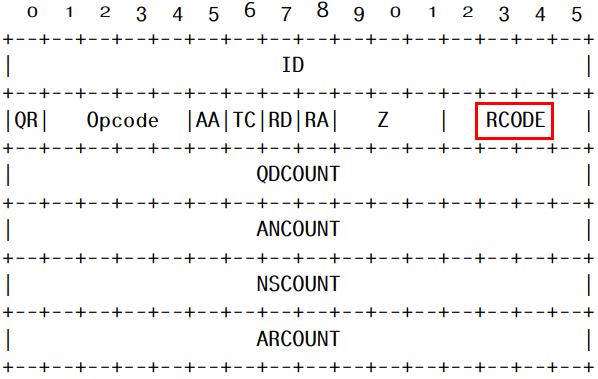

## 概述
### 什么是DNS NXDOMAIN Flood？

简单来说，DNS NXDOMAIN Flood 就是攻击者向DNS服务器发起大量域名无效或不存在的请求。DNS服务器收到请求时，由于在本地缓存中查找不到该域名，会继续向上游服务器查询，导致服务器耗尽资源处理这些恶意请求，减慢甚至停止对正常用户的响应。
> In a DNS NXDOMAIN flood DDoS attack, the attacker overwhelms the Domain Name System (DNS) server with a large volume of requests for records that are non-existent or invalid. These state exhaustion DDoS attacks will in most cases be handled by a DNS Proxy server, which will then use up most, if not all, of its resources querying the DNS Authoritative server with these records. This will, in most cases, result in both the DNS Proxy server and the DNS Authoritative server using up all their time handling those bad requests, slowing response for legitimate requests and eventually, stopping responses all together.

### 检测DNS NXDOMAIN Flood
DNS NXDOMAIN Flood的特点是出现大量域名不存在的请求，所以在一定时间内，如果DNS服务器发出的响应中频繁出现“域名不存在”的错误，则可以判断其正受到DNS NXDOMAIN Flood攻击。

#### DNS报文格式
DNS报文的格式如下：


其中“域名不存在”的错误信息在header中，DNS header的结构如下：



其中的RCODE（Response code）是检测的关键，它只在响应中设置，表示此次响应的状态，其值对应的含义如下：
- 0 请求成功
- 1 Format error - 格式错误，DNS服务器无法解析该查询
- 2 Server failure - DNS服务器由于内部错误无法解析该请求
- 3 Name Error - 只对来自权威DNS服务器的响应有意义，表示此域名不存在
- 4 Not Implemented - DNS服务器不支持所请求的查询类型
- 5 Refused - 此次请求由于策略原因拒绝

#### 错误计数
如果相应的RCODE为3，则表示“域名不存在”，所以可以根据DNS响应中RCODE的值实现错误计数。如果计数值达到阈值后，则判定当前受到了 DNS NXDOMAIN Flood 攻击。

#### 实现
1. 维护一个ebpf map<ip, count>，key为请求源ip，count为该ip发出“域名不存在”请求的次数。

2. 将socket filter程序attach到DNS服务器的网卡上，监测网卡发出的DNS响应，如果响应的RCODE为3，则说明此次请求的域名“不存在”，将该ip对应的count+1，如果count超过阈值，则判定当前受到该ip发起的 DNS NXDOMAIN Flood 攻击。

### 防御DNS NXDOMAIN Flood
使用XDP程序实现 DNS NXDOMAIN Flood 的防御。

对于每个请求，从ebpf map中获取到请求源ip对应的错误次数，如果错误次数超过阈值，则直接返回XDP_DROP，达到防御的效果。

## 实践

### 前提
内核版本>=5.4，更低版本未验证

已安装：
- Docker
- dig（DNS客户端，用于测试）

### 快速开始
1. 构建测试镜像
```sh
make builder
```
demo的所有依赖都包含在docker镜像中，不需要在宿主机中安装

2. 运行DNS服务器，并加载eBPF程序
```sh
make test
```
此时已在本机用docker运行了一个DNS服务器，可以使用dig命令测试DNS服务器是否正常运行
```sh
dig @localhost gateway.example.com +retry=0
```

3. 配置错误阈值
```sh
make fail-threshold value=3 # bpftool map update pinned /sys/fs/bpf/xdp/globals/configuration key 0 value 3 0 0 0
```
这意味着在60s内（默认），最多允许一个ip发出3次域名不存在的请求

4. 模拟DNS NXDOMAIN Flood
使用dig向DNS服务器连续发送3次请求，请求域名为xxx.com（不存在）
```sh
dig @localhost xxx.com +retry=0
dig @localhost xxx.com +retry=0
dig @localhost xxx.com +retry=0
```
可以发现这3次请求都能够正常的返回结果

 再发送1次请求
```sh
dig @localhost xxx.com +retry=0
```
会发现这次请求超时，原因是该请求被XDP程序正确地丢弃了

5. 清理测试环境
```sh
make clean-test
```

### 使用说明
运行相关的参数都使用bpf map的方式动态配置

|  key |  value |  说明  |
| :------------: | :------------|:------------|
| 0  |  连续域名错误阈值（每个源ip） | 超过阈值后，该ip发出的请求会被直接丢弃 |
|  1 |  请求次数阈值（每个源ip） | 超过阈值后，该ip发出的请求会被直接丢弃 |
|  2 |  ANY查询阈值（每个源ip） | 超过阈值后，该ip发出的请求会被直接丢弃 |
|  3 |  ANY查询阈值（全局） | 超过阈值后，服务器将拒绝接收ANY查询 |
| 4  |  域名错误阈值（全局） | 超过阈值后，将自动强制使用TCP |
| 200  | 刷新间隔时间（s）  | 统计数据的刷新间隔，默认为60s |
| 201  |  是否强制使用TCP | 0/未设置代表否，非0代表是 |


#### 例：将刷新间隔设置为100s
```sh
make interval value=100 # bpftool map update pinned /sys/fs/bpf/xdp/globals/configuration key 200 value 100 0 0 0
```
这意味着每过100s，会刷新所有ip的计数值

#### 例：将请求阈值设置为200
例：将请求阈值设置为200
```sh
make count-threshold value=200 # bpftool map update pinned /sys/fs/bpf/xdp/globals/configuration key 1 value 200 0 0 0
```
这意味着在刷新间隔时间内，每个ip最多允许发出200次请求

#### 编译eBPF程序
本demo有2个eBPF程序，XDP和socket filter，其中socket filter是由BCC在python运行时编译和加载的，所以只需编译XDP程序：
```sh
make xdp_dns
```
编译后的obj文件为`src/xdp_dns_kern.o`

## 参考
[1] https://www.netscout.com/what-is-ddos/dns-nxdomain-flood

[2] https://www.f5.com/services/resources/glossary/dns-flood-nxdomain-flood

[3] https://mislove.org/teaching/cs4700/spring11/handouts/project1-primer.pdf