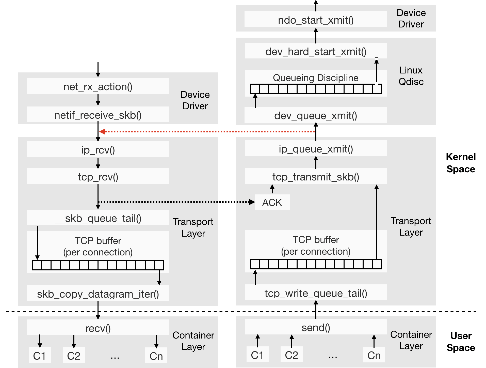

# 2022 GitLink编程夏令营 - 基于eBPF的Linux系统性能监测工具-网络子系统

## 1. 项目背景与内容
Linux系统性能监测对于监测系统运行状态、分析系统运行效率、定位运行故障以及优化系统设计等方面都具有重要的意义。本题目基于eBPF机制对Linux系统网络子系统的TCP层进行性能监测。完成的内容包括：
1. 分析Linux中网络子系统TCP层的基本原理，提出性能监测参数
2. 性能指标实现进程粒度监测
3. 利用eBPF工具提取性能监测参数并进行分析展示
4. 尝试将该监测工具部署在华为的鸿蒙系统上并进行测试（嵌入式环境）

## 2. 项目方案
### 2.1 性能监测参数
#### 2.1.1 Linux网络子系统
下图所示为接收和发送数据包时，主要内核函数调用和缓冲区过程：


与OSI模型的传输层功能类似，kernel中的传输层实现了TCP报文收发、TCP Socket连接管理、TCP协议状态机、TCP拥塞控制框架等功能。

#### 2.1.2 性能监测参数
eBPF通过特定的Hook点监听内核中的特定事件，进而执行用户定义的处理。这些Hook点包括：静态tracepoint、动态内核态探针、动态用户态探针、其他hook点。通过参考其他开源项目，Linux网络系统性能监测参数可以包括例如：

|  |  | 单位 | 代号 | 解释 | 可选参数 |
| ------ | ------ | ------ | ------ | ------ |------ |
|NetWorking Stack | tcp | connections | ip.tcpconnaborts | TCP Connection Aborts | BadData, UserClosed, NoMemory, Timeout, Linger, Failed
| | | pps | ip.tcp_accept_queue | TCP Accept Queue Issues | Overflows, Drops 
| | | pps | ip.tcpreorders | TCP Reordered Packets by Detection Method | Timestamp, SACK, FACK, Reno
| | | pps | ip.tcpofo | TCP Out-Of-Order Queue | InQueue, Dropped, Merged, Pruned
| | | pps | ip.tcpsyncookies | TCP SYN Cookies | Received, Sent, Failed
| | IP Multicast | KiB/s | ip.mcast | IP Multicast Bandwidth | 
| | | pps | ip.mcastpkts | IP Multicast Packets | 
| | ECN | pps | ip.ecnpkts | IP ECN Statistics | CEP, NoECTP, ECTP0 and ECTP1
IPv4 Networking | sockets | sockets | ipv4.sockstat_sockets | IPv4 Sockets Used | 
| | packets | pps | ipv4.packets | IPv4 Packets | Received, Sent, Forwarded, Delivered
| | errors | pps | ipv4.errors | IPv4 Errors | InDiscards, OutDiscards, InHdrErrors, OutNoRoutes, InAddrErrors
| | icmp | pps | ipv4.icmp | IPv4 ICMP Packets | Received, Sent
| | | pps | ipv4.icmp_errors | IPv4 ICMP Errors | InErrors, OutErrors, InCsumErrors
| | | pps | ipv4.icmpmsg | IPv4 ICMP Messages | 
| | tcp | connections | ipv4.tcpsock | IPv4 TCP Active Connections | 
| | | socket | ipv4.sockstat_tcp_sockets | IPv4 TCP Sockets | Alloc, Orphan, InUse, TimeWait
| | | pps | ipv4.tcppackets | IPv4 TCP Packets | Received, Sent
| | | connections | ipv4.tcpopens | IPv4 TCP Opens | Active, Passive
| | | pps | ipv4.tcperrors | IPv4 TCP Errors | InErrs, InCsumErrors, RetransSegs
| | | events | ipv4.tcphandshake | IPv4 TCP Handshake Issues | EstabResets, OutRsts, AttemptFails, SynRetrans
| | | KiB | ipv4.tcpbytes | IPv4 TCP Bytes | Received, Sent
| | | KiB | ipv4.sockstat_tcp_mem | IPv4 TCP Sockets Memory | 
| | | Others: RTT, FlightPacktes, RWND, CWND, MSS, RePackets, fastRetrans, AppWQueue, Duration
| | udp | sockets | ipv4.sockstat_udp_sockets | IPv4 UDP Sockets | 
| | | pps | ipv4.udppackets | IPv4 UDP Packets | 
| | | events | ipv4.udperrors | IPv4 UDP Errors | RcvbufErrors, InErrors, NoPorts, InCsumErrors, IgnoredMulti
| | | KiB | ipv4.sockstat_udp_mem | IPv4 UDP Sockets Memory | 
| | raw | sockets | ipv4.sockstat_raw_sockets | IPv4 RAW Sockets | 
IPv6 Networking | packets | pps | ipv6.packets | IPv6 Packets | Received, Sent, Forwarded, Delivered
| | | pps | ipv6.ect | IPv6 ECT Packets | CEP, NoECTP, ECTP0 and ECTP1
| | tcp6 | sockets | ipv6.sockstat6_tcp_sockets | IPv6 TCP Sockets | 
| | udp6 | sockets | ipv6.sockstat6_udp_sockets | IPv6 UDP Sockets | 
| | | pps | ipv6.udppackets | IPv6 UDP Packets | 
| | multicast6 | bits | ipv6.mcast | IPv6 Multicast Bandwidth | 
| | | packets | ipv6.mcastpkts | IPv6 Multicast Packets | 
| | icmp6 | messages | ipv6.icmp | IPv6 ICMP Messages | Received, Sent
| | | messages | ipv6.icmprouter | IPv6 Router Messages | 
| | | messages | ipv6.icmpneighbor | IPv6 Neighbor Messages | 
| | | reports | ipv6.icmpmldv2 | IPv6 ICMP MLDv2 Reports | 
| | | messages | ipv6.icmptypes | IPv6 ICMP Types | InType1, InType128, OutType0, OutType128...
| Application | sockets | sockets | apps.sockets | Apps Open Sockets | 
| ------ | ------ | ------ | ------ | ------ |------ |

上述众多参数均可以根据PID分别统计，实现进程粒度的性能指标监测。

### 2.2 eBPF提取参数
用eBPF提取参数，关键难点在于BPF程序的实现，即各个性能参数与tcp层中内核函数之间的关联。当前eBPF常用开发库有bcc、libbpf、ebpfgo、cilium eBPF等，考虑到后面该监测工具有部署在华为鸿蒙系统上（嵌入式环境）的需求，使用C语言及libbpf开发。
例如统计进程累计发送字节数，实现样例如下：
sendbytes.bpf.c
``` C
#include "vmlinux.h"
#include <bpf/bpf_tracing.h>
#include <bpf/bpf_helpers.h>
char LICENSE[] SEC("license") = "Dual BSD/GPL";
typedef struct  { u32 pid;} hash_key_t;
struct {
    __uint(type, BPF_MAP_TYPE_HASH);
    __uint(max_entries, 8192);
    __type(key, hash_key_t);
    __type(value, u64);
} tcp_send_bytes SEC(".maps");

SEC("kretprobe/tcp_sendmsg")
int BPF_KRETPROBE(do_tcp_sendmsg, long ret) {
      pid_t pid = bpf_get_current_pid_tgid() >> 32;
    if (ret > 0){
        hash_key_t key = {.pid = pid};
        u64 *size = bpf_map_lookup_elem(&tcp_send_bytes, &key);
        if(size){
            *size += ret;
        }else{
            u64 value = ret;
            bpf_map_update_elem(&tcp_send_bytes, &key, &value, BPF_ANY);
        }
    }
    return 0;
}
```

sendbytes.c
``` C
#include <stdio.h>
#include <unistd.h>
#include <signal.h>
#include <string.h>
#include <errno.h>
#include <sys/resource.h>
#include <bpf/libbpf.h>
#include <bpf/bpf.h>
#include "sendbytes.skel.h"

static int libbpf_print_fn(enum libbpf_print_level level, const char *format, va_list args){
    return vfprintf(stderr, format, args);
}

typedef struct  { __u32 pid; } hash_key_t;

static void print_map(int fd){
    hash_key_t key = {}, next_key;
    __u64 value;
    while (bpf_map_get_next_key(fd, &key, &next_key) == 0) {
        bpf_map_lookup_elem(fd, &next_key, &value);
        printf("%d: %llu\n", next_key.pid, value);
        key = next_key;
    }
}

int main(int argc, char **argv){
    struct sendbytes_bpf *skel;
    int err;
    libbpf_set_strict_mode(LIBBPF_STRICT_ALL);
    libbpf_set_print(libbpf_print_fn);
    /* Open load and verify BPF application */
    skel = sendbytes_bpf__open_and_load();
    /* Attach tracepoint handler */
    err = sendbytes_bpf__attach(skel);
    int fd = bpf_map__fd(skel->maps.tcp_send_bytes);
    for (;;) {
        print_map(fd);
        sleep(1);
    }
cleanup:
    sendbytes_bpf__destroy(skel);
    return -err;
}
```

上面的代码统计各进程发送字节数时，需使用bpf_get_current_pid_tgid()等helper functions 及 tcp_sendmsg等内核tcp层函数。可扩充hash_key_t以保留更多信息。若统计更多参数，则构建更多SEC(".maps")。

### 2.3 参数分析展示
参数的分析与展示可使用当前社区的eBPF_observability项目，预期使用C与libbpf库开发， 指标采集后可输出到标准输出或写入influxdb。

### 2.4 鸿蒙移植
该任务的目标是在鸿蒙上部署ebpf相关的开发环境并测试。
当前OpenHarmony支持mini/small/standard三种系统类型，其中只有standard标准系统可以使用LiteOS内核或Linux内核，而本项目eBPF为Linux内核组件，因此只能选用标准系统。官方文档中，给出的标准系统支持的开发板及其芯片型号为：

| 开发板型号 | 芯片型号 | 价格 |
| ------ | ------ | ------ |
| Hi3516DV300 | Hi3516DV300 | 800左右（King-DV300 1+8主板）|
| 润和DAYU200 | RK3568 | 2000+（HH-SCDAYU200 2+32主板）700+（RP-RK3568 2+8主板）|


### 2.5 XDP&eBPF
该任务的目标是利用XDP做一些相应的性能优化功能，使用ebpf对优化方法进行评价。XDP（eXpress Data Path）是Linux网络子系统中内核集成的数据包处理器，当网卡驱动程序收到数据包时，该处理器执行BPF程序。XDP在数据包进入协议栈之前进行处理，因此具有高性能的特点，可用于DDoS防御、防火墙、负载均衡等场景。
设计场景：比较使用iptables和xdp丢包对性能的影响，比较正常数据包的接收、处理情况，根据IPv4 Received Packets判断来自正常源ip（不在黑名单中的ip）的包是否还能收到、收到的速度，或比较两种方式丢包的速度。
