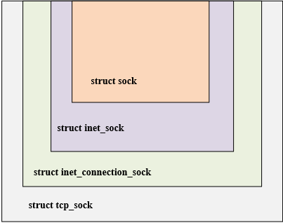

# 基于eBPF分析Linux网络子系统——重要结构体

网络协议栈的内核实现和理论上的分层有些不一样，在代码里面的分层如下图：


## struct sock结构体

Linux内核网络源码中经常看到的几个与TCP相关的关键结构体如下图所示，



四个结构的关系具有面向对象的特征，通过层层继承，实现了类的复用。内核中网络相关的很多函数，参数往往都是struct sock，函数内部依照不同的业务逻辑，将struct sock转换为不同的业务结构。struct sock *sk是贯穿并连接于L2～L5各层之间的纽带，也是网络中最核心的结构体。

<!-- socket是传输层使用的数据结构，用于声明、定义套接字，网络层会调用sock结构体，其中sock会用到了通用sock_common结构体。而sk_buff则是内核中使用的套接字缓冲区结构体。 -->


``` C
// include/net/sock.h
struct sock {
    struct sock_common	__sk_common; // sock通用结构体
    
    socket_lock_t	sk_lock; // 套接字同步锁
	atomic_t		sk_drops; // IP/UDP包丢包统计
	int			    sk_rcvlowat; // SO_SO_RCVLOSO_RCVLOWAT标记位
    
    struct sk_buff_head	sk_error_queue;
	struct sk_buff		*sk_rx_skb_cache;
	struct sk_buff_head	sk_receive_queue; //接收数据包队列
    
    int sk_forward_alloc;
    int sk_rcvbuf; //接收缓存大小
    int sk_sndbuf; //发送缓存大小

	union {
		struct socket_wq __rcu	*sk_wq; // 等待队列
		struct socket_wq	*sk_wq_raw;
	};

    /* ===== cache line for TX ===== */
	int	sk_wmem_queued; //传输队列大小
	refcount_t sk_wmem_alloc; //已确认的传输字节数
	unsigned long sk_tsq_flags; //TCP Small Queue标记位
	union {
		struct sk_buff	*sk_send_head; //发送队列队首
		struct rb_root	tcp_rtx_queue;
	};
	struct sk_buff_head	sk_write_queue; //发送队列
    
	u32			sk_pacing_status; /* see enum sk_pacing */
	long			sk_sndtimeo; //SO_SNDTIMEO标记位
	struct timer_list	sk_timer; //套接字清空计时器
	__u32			sk_priority; //SO_PRIORITY标记位
   
    unsigned long		sk_pacing_rate; /* bytes per second */
	unsigned long		sk_max_pacing_rate; //最大发包速率
	struct page_frag	sk_frag; //缓存页帧
	
    int			sk_err, //上次错误
				sk_err_soft; 
	u32			sk_ack_backlog; //ack队列长度
	u32			sk_max_ack_backlog; //最大ack队列长度
	kuid_t			sk_uid; //user id
	struct pid		*sk_peer_pid; //套接字对应peer id
	const struct cred	*sk_peer_cred;
	long			sk_rcvtimeo; //接收超时
	ktime_t			sk_stamp; //时间戳
}; 
```

``` C
struct sock_common {
	/* skc_daddr and skc_rcv_saddr must be grouped on a 8 bytes aligned
	 * address on 64bit arches : cf INET_MATCH()
	 */
	union {
		__addrpair	skc_addrpair;
		struct {
			__be32	skc_daddr; //目标IPv4地址
			__be32	skc_rcv_saddr; //源IPv4地址
		};
	};
	union  {
		unsigned int	skc_hash; //根据协议查找表获取的哈希值
		__u16		skc_u16hashes[2]; //2个16位哈希值，UDP专用
	};
	/* skc_dport && skc_num must be grouped as well */
	union {
		__portpair	skc_portpair;
		struct {
			__be16	skc_dport; //目标端口
			__u16	skc_num; //源端口
		};
	};

	unsigned short		skc_family; //网络地址family
	volatile unsigned char	skc_state; //连接状态
	unsigned char		skc_ipv6only:1; //IPv6标记位
	int			skc_bound_dev_if; //bound device index if != 0

	unsigned short		skc_tx_queue_mapping; //连接的传输队列
	unsigned short		skc_rx_queue_mapping; //连接的接受队列

	union {
		int		skc_incoming_cpu;
		u32		skc_rcv_wnd; //接收窗口大小
		u32		skc_tw_rcv_nxt; /* struct tcp_timewait_sock  */
	};
};
```

sock结构工作在INET socket层，所有BSD socket层的操作都通过struct sock及其域字段prot指针转化为prot锁指向的函数处理，所以sock结构是维系BSD socket层和INET socket层的纽带，其重要性是不言而喻的。
下面是对sock结构的简单注释

Linux的BSD和INET socket层分别对应于ISO的表示层和会话层，

而struct sock *sk 就是我们要说的另外一个非常重要的数据结构，相对于socket只应用于L6层，sock贯穿于L2～L5层并且做过各层之间贯穿的一个纽带。
