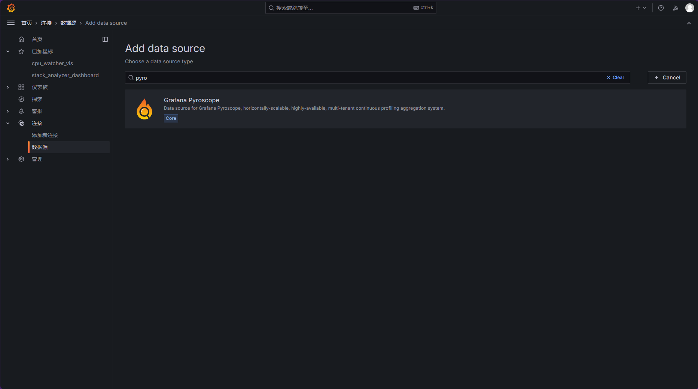
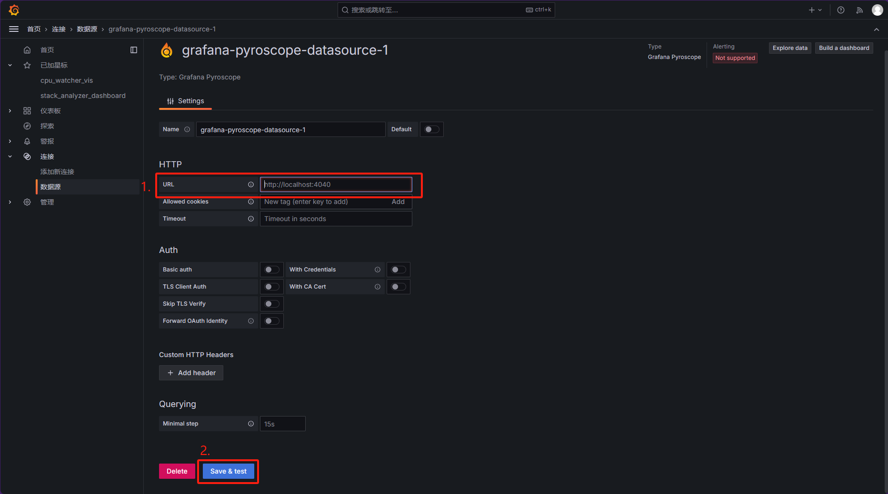
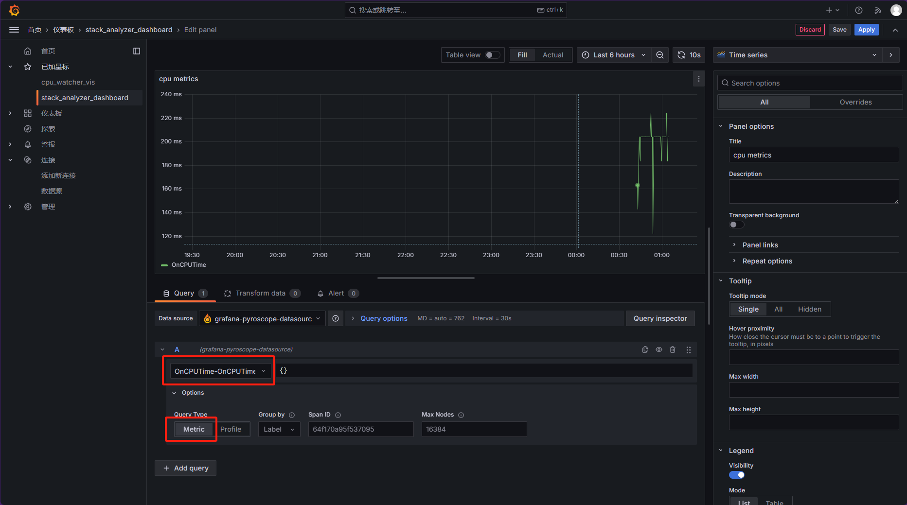
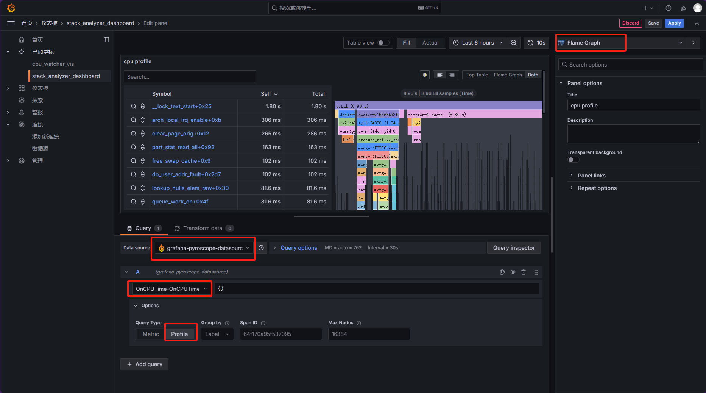
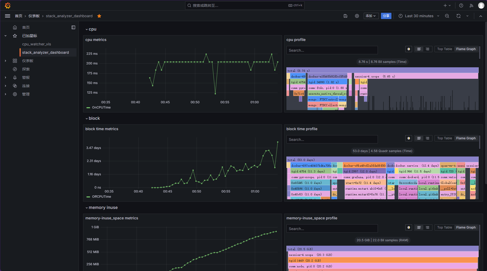

# 功能描述

对操作系统各方面的调用栈进行计数，从中分析程序性能瓶颈。

# 意义

## 应用场景及意义

Stack_Analyzer是一个基于eBPF的按照指定时间间隔（默认为5s）来统计涉及特定子系统的进程函数调用栈的性能指标的工具。使用它可以帮助您便捷地查看相关子系统性能损耗最高或者对系统吞吐量影响较大的瓶颈调用栈，直接而具体地设计并进行程序或系统性能上的优化，进而降低对cpu性能的损耗，提高系统吞吐量，以增强车机系统的实时性。

与传统工具相比，Stack_Analyzer可提供指标相关的更细粒度的信息，从以进程为单位监测性能指标深入到了以调用栈为单位，可直接找出性能问题的根源。目前支持的指标如下：

- cpu占用量
- 阻塞时间
- 内存占用大小
- 磁盘/网络IO请求数据量
- 预读取页剩余量

除此之外，本项目设计了一个便于复用的调用栈采集框架，方便监测指标的添加。之后可根据需求添加更多的监测指标。

## 性能参数及观测意义

采集的指标对主要子系统进行了覆盖，分为以下五个部分：

- on-cpu：进程/线程使用cpu的计数，从而分析出进程的用时最长的调用栈即性能瓶颈
- off-cpu：进程/线程阻塞的时长、阻塞原因（内存分配、主动睡眠、锁竞争等）及调用路径，从而解决出进程执行慢、甚至卡死的问题，提高系统吞吐量
- mem：进程/线程内存占用的大小及分配路径、更进一步可以检测出释放无效指针的问题，从而优化进程的内存分配方式
- io：进程/线程输入/输出的数据量，及相应路径，从而优化进程输入/输出方式
- readahead：进程/线程预读取页面使用量及对应调用栈，从而了解进程读数据的行为特征，进而使用madvise进行优化

为了易于分析调用栈数据，项目加入更多的可视化元素和交互方式，使得画像更加直观、易于理解，对优化程序或系统性能有重要意义。

# 使用要求

## 内核配置要求

- 版本：>= Linux 5.10
- 开启内核选项：
    - kprobes相关选项
        - CONFIG_KPROBES=y
        - CONFIG_KPROBE_EVENT=y
    - uprobe相关选项
        - CONFIG_TRACING_SUPPORT=y
        - CONFIG_FTRACE=y
        - CONFIG_HAVE_REGS_AND_STACK_ACCESS_API=y
        - CONFIG_HAVE_KPROBES_ON_FTRACE=y
        - CONFIG_DYNAMIC_FTRACE_WITH_REGS=y
        - CONFIG_KPROBES_ON_FTRACE=y
    - eBPF相关选项
        - CONFIG_BPF=y
        - CONFIG_BPF_SYSCALL=y
        - CONFIG_BPF_JIT=y
        - CONFIG_HAVE_EBPF_JIT=y
        - CONFIG_BPF_EVENTS=y
        - CONFIG_DEBUG_INFO_BTF=y
        - CONFIG_FTRACE_SYSCALLS=y

## 数据准确性要求

添加 `-g -fno-omit-frame-pointer` 选项编译被测程序以保留程序的fp信息，以便监测程序可以通过fp信息回溯被测程序的调用栈。

## 编译要求

初始化并更新libbpf和bpftool的代码仓库：

```shell
git submodule update --init --recursive ../lib/*
```
需要安装一下依赖：

Ubuntu下

```shell
sudo apt update
sudo apt install -y clang libelf1 libelf-dev zlib1g-dev bpftool
```

CentOS下

```shell
sudo dnf install clang elfutils-libelf elfutils-libelf-devel zlib-devel bpftool
```

clang-12以上

# 使用方法

## 工具编译

```shell
$ make -j$(nproc)
```

## 命令使用方法

```shell
$ ./stack_analyzer -h
```

## 输出格式

```shell
time:20240516_17_37_41
counts:
pid     usid    ksid    OnCPUTime/20408163nanoseconds
720     9226    49641   1
3149    35172   -14     1
91036   70751   78610   1
91045   33012   -14     1
traces:
sid     trace
9226    GlobalConfig_DownloadConfig+0xffffa9f3f4439631;__socket+0xb;
33012   0x40;0x7f2e8c34183c;0x7f2e8c344845;
35172   runtime.goexit.abi0+0x1;github.com/prometheus/node_exporter/collector.NodeCollector.Collect.gowrap1+0x30;github.com/prometheus/node_exporter/collector.NodeCollector.Collect.func1+0x37;github.com/prometheus/node_exporter/collector.execute+0x90;github.com/prometheus/node_exporter/collector.(*netClassCollector).Update+0x2a;github.com/prometheus/node_exporter/collector.(*netClassCollector).netClassSysfsUpdate+0x32;github.com/prometheus/node_exporter/collector.(*netClassCollector).getNetClassInfo+0xf9;github.com/prometheus/procfs/sysfs.FS.NetClassByIface+0x105;github.com/prometheus/procfs/sysfs.parseNetClassIface+0xc5;github.com/prometheus/procfs/sysfs.ParseNetClassAttribute+0x94;github.com/prometheus/procfs/internal/util.SysReadFile+0x4d;os.OpenFile+0x3e;os.openFileNolog+0x92;os.open+0x2b;syscall.openat+0x90;syscall.Syscall6+0x6a;runtime/internal/syscall.Syscall6+0xe;
49641   entry_SYSCALL_64_after_hwframe+0x67;do_syscall_64+0x56;x64_sys_call+0x1ec2;__x64_sys_socket+0x17;__sys_socket+0x5d;__sock_create+0x133;unix_create+0x43;unix_create1+0x67;sk_alloc+0x31;sk_prot_alloc+0x8b;
70751   0x7f19ac2e37e2;
78610   entry_SYSCALL_64_after_hwframe+0x67;do_syscall_64+0x56;x64_sys_call+0x1dba;__x64_sys_read+0x19;ksys_read+0x67;vfs_read+0x9c;seq_read+0xf2;seq_read_iter+0x121;proc_single_show+0x4f;proc_pid_status+0x40c;cpuset_task_status_allowed+0x3a;seq_printf+0x91;vsnprintf+0x1e3;pointer+0x2a5;bitmap_string.constprop.0+0xe7;
info:
pid     NSpid   comm    tgid    cgroup
720     0       vmtoolsd        720     open-vm-tools.service
3149    0       node_exporter   3046    docker-bb4adf6694d50bea52f9e57038ab2870cd070fac4c8fe241f3d34dd1791a9a32.scope
91036   0       ps      91036   session-4.scope
91045   0       sed     91045   session-4.scope
OK
```

## 发送到Pyroscope

请阅读[`exporter/README.md`](exporter/README.md)。

## 将Pyroscope集成到Grafana

1. 选择pyroscope数据源
    
2. 设置pyroscope服务器地址并测试保存
    
3. 创建仪表盘并添加可视化面板，将数据源设为刚刚创建的pyroscope数据源，调整参数，其中，metrics请求可以获取调用栈对应指标总体走势，profile请求可以获取火焰图绘制数据，展示时间区间内的火焰图。
    
    
4. 总体效果展示
    

## grafana dashboard 导出及导入

本仓库提供了上节效果展示所使用的dashboard，即`./grafana_stack_analyzer_dashboard.json`
其导出方法为：在仪表盘界面点击[分享]按钮，导出，导出为文件，即可。
导入则需要在创建仪表盘菜单选择[导入仪表盘]，通过仪表板 JSON 模型导入，选择需要的仪表盘文件，即可。

# 目录描述

- include：各种定义。
- include/bpf：eBPF程序的骨架头文件和其包装类的定义。
- src：各种实现。
- src/bpf：eBPF程序的代码和其包装类的实现。
- exporter：使用Golang开发的数据推送程序，将采集到的调用栈数据推送到Pyroscope服务器，获取更强的数据存储和可视化性能。
- main.cpp：负责参数解析、配置、调用栈数据收集器管理和子进程管理。
- libbpf-bootstrap: 项目依赖的libbpf及相关工具源代码，方便移植。
- new_bpf.sh：初始化新的采集能力的脚本，详情请参考`框架使用说明.md`。

# 问题描述

- [x] 符号解析库没有访问容器内可执行文件的能力
- [ ] memleak挂载在uprobe上时无数据
- [ ] memleak在定频时依旧会采集大量数据
- [ ] golang语言调用栈解析效果差
- [ ] readahead采集结果中存在指标值为0的项