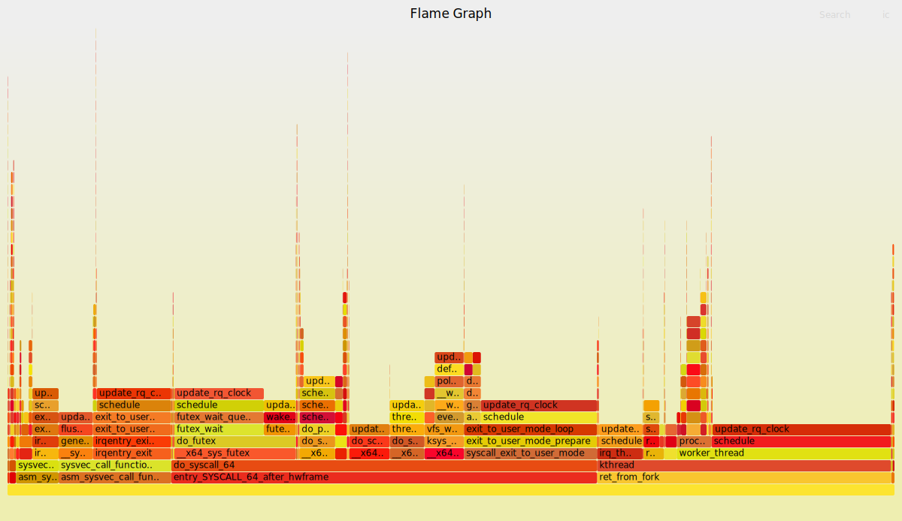

# libbpf/stack_analyzer (incomplete)

用于对调用栈进行计数，libbpf版本

## 计划安排

- [x] 实时输出功能
- [x] on-cpu 栈采集功能
- [x] off-cpu 栈采集功能
- [x] malloc-free 栈采集功能
- [x] 保存为json文件功能
- [ ] 火焰图绘制功能
- [x] io-write栈采集功能
- [ ] 收发包栈采集功能
- [ ] 兼容perf数据
- [ ] 栈数据智能分析功能

## 实时输出测试结果

```shell
Stack_Analyser/libbpf$ sudo ./stack_analyzer -p 12532
---------7---------
12532  ( 38758,118464) 1     
12532  ( 77616, 97063) 1     
12532  (   -14,116464) 1     
12532  (   -14, 18600) 1     
12532  ( 31291, 87833) 1     
---------5---------
---------7---------
12532  (    -1, 91718) 3482309
12532  (    -1, 38038) 3533633
12532  (    -1, 89746) 377229951
12532  (    -1, 83783) 2977594
```

代码示为on-cpu、off-cpu和内存栈数据分别采集stress-ng-malloc 5s的输出，由分割线分开，分割线中间的数字为map fd，分割线间，第一列为pid，第二列括号中用户栈id和内核栈id，第三列为栈的数量，计数单位略有不同，on-cpu计数单位为次，off-cpu计数单位为0.1ms，内存计数单位为1kB

## json文件结果

```json
{
    "12532": {
        "12532": {
            "stacks": {
                "91718,-1": {
                    "count": 3482309,
                    "trace": [
                        "MISSING KERNEL STACK",
                        "stress_malloc_loop"
                    ]
                }
            },
            "name": "stress-ng-mallo"
        }
    }
}
```

以上代码为保存的json文件片段展开后的内容，是一个跟踪stress-ng-malloc采集到的内存栈信息，其内核栈标注为"MISSING KERNEL STACK"，表示内核栈没有被采集。

# bcc/stack_count.py

用于对调用栈进行计数，拥有对调用栈出现频次异常检测的能力。

启动后每5s输出一次从开始起记录到的进程栈及数量等信息。

在终止时将所有信息以json格式保存在`./stack_count.log`文件中。

## 计划安排

- [x] 实时输出功能
- [x] on-cpu 栈采集功能
- [x] off-cpu 栈采集功能
- [x] malloc-free 栈采集功能
- [x] 保存为json文件功能
- [x] 火焰图绘制功能
- [x] 栈数据智能分析功能
- [ ] sync栈采集功能
- [ ] 解决保存数据时卡顿的问题

## 输出片段

屏幕及文件输出：
```json
  "273755":{
    "name":"node",
    "pids":{
      "273755":{
        "40":{
          "trace":[
            "0x7fab3b4dd97b:__clock_gettime_2",
            "0x1548615:uv_run",
            "0xa3fa35:_ZN4node13SpinEventLoopEPNS_11EnvironmentE",
            "0xb42c56:_ZN4node16NodeMainInstance3RunEv",
            "0xac89bc:_ZN4node5StartEiPPc",
            "0x7fab3b423510:__libc_start_call_main"
          ],
          "count":1,
          "label":null
        }
      }
    }
  },
```

## 相关选项

- `u`: 跟踪用户空间调用栈而不是内核空间调用栈
- `pid "pids"`: 设定需要跟踪的进程pid，可以是多个。不设定此选项会跟踪除idel外的所有进程

## 附加依赖

python库：

- psutil
- pyod

# bcc/load_monitor.py

用于在计算机负载超过阈值时记录内核栈数量信息，每5s输出一次总记录。

终止时将记录以 栈-数量 的格式保存在 `./stack.bpf` 中，并输出火焰图文件 `./stack.svg`

## 计划列表

- [ ] 优化触发逻辑和性能

## 输出片段

屏幕输出：
```log
____________________________________________________________
0xffffffff928fced1 update_rq_clock
0xffffffff92904c34 do_task_dead
0xffffffff928c40a1 do_exit
0xffffffff928c421b do_group_exit
0xffffffff928d5280 get_signal
0xffffffff9283d6ce arch_do_signal_or_restart
0xffffffff9296bcc4 exit_to_user_mode_loop
0xffffffff9296be00 exit_to_user_mode_prepare
0xffffffff9359db97 syscall_exit_to_user_mode
0xffffffff93599809 do_syscall_64
0xffffffff93600099 entry_SYSCALL_64_after_hwframe
stackid    count  pid    comm            
5          37    
                  82731  5               
                  82783  IPC I/O Parent  
                  82794  TaskCon~ller #1 
                  82804  pool-spawner    
                  82830  Breakpad Server 
                  82858  Socket Thread   
                  82859  JS Watchdog     
                  82860  Backgro~Pool #1 
                  82861  Timer           
                  82862  RemVidChild     
                  82863  ImageIO         
                  82864  Worker Launcher 
                  82865  TaskCon~ller #0 
                  82867  ImageBridgeChld 
                  82869  ProfilerChild   
                  82870  AudioIP~ack RPC 
                  82871  AudioIP~ver RPC 
                  82877  dconf worker    
                  82885  snap            
                  83010  StreamTrans #1  
                  83011  StreamTrans #2  
                  83018  StreamTrans #3  
                  83020  StreamTrans #5  
                  83029  JS Watchdog     
                  83030  Backgro~Pool #1 
                  83031  Timer           
                  83033  ImageIO         
                  83034  Worker Launcher 
                  83036  TaskCon~ller #1 
                  83037  ImageBridgeChld 
                  83048  IPC I/O Child   
                  83049  Socket Thread   
                  83051  Backgro~Pool #1 
                  83052  Timer           
                  83053  RemVidChild     
                  83055  TaskCon~ller #0 
                  83059  ProfilerChild   
____________________________________________________________
```

文件输出：
```log
@[
update_rq_clock
sched_autogroup_exit_task
do_exit
do_group_exit
get_signal
arch_do_signal_or_restart
exit_to_user_mode_loop
exit_to_user_mode_prepare
syscall_exit_to_user_mode
do_syscall_64
entry_SYSCALL_64_after_hwframe
]: 37
```
<center></center>

## 附加依赖

程序：
- `/usr/share/bcc/FlameGraph/stackcollapse-bpftrace.pl`
- `/usr/share/bcc/FlameGraph/flamegraph.pl`