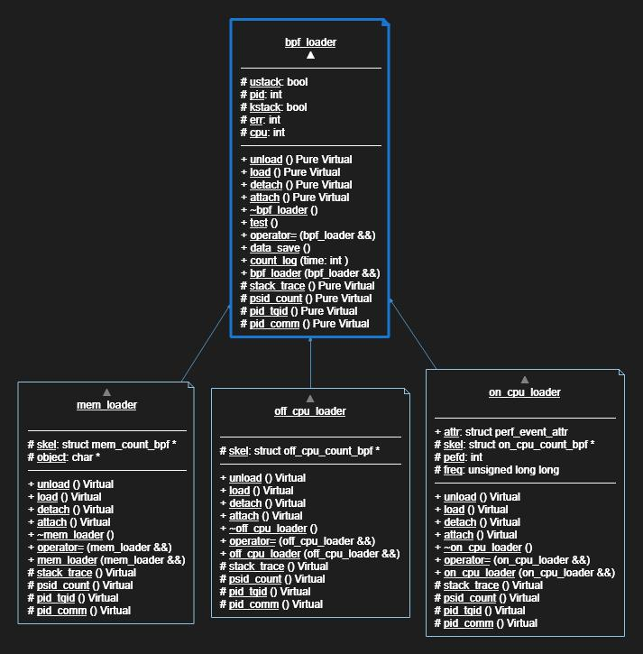

2023.6.25
- 首先根据进程指标（在线时间）找出异常进程，找到异常进程后拉起栈计数程序跟踪分析异常进程
- 直接使用栈计数程序跟踪分析所有进程的栈，找出数量异常的栈及相关的进程
- 应用在调试上一般直接跟踪相关进程
- 如果应用在系统异常检测上，应该每个进程分别检测
- 利用时序异常检测检测栈变化的异常，也分以上途径

2023.7.8
- 不同进程优先级不同，分得的时间片大小不同，定频采样所有进程的调用栈混在一起没有可比性
- 根据进程指标找出异常进程实际上也是混在一起比较，没有考虑优先级、控制组对资源的特定分配
- 应考虑每个进程分别检测
- 赵晨雨师兄建议将内核栈和用户栈关联

2023.7.9
- 在跟踪所有进程时每个进程只能获取一个调用栈（暂时无法解释），所以跟踪所有进程时分别分析每个进程的主要调用栈的这种方式不可行
- 用来统计所有进程中特殊频次资源消耗的进程栈（目前实现）
- 在运行时设定要跟踪的特定的进程或者运行的命令（计划）
- 分析特定进程的调用栈时序变化

2023.7.10
- 想要跟踪的子进程或者线程可能在跟踪主进程时还未来得及创建，因此无法获取它们的pid
- attach_perf_event可以跟踪设定的pid的子进程
- 优于火焰图的地方，可以看出栈所属的进程
- on-cpu使用计数器而不是时间戳可以提高性能，减少记录次数

2023.7.11

- perf可以在无关栈顶函数的情况下记录栈
- 但off-cpu没办法计数，必须使用时间戳
- 如果要做hot-cold图的话on-cpu也必须以时间戳为单位
- 使用`sudo perf record -a -g -F 997 sleep 60`、`perf script > perf_stack.log`命令记录的stack信息如下：
    ```log
    swapper     0 [003] 604164.215324:    1003009 cpu-clock:pppH: 
        ffffffff81f4108b native_safe_halt+0xb ([kernel.kallsyms])
        ffffffff81f4187b acpi_idle_enter+0xbb ([kernel.kallsyms])
        ffffffff81bb5697 cpuidle_enter_state+0x97 ([kernel.kallsyms])
        ffffffff81bb5cae cpuidle_enter+0x2e ([kernel.kallsyms])
        ffffffff81130493 call_cpuidle+0x23 ([kernel.kallsyms])
        ffffffff8113485d cpuidle_idle_call+0x11d ([kernel.kallsyms])
        ffffffff81134952 do_idle+0x82 ([kernel.kallsyms])
        ffffffff81134bbd cpu_startup_entry+0x1d ([kernel.kallsyms])
        ffffffff810880f2 start_secondary+0x122 ([kernel.kallsyms])
        ffffffff8100015a secondary_startup_64_no_verify+0xe5 ([kernel.kallsyms])
    ```
    头部的条目分别为：comm、tid、time、ip、sym，时间的格式是`s.ns`

2023.7.25

- 项目改用libbpf框架，缩小项目重量，增加可移植性
- 添加内存数据提取功能
- 内存数据提取在用户态跟踪malloc和free两个函数
- 跟踪malloc入口以记录申请的内存大小
- 跟踪malloc返回值以记录本次申请的内存大小对应的地址，若有效则添加进计数中
- 跟踪free入口以记录释放的地址，根据释放的地址获取对应大小，从计数中减去

2023.7.31

- 项目计划将栈详细信息以json格式存储，使用了Tencent的c++ rapidjson库
- 项目中的栈地址解析为符号使用了Ali的diagnose-tools的c++自实现库
- 由于要引入两个c++的库，项目决定利用c++面向对象特性优化代码框架，增加栈数据处理的通用性
    <br>框架中使用了一个抽象类来规范bpf获取栈信息的通用接口，其子类针对各种不同的数据有不同的bpf跟踪点和获取方式的实现的包装
- 测试效果
    ```shell
    Stack_Analyser/libbpf$ sudo ./stack_analyzer -p 12532
    ---------7---------
    12532  ( 38758,118464) 1     
    12532  ( 77616, 97063) 1     
    12532  (   -14,116464) 1     
    12532  (   -14, 18600) 1     
    12532  ( 31291, 87833) 1     
    ---------5---------
    ---------7---------
    12532  (    -1, 91718) 3482309
    12532  (    -1, 38038) 3533633
    12532  (    -1, 89746) 377229951
    12532  (    -1, 83783) 2977594
    ```
    代码示为on-cpu、off-cpu和内存栈数据分别采集stress-ng-malloc 5s的输出，由分割线分开，分割线中间的数字为map fd，分割线间，第一列为pid，第二列括号中用户栈id和内核栈id，第三列为栈的数量，计数单位略有不同，on-cpu计数单位为次，off-cpu计数单位为0.1ms，内存计数单位为1kB

2023.8.3

- libbpf项目实现在GitHub测试时报出很多错误，但在本地没有报错。
- 经过在本地与GitHub测试镜像相同版本Ubuntu22.04的docker中进行预处理、头文件查找，发现是uprobe的跟踪方式变了
- 在22.04中，uprobe跟踪函数`bpf_program__attach_uprobe_opts`的参数`struct bpf_uprobe_opts`的定义为：
    ```c
    struct bpf_uprobe_opts {
        size_t sz;
        size_t ref_ctr_offset;
        __u64 bpf_cookie;
        bool retprobe;
        size_t :0;
    };
    ```
- 而本地新版系统的`struct bpf_uprobe_opts`中多了一个字段`const char *func_name`，方便设置uprobe回调函数的跟踪点。
- 解决方法：加入版本控制宏，将不同版本内核的接口封装为同一个宏接口
    ```c
    #include <linux/version.h>
    #if LINUX_VERSION_CODE < KERNEL_VERSION(5, 19, 0)
    #define __ATTACH_UPROBE(skel, sym_name, prog_name, is_retprobe)  \
        do                                                           \
        {                                                            \
            DECLARE_LIBBPF_OPTS(bpf_uprobe_opts, uprobe_opts,        \
                                .retprobe = is_retprobe);            \
            /*...*/                                                  \
        } while (false)
    #else
    #define __ATTACH_UPROBE(skel, sym_name, prog_name, is_retprobe)  \
        do                                                           \
        {                                                            \
            LIBBPF_OPTS(bpf_uprobe_opts, uprobe_opts,                \
                        .retprobe = is_retprobe,                     \
                        .func_name = #sym_name);                     \
            /*...*/                                                  \
        } while (false)
    #endif
    ```

2023.8.4

- 添加了ctrl-c信号处理功能
- 添加了mmap和munmap采集功能
- 添加io write采集功能，跟踪点为`vfs_write`，为其他文件系统写入文件操作的必经之路
- 需要考虑记录io次数还是io数据量