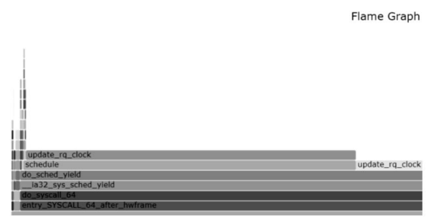
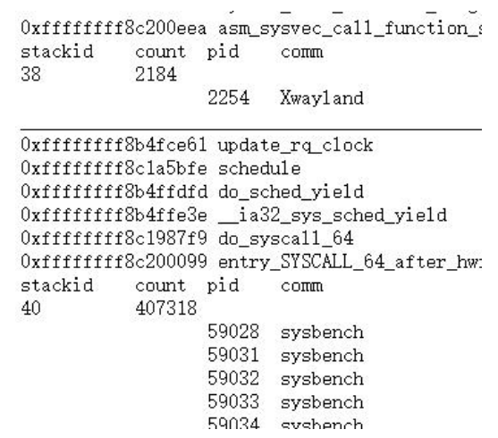
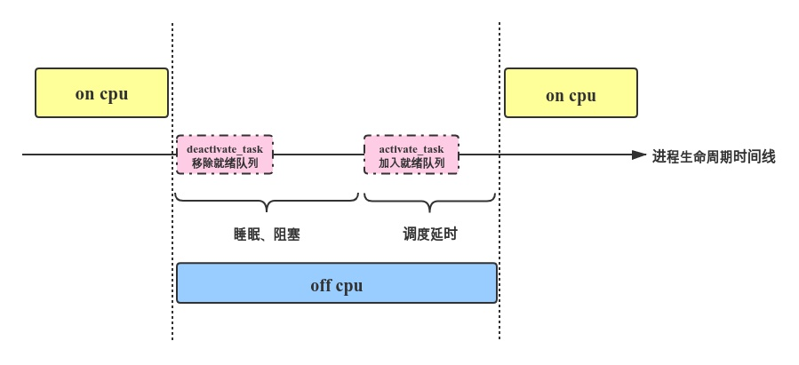
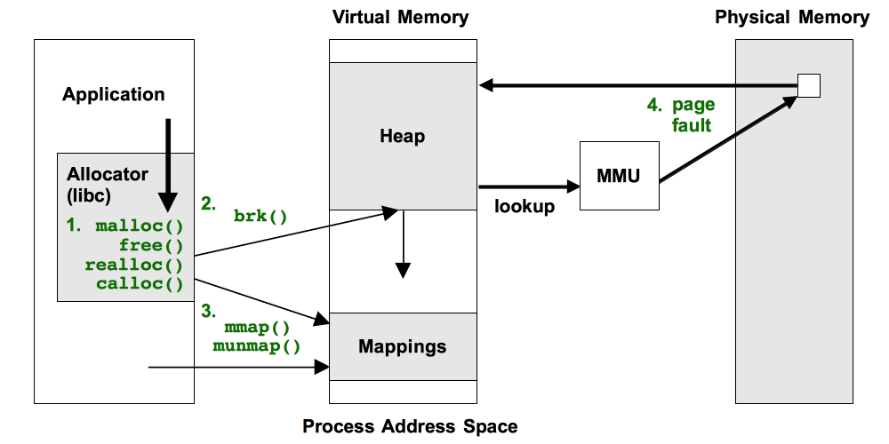

## 1 项目研究的内容

1. 找到修改进程有关on-cpu、off-cpu和memory状态的关键eBPF跟踪点，将工具对机器**性能的损耗降到最小**。
2. 调用栈（Call Stack）是程序运行时跟踪函数调用的一种机制。通过分析调用栈，我们可以了解到程序的执行路径、函数之间的关系以及函数调用的次数等信息，对于程序优化、故障排查等都具有重要意义。 调用栈信息往往非常庞大，尤其是在复杂的应用场景下，分析和处理的效率非常低下，甚至无法完成。因此，针对调用栈的高效统计和分析工具显得尤为重要。  
    因此需要找到一个**合适的记录调用栈的方式**。使栈数据既能概括出栈的变化又不至于占用太多的空间。
3. 针对调用栈的异常检测可以有多种方式，针对一段时间内调用栈的异常检测比较容易，多是以命中率最大的为异常；也可以对调用栈时间序列做一个**持续的异常检测**，调用栈序列是一个多维的数据，且会随着业务的复杂程度变得没有规律可循。需要找到一种适用于栈时序异常检测的算法。
4. 异常检测算法检测出的异常有些难以区分，可以搭配聚类算法对每种异常进行一个**预分类**。为给出解决方案提供便利。

## 2 现状分析及目前完成的工作

### 2.1 获取调用栈

#### 2.1.1 eBPF相关

eBPF 是一种基于事件的非常灵活和强大的内核技术，可以用于网络监控、安全过滤、性能分析和虚拟化等多种应用场景。

BCC是用于创建基于eBPF的高效内核跟踪和操作程序的工具包，其中包括一些有用的命令行工具和示例。 BCC简化了用C进行内核检测的eBPF程序的编写，包括LLVM的包装器以及Python和Lua的前端。它还提供了用于直接集成到应用程序中的高级库。

BCC提供的 [stackcount](https://github.com/iovisor/bcc/blob/master/tools/stackcount.py) 工具，其可以记录特定进程特定跟踪点的调用栈的次数，其获取特定进程malloc次数栈的命令为`/usr/share/BCC/tools/stackcount -p 19183 -U c:malloc > out.stacks`​，brk次数栈的命令为`/usr/share/BCC/tools/stackcount SyS_brk > out.stacks`​，mmap次数栈的命令为`/usr/share/BCC/tools/stackcount SyS_mmap > out.stacks`​，缺页异常次数栈的命令为`/usr/share/BCC/tools/stackcount 't:exceptions:page_fault_*' > out.stacks`​。由于该工具的通用性，导致**无法伴随内存的申请和释放对占用内存的统计数量进行加减。**

BCC的另一个工具为：[mallocstacks](https://github.com/iovisor/bcc/blob/master/examples/tracing/mallocstacks.py)，它跟stackcount很像，但是不再做堆栈计数，而是专门用于记录内存分配，以参数 `size_t`​为单位进行统计，统计调用栈分配内存的大小。其统计malloc分配大小调用栈的命令为`./mallocstacks.py -f 30 > out.stacks`​。不足之处就是**没有考虑到内存的释放**。

#### 2.1.2 perf相关

perf 是Linux的一款性能分析工具，能够进行函数级和指令级的热点查找，可以用来分析程序中热点函数的CPU占用率，从而定位性能瓶颈。它是一个基于内核的子系统，它提供一个性能分析框架，比如硬件（CPU、PMU（Performance Monitoring Unit））功能和软件（软件计数器、tracepoint）功能。

通过perf，应用程序可以利用PMU、tracepoint和内核中的计数器来进行性能统计。

Perf 可以对程序进行函数级别的采样，从而了解程序的性能瓶颈在哪里。其基本原理是：每隔一个固定时间，就是CPU上产生一个中断，看当前是哪个进程、哪个函数，然后给对应的进程和函数加一个统计值，这样就知道CPU有多少时间在某个进程或某个函数上了。

perf只能跟踪一些内核函数，其统计brk调用频率的实例代码：`perf stat -e syscalls:sys_enter_brk -I 1000 -a`​

统计brk调用栈和对应次数的命令：`perf record -e syscalls:sys_enter_brk -a -g -- sleep 120`​；mmap调用栈：`perf record -e syscalls:sys_enter_mmap -a -g -- sleep 60`​；page_fault调用栈`perf record -e page-fault -a -g -- sleep 30`​。依然只能统计次数。而且因为是**按频率采样，会损失更多的性能。**

### 2.2 分析方式

#### 2.2.1 火焰图相关

火焰图（Flame Graph）是由 Linux 性能优化大师 Brendan Gregg 发明的，和所有其他的 profiling 方法不同的是，火焰图以一个全局的视野来看待时间分布，它从底部往顶部，列出所有可能导致性能瓶颈的调用栈。

常见的火焰图类型有 On-CPU，Off-CPU，还有 Memory，Hot/Cold，Differential 等等。他们分别适合处理什么样的问题呢？

|火焰图类型|横轴含义|纵轴含义|针对问题|采样方式|
| :---------------| :----------------------------------------------| :--------- | :------------------------------------------------------------------------------ | :--------------------------------------------------------------- |
|cpu火焰图|cpu占用时间|调用栈|找出 cpu 占用高的问题函数；分析代码热路径|固定频率采样cpu 调用栈|
|off-cpu火焰图|阻塞时间|调用栈|i/o、网络等阻塞场景导致的性能下降，锁竞争、死锁导致的性能下降问题|固定频率采样阻塞事件调用栈|
|内存火焰图|内存申请/释放函数调用次数|调用栈|内存泄露问题；内存占用高的对象/申请内存多的函数；虚拟内存或物理内存泄露问题|有四种方式：跟踪malloc/free；跟踪brk；跟踪mmap；跟踪页错误|
|hot/cold火焰图|on-cpu火焰图和off-cpu火焰图结合在一起展示|调用栈|需要结合 cpu 占用、阻塞的场景；off-CPU 火焰图无法直观判断问题的场景|on-CPU火焰图和off-CPU火焰图结合|

四种火焰图的针对性很强，没有一种统一的处理方式，**只有使用发生异常时的栈数据绘制才能够明显地看出异常所在**，**对于难以复现的问题具有有较大的局限性。**

#### 2.2.2 异常检测相关

异常检测（Anomaly Detection 或 Outlier Detection）指的是通过数据挖掘手段识别数据中的“异常点”，很多行业都在使用异常检测技术来帮助企业降低风险，并为业务提供指导建议。

目前比较公认的分类方式是分为三种：单点异常（Global Outliers）：也可以称为全局异常。上下文异常（Contextual Outliers）：这类异常多为时间序列数据中的异常。集体异常（Collective Outliers）：这类异常是由多个对象组合构成的，即单独看某个个体可能并不存在异常，但这些个体同时出现，则构成了一种异常。

在异常检测中经常遇到的困难：**无法直接使用一些成熟的有监督学习方法；噪音和异常点混杂在一起**；**很难区分不同类型的异常。**要解决这种情况，将无监督学习方法和专家经验相结合，以便于我们及时调整模型，反复进行迭代，最终得到一个越来越准确的模型。

准确而快速的发现异常，可以帮助规避生产生活中很多风险，快速抓住机遇，产生巨大的价值。然而，准确地探测异常是非常困难的。首先，所谓的**异常现象是不断变化的**。随着软件的更新或行为的改变，系统会随着时间的推移而演进。因此，**有效的异常检测需要一个系统不断的学习**。其次，为了发现异常，我们不能等待一个指标明显超出范围。早期检测需要能够检测不明显或容易检测到的模式的细微变化。此外，由于异常的性质是出乎意料的，**一个有效的检测系统必须能够确定新事件是否异常，而不依赖预先设定的阈值**。

### 2.3 目前完成的工作

目前完成了一个**高负载下输出在线进程栈命中数**的BCC工具。平均负载是衡量计算机繁忙程度的一个指标，我经过对Linux 内核计算平均负载算法和其值含义的学习研究，使用BCC框架设计了一个**监控系统的平均负载**的eBPF－用户态程序，通过sysbench压测工具进行测试，捕获了导致计算机运行阻塞的瓶颈进程，记录其内核栈，便于分析其长期运行的原因。由捕获的进程栈数据生成了如下**火焰图**，可以非常**明显地找出瓶颈进程的栈**，从而进行进一步的措施；下面第二张是进程相关于该异常调用栈的切片。之后比较了内核模块和 eBPF 程序之间的区别，以及该程序与参考的模块获取结果的差别，发现本程序能更具体的指出瓶颈进程，效果更好。

基于上述工具，修改跟踪点、触发阈值或数据存储方式，可以更方便地获取符合要求的数据。

## 3 设计方案

工具的大致思路是，使用eBPF程序提取一定时间间隔内的栈及其命中次数和pid，并在用户态程序中进行处理和数据流实时异常检测，对异常进行分类，并显示异常调用栈，完成基于eBPF的调用栈统计工具开发。

通过ebpf获取调用堆栈并利用map机制**建立一个哈希表**，记录每个函数的调用次数、执行时间等信息，通过用户态程序**从缓冲区中读取数据**并进行分析和展示；也可以尝试**在用户空间进行调用栈统计分析**。 同时要求该工具具有高效、精确、可扩展等特点，能够在生产环境下快速定位性能问题。

完成基于eBPF的调用栈统计工具开发，并至少采用两个思路完成调用栈的分析并落地。以下是初步设想的工具架构图：

需求仓库地址：[https://github.com/linuxkerneltravel/lmp/tree/develop/eBPF_Supermarket](https://github.com/linuxkerneltravel/lmp/tree/develop/eBPF_Supermarket)

## 4 技术路线

具体路线如下：

### 4.1 eBPF 提取内核数据

eBPF是一个基于事件的内核分析工具，找到合适的内核事件跟踪点对工具统计出数据价值有决定性的影响。选取跟踪点首先考虑到要提取哪些数据。找到修改相关状态的关键跟踪点可以最大程度上减少eBPF对性能的损耗。针对on-cpu、off-cpu、memory相关栈的统计，我们计划分别设计三个的eBPF程序，跟踪不同的跟踪点。

#### 4.1.1 on/off-cpu

下图是on/off－cpu状态示意图

进程获得CPU称之为on-cpu时间，那进程什么时候让出cpu或被让出cpu呢？主要包括以下几种情况：

1. voluntary情况下包括IO阻塞、等待mutex锁睡眠、主动睡眠等，这些情况会导致进程task_struct->state切换为非RUNNING，再由deactivate_task()从就绪队列移除，然后通过context_switch让出CPU，接下来的便是等待被wakeup。当进程满足被唤醒的条件被wakeup，activate_task()会将进程重新加入就绪队列，但其并不代表能马上被调度，进入就绪队列再到被真正执行的时间即调度延时。
2. involuntary情况即进程被抢占。这种情况下进程状态保持为RUNNING，在合适的抢占时机通过context_swtich()让出CPU给高优先级进程。从被动让出CPU到再次被选择调度的这个时间被称为调度延时，同样属于off cpu时间。

这里首先计划提取进程调用栈、调用栈在线时间，这是工具的主要研究对象，在eBPF中，调用栈存储在上下文中，每个跟踪点基本都可以获取该信息，难点在统计调用栈在线时间上，这里我们找到了update_rq_clock跟踪点，这是一个更新运行队列时钟的函数，所以我们可以用该事件发生时栈的命中次数来代表栈的在线总时间，而避免了时间戳这个较大数据存储以及加减运算对性能的影响。

其次，统计高负载时而不是正常情况下的调用栈更有价值，所以这里计划设定负载阈值，在超过负载阈值时开始统计调用栈。这就要求我们获取负载数据，负载一般由运行队列中的进程数计算出，当运行队列中的总进程数超过内核数量的5倍时，说明机器在超负荷工作，update_rq_clock跟踪点刚好可以获取运行队列数据结构，其中包含进程数量。可以将阈值设置为可自定义的值。

#### 4.1.2 内存

如下图所示，是研究内存分配及泄露的四种常用的途径：

1. 在用户态可以追踪**malloc**，**free**等内存分配器函数。在内核态可以跟踪**kmalloc**、**kfree**等。通过记录分配和释放内存的次数来统计进程占用内存的大小。但这条跟踪路径会过于频繁，对工具性能影响较大。
2. 很多应用使用**brk**来获取内存，brk()系统调用在堆段的尾部（也即进程的数据段）设置断点。brk()不是由应用程序直接调用的，而是提供接口给malloc()/free()这些用户级分配器函数，这些分配器函数通常不会把内存直接返还给系统，而是把释放的内存作为cache以供将来继续分配。因此，brk()通常只等价于增长（而不是收缩），我们即将设想的情景就是这样，这简化了追踪难度。
3. 一个应用程序，特别是在其启动和初始化期间，可以显式地使用**mmap**() 系统调用来加载数据文件或创建各种段，在这个上下文中，我们聚焦于那些比较缓慢的应用增长，这种情况可能是由于分配器函数调用了mmap()而不是brk()造成的。而libc通常用mmap()分配较大的内存，可以使用**munmap**()将分配的内存返还给系统。
4. brk()和mmap()追踪显示的是虚拟内存扩展，随后的写入操作会逐渐消耗物理内存，引起**缺页中断**并初始化虚拟到物理的映射。这些过程可能在不同的代码路径上发生，一条路径有时可能足以说明问题，有时却可能不太典型，可以通过追踪缺页中断来进一步分析。

### 4.2 eBPF map 存储调用栈

**eBPF map**这是一种高性能的内核用户通信结构。要统计调用栈，首先要找到一种获取调用栈的方法，eBPF有直接获取调用栈的方法。eBPF中一种**类型为**​`**BPF_MAP_TYPE_STACK_TRACE**`​**的map**是专门用来存储调用栈的。内核程序能通过`bpf_get_stackid()`​helper 将 stack 信息存储到该类map中，并将 stack 信息关联到一个 id，而这个 id 是**对当前栈的 指令指针地址（instruction pointer address）进行 32-bit hash** 得到的。`BPF_F_USER_STACK`​选项可以指定其收集用户空间调用栈的数据。

在内核中获取 stack id，用它作为 key 更新另一个 map。 例如通过对指定的 stack traces 进行 profiling，统计它们的出现次数，或者将 stack trace 信息与当前 pid 关联起来。官方相关示例代码：打印调用栈：`samples/bpf/offwaketime_kern.c`​

这里计划将上述几种map：**stackid-stack** map、**stackid-count** map 和 **pid-stackid** map 都统计下来，便于做一个多维度的分析。

### 4.3 处理调用栈数据

1. 通过上述方法获取调用栈，实际上是将 stackid－stack对 存储到了map中，map中一个相同的栈对应一个id，这样我们便可以在用户态对map中的数据进行处理，进程通常很多，若按进程输出调用栈信息量会很大，不利于阅读和分析，所以这里计划按stackid输出调用栈，并将进程信息按stackid切片，这样可以找到相关调用栈的所有进程，便于阅读和分析。
2. 将 stack 和 count 保存为火焰图绘制程序支持的编码格式，绘制火焰图，便于分析出哪个stack的影响最大。
3. 将三类栈信息的 **[stackid, count] ​**的时序数据分别输入到多维度时序异常检测算法中进行异常检测，分别检测cpu占用异常、阻塞异常和内存异常；将三类堆栈信息合并为 **[stackid, on-cpu count, off-cpu count, memory count]**，进行时序异常检测，检测出异常调用栈。  
    本项目问题包含多个特征，同时是连续的时间变量，因此需要考虑使用一个在多变量中的时间序列，  
    可以对检测出的异常进行聚类，将异常进行分类后，针对不同类型的异常给出相应的解决方法。

### 4.4 perf 兼容

perf是以定频率采样内核数据的一种工具，其利用了pmu硬件寄存器来作为计数器，具有较高的数据记录性能。在可以将perf采集的数据读取为与上述map数据一致的结构，再依照上述方法进行处理。

### 4.5 实时异常检测算法

软件中异常多变，并且有时候难以复现，因此软件运行过程中更需要的一种**实时异常检测算法。**

很多异常检测算法结果的性能采用了NAB(Numenta Anomaly Benchmark) 进行基准比较测试。NAB基准测试是流式数据的异常检测性能基准，用于测试各种算法的性能。**NAB 测试**结果的GITHUB 网站为：[github.com/numenta/NAB](https://link.zhihu.com/?target=https%3A//github.com/numenta/NAB)，从这个网站上可以找到性能最高的一种异常检测算法进行利用。

### 4.6 不定簇数聚类算法

因为异常检测算法检测出的异常常有多种类型，难以区分，所以这里引入聚类算法，来进行一个预分类，之后可以首先针对样本最多的异常类别进行解决。

### 4.7 使用压测工具模拟真实环境

使用**stress**、**stress-ng**、**sysbench**和**iozone**等多种压测工具进行压测，来测试本工具的性能以及开销，来进一步的优化本工具。

## 5 时间进度安排

计划的时间进度安排如表下面格中所示，在实施过程中因为技术问题可能会有所调整：

|时间|计划|
| :------------| :---------------------------|
|**6.26~7.15**|**开发eBPF部分程序**|
|__6.26~6.30|on-cpu|
|__7.1~7.5|off-cpu|
|__7.6~7.15|memory|
|**7.16~8.15**|**用户态数据处理程序**|
|__7.16~7.20|数据切片展示模块|
|__7.21~7.25|火焰图绘制模块|
|__7.26~8.15|异常检测模块和聚类模块|
|**8.16~9.15**|**压测优化**|
|__8.16~8.30|压测统计对性能的消耗|
|__8.31~9.15|对性能、用户接口等进行优化|
|**9.16~9.30**|**添加对perf数据的支持（可以将eBPF和perf结果对比一下）**|

## 6 期望

希望产出一个长期可用的项目，进行一个持续的维护，为社区做一份贡献。

希望借此机会，积累相关经验、学习新的知识，增加对操作系统原理的认识，并且为日后参与更多开源项目提供一个经验借鉴。

