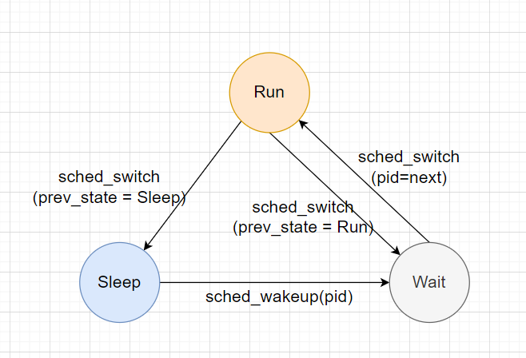

### 1. 问题分析

#### 1.1 进程睡眠原理

由之前学习的内核知识可知，系统发生进程调度的时机主要有以下几种：

1. 进程陷入**系统调用**，系统调用中将调度权出让（状态不是TASK_RUNNING）
2. 当前进程被高优先级的进程抢占（状态为TASK_RUNNING）(原因：时间片用尽、有高优先级进程进入**可执行状态**)
3. 进程的时间片到期，强制进程切换（状态为TASK_RUNNING）

其中1中又包括进程调用**主动将调度权出让的syscall (sys_yield)** 和 **等待某些事件而被动陷入睡眠的syscall**。

其中，我们最关心的就是后面一种，被动陷入睡眠的syscall。

以sys_read为例：这是一个读取某类资源的系统调用。当目前所请求的资源尚未获得（如尚未得到硬盘的IO回应）时，syscall会主动放弃CPU，调整当前状态为TASK_(UN)INTERRUPTIBLE, **进入相应资源的等待队列**，等待相应资源就绪；当资源就绪时，内核会唤醒处于等待队列的该处于等待中的进程。进程的等待涉及很多业务中的性能问题，研究**进程等待的目标、等待的时间、等待链**等，有利于我们**优化具体业务的性能**，所以这是一类值得关注的系统指标。

从内核代码来看，进程进入睡眠的流程如下：

1. 调用futex，semaphore_operation(对信号量的操作)，read系统调用，系统资源**暂时无法取得**；
2. 当前进程进入一个专门的等待队列wait_q；

3. 调用set_current_state(TASK_INTERRUPTIBLE)，设置进程的状态为非TASK_RUNNING

4. 调用schedule() 请求调度
5. schedule() 函数中检测到prev进程不是TASK_RUNNING状态，将其**移出运行队列**。

所以，我们在识别进程的睡眠行为时，不必去繁琐地分析内核每个子系统涉及到进程休眠部分的代码，只需要关注**进程上下文切换**时，上一个进程状态为TASK_(UN)INTERRUPTIBLE的情况。此时机就是**进程发生睡眠的通用过程**。

至于进程为什么睡眠，我们可以通过分析进程的调用栈信息，来看是哪个内核函数主动调用了schedule。顺着这个函数以及其上层的函数查询，我们就能了解到使这个进程进入休眠状态的原因。同样地，我们也可以调取某个进程wakeup另一个进程时的调用栈，来查看这个进程唤醒另一个进程的原因。

以下是几个比较典型的**睡眠时调用栈**信息，通过这些例子可以得到一些较为通用的规律：

获取时机：tracepoint:sched:sched_switch且prev->state != TASK_RUNNING时，调用栈信息

```txt
	__traceiter_sched_switch select系统调用
	__traceiter_sched_switch
	__sched_text_start
	schedule
	schedule_hrtimeout_range_clock
	schedule_hrtimeout_range
	poll_schedule_timeout.constprop.0
	do_select
	core_sys_select
	__x64_sys_pselect6
	do_syscall_64
	entry_SYSCALL_64_after_hwframe

	__traceiter_sched_switch  内核线程对rcu_gp_kthread的调用
	__traceiter_sched_switch
	__sched_text_start
	schedule
	rcu_gp_kthread
	kthread
	ret_from_fork

	__traceiter_sched_switch  处理page_fault时，阻塞在rwsem(读写信号量)上
	__traceiter_sched_switch
	__sched_text_start
	schedule
	rwsem_down_read_slowpath
	down_read
	do_user_addr_fault
	exc_page_fault
	asm_exc_page_fault

	__traceiter_sched_switch   read系统调用
	__traceiter_sched_switch
	__sched_text_start
	schedule
	schedule_timeout
	unix_stream_read_generic
	unix_stream_recvmsg
	sock_recvmsg
	sock_read_iter
	new_sync_read
	vfs_read
	ksys_read
	__x64_sys_read
	do_syscall_64
	entry_SYSCALL_64_after_hwframe
```

更全面的信息可参阅同目录下的stack_type.txt。

我们可以发现，调用栈**都是**以schedule函数及其子函数的调用作为顶层，向下挖到第一个不属于调度过程的函数（查找时，可以简单地找第一个不含有schedule的函数），那么这个函数就蕴含了**使进程休眠的原因**。如poll_schedule_timeout.constprop.0、rcu_gp_kthread、rwsem_down_read_slowpath、unix_stream_read_generic等等。实际上，linux的proc文件系统的/proc/\<pid\>/wchan文件就记录了进程在睡眠时阻塞在的内核函数名称，求法也是**找第一个不属于调度过程的函数**。这说明我们的研究方向是准确的。

**局限性**：只能分析内核层次的进程睡眠与唤醒，如果某种睡眠与唤醒是在用户态实现的，本程序将无法识别。

#### 1.2 程序在不同状态之间的转换过程



如上图所示，进程在运行过程中，状态在Run、Sleep、Wait三种状态之间转换。

* Run：运行状态

* Wait：等待状态。指进程处于TASK_RUNNING的状态，但是并没有在处理机上执行
* Sleep：睡眠状态。此时进程等待唤醒，处于TASK_INTERRUPTIBLE或者TASK_UNINTERRUPTIBLE状态

这三种状态囊括了进程生命周期内的全部事件，因此这三种状态的时间之和应该为**流逝的时间**（指现实世界流逝的时间，而不是CPU时间）。经过实际的验证，证实了本程序对进程状态的分类是正确的，因为三种状态之和正好就是流逝的时间。

### 2. 程序实现

我们定义几个关键的事件，作为分析的基准：

* Run开始，Run结束
* Wait开始，Wait结束
* Sleep开始，Sleep结束

我们使用eBPF程序从内核态统计数据，然后通过perf_output将**上述的事件流**回传到用户态BCC程序，以进行进一步的分析。

#### 2.1 判别当前的执行上下文：

进程在**进入睡眠**时，其调用栈信息包含了使其进入睡眠的原因，一般是调用了某个**syscall**，然后因为资源暂时获取不到或者同步条件没有达成，因此进入睡眠状态。而在**结束睡眠**时，实现wakeup操作(sched_wakeup) 的进程不一定是睡眠进程的唤醒进程。有可能睡眠进程是在**中断或者软中断**中被唤醒的，与当前运行进程无关。

经过对数据的研究，我发现，唤醒操作的上下文有两种：一种是中断上下文(hardirq或者softirq)，另一种是**系统调用**。前一种很好理解，就是因为中断带来了**IO数据**或者**时钟信号**，使得睡眠进程获取到了想要的资源，于是被唤醒。后一种情况有两个例子可以说明：假设进程A在等待进程B处理一些事务，于是用futex将自己睡眠，之后进程B处理完毕，就调用syscall将A唤醒；或者A在等待**管道pipe**上的数据，而B正在准备数据写管道，当B**写** (syscall) 管道时，内核会先执行write，然后检查有没有进程被阻塞在管道的读取上，如果有，就唤醒。这样，就实现了从syscall唤醒睡眠程序。

容易知道，在syscall中进行唤醒的进程是实际上的**唤醒者**。因此，在分析进程等待链时，只需要考虑这种情况。

进程在运行时（无论是内核态还是用户态），如果被中断，就会向其进程结构体对应的preempt_count字段写入一些值。具体来说，分以下几类：

* 中断(hardirq)：在16-19位记录当前层叠的硬中断数目。不过硬中断**一般**不允许嵌套，所以大多数情况下，只有第16位被置为1，示值为65536.
* 软中断(softirq)：在8~15位记录当前软中断数目。但是软中断在同一CPU同一时间只能有一个执行，因此发生软中断时**只能**是第8位被置为1。
* preemption_count：进程抢占数目。表示有高优先级的进程想要抢占当前进程。如果hardirq和softirq没有在执行，那么就立即抢占；否则，等待hardirq或softirq执行完毕，就立即抢占。


include/linux/preempt.h

此文件记录了一些判断当前执行上下文的宏定义，其主要原理都是通过操作preempt_count()来获取的。

```c
#define nmi_count()	(preempt_count() & NMI_MASK)
#define hardirq_count()	(preempt_count() & HARDIRQ_MASK)
#ifdef CONFIG_PREEMPT_RT
# define softirq_count()	(current->softirq_disable_cnt & SOFTIRQ_MASK)
#else
# define softirq_count()	(preempt_count() & SOFTIRQ_MASK)
#endif
#define irq_count()	(nmi_count() | hardirq_count() | softirq_count())

/*
 * Macros to retrieve the current execution context:
 *
 * in_nmi()		- We're in NMI context
 * in_hardirq()		- We're in hard IRQ context
 * in_serving_softirq()	- We're in softirq context
 * in_task()		- We're in task context
 */
#define in_nmi()		(nmi_count())
#define in_hardirq()		(hardirq_count())
#define in_serving_softirq()	(softirq_count() & SOFTIRQ_OFFSET)
#define in_task()		(!(in_nmi() | in_hardirq() | in_serving_softirq()))
```

另有一篇详细介绍preempt_count的文章，可供参考: https://zhuanlan.zhihu.com/p/88883239

x86机器定义preempt_count的方式如下：

arch\x86\include\asm\preempt.h

```c
DECLARE_PER_CPU(int, __preempt_count);

/* We use the MSB mostly because its available */
#define PREEMPT_NEED_RESCHED	0x80000000

...

static __always_inline int preempt_count(void)
{
	return raw_cpu_read_4(__preempt_count) & ~PREEMPT_NEED_RESCHED;
}
```

表示此时可以通过一个percpu变量来访问。你可能有疑问，为什么preempt_count是thread的一个属性，却可以用percpu**全局变量**来表示呢？实际上，preempt_count是用来标识当前**正在执行**的线程的抢占信息的，非运行状态的线程此信息是无效的。一个CPU同一时刻只能有一个运行的线程（空闲时也有线程在运行，是swapper线程），那么这个线程的preempt_count也就是当前cpu的抢占信息，保证了唯一性。

代码描述：

```c
preempt_count[cpu] = rq[cpu].current_thread.preempt_count
```

#### 2.2 可视化方案探索

页内通用方案：**普罗米修斯 和 Grafana**。尝试过，但是这套组合只适用于定时采样（秒级或者10s级）的指标跟踪，不适用于Tracing或者State监控等，不适合唤醒链/调用链的图示绘制。

Jaeger UI 可以做流水线图，但是其原生只针对网络请求的跟踪，用来显示进程间的**唤醒链/调用链**配置较为复杂。

### 3. 运行效果

* 尝试把事件图用**流水线图**的形式呈现，全画太复杂，只画我们感兴趣的若干个进程的图。
* 分析进程的特征，进入RUNNING状态的时长，每个RUNNING时间段的上CPU运行次数 ok
* 分析进程内睡眠的状况，尝试发现**进程的阻塞**是否有**连环依赖**关系
* 尝试用可视化的形式展示这块内容（如不同阻塞原因对应的进程及其时间等）

### 4. 准确性和性能评价


### 4. 业务应用实例


### 5. 后期计划

* 将Go语言写的程序整合为一个。

* 将BCC wakeup这个程序**进一步开发**（进程的生命周期），并确定长远目标，考虑这个项目如何传承给后来者进一步开发。