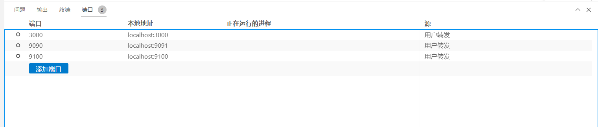
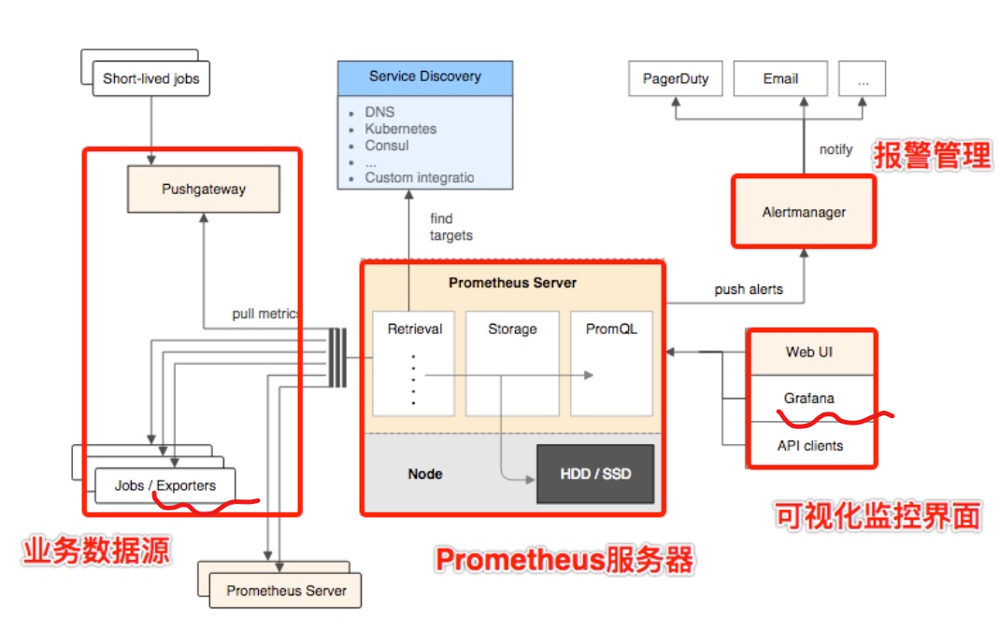
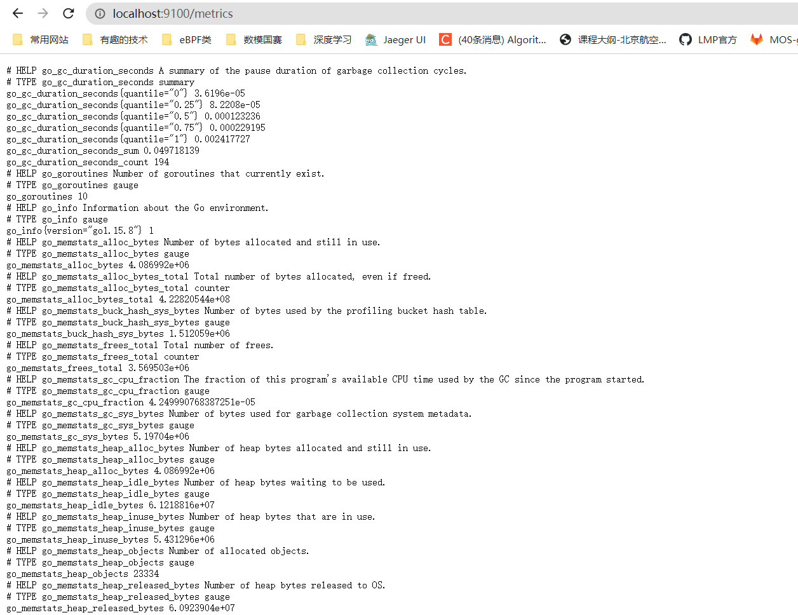
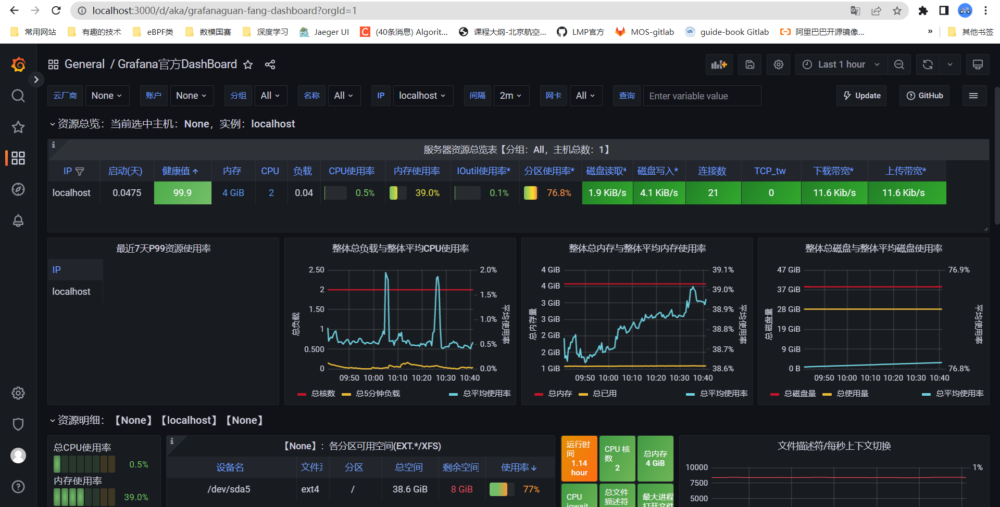
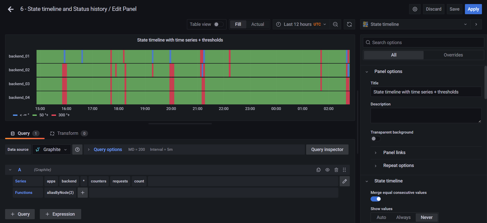
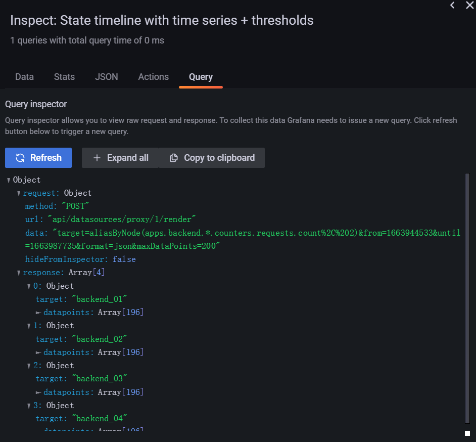
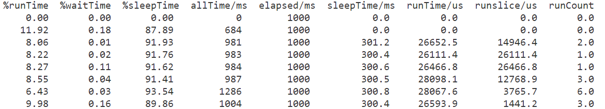
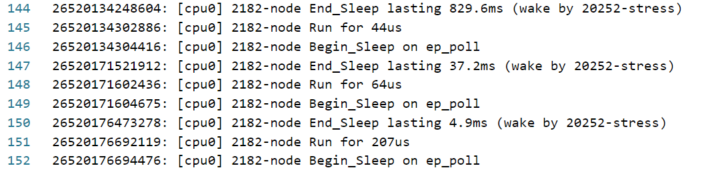
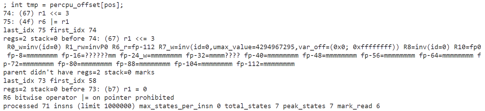

### 2. Prometheus和Grafana配置流程记录

考虑用Grafana或Prometheus时间序列图的形式表现一个进程的事件和生命周期

#### 2.1 踩坑合集：

1. Prometheus图表上显示的时间与目前Linux虚拟机和Windows机器上的准确时间不一致：

   

解决：点击“Use Local Time".


2. Grafana显示Nodata，无法从时序数据库中查询到数据：

* 问题描述：Grafana接收不到数据，一直显示Nodata

* 解决方法：

  1. 首先可以用官方的dashboard做一下测试，见博客https://blog.csdn.net/weixin_50782026/article/details/122321009。

  2. 低版本的Grafana (7.5.2) 总是出各种莫名其妙的bug，现在换成官网的最新版：https://grafana.com/grafana/download

  3. 还得是最新版本的Grafana9.1.6，功能太强大了，之前的几乎所有bug都消失了，也能读取到数据了。

3. 在Windows上浏览虚拟机端口实现的网站：端口转发

   

#### 2.2 系统架构

我们是想实现一套自己的exporter，用来把eBPF采集的数据整理成Prometheus能够接受的形式，并且交由Grafana进行可视化展示。系统的架构如下：



node_exporter:



Prometheus:


Grafana：(图形来源于官方的DashBoard)



主要部分介绍：

* exporter：接口，当访问exporter服务开启的服务端口的metrics路由时，会接受到消息，这些消息是实时的，**没有存储**。消息的格式遵守OpenTelemetry的格式规范

* Prometheus: 一个接受exporter送来的实时数据，并将数据记录到时序数据库PromDB（可通过PromQL查询），**持久化保存**。Prometheus和exporter的关系相当于exporter是传感器，每次观测都会采集到一个数据，Prometheus是主机，每隔指定时间（默认为15s）观测一下传感器，并将数据记录在硬盘中。Prometheus的作图功能十分有限，需要借助Grafana实现更精细化的绘图。
* Grafana：接收Prometheus发送过来的数据，并进行可视化呈现，其呈现方式是实时呈现每个Metric的变化。Grafana支持条形图、线图、状态图、Trace（类似JAEGER）等。Grafana可以配置多种数据源，并不只局限于Prometheus。简单点说，Grafana和Prometheus的关系相当于**实时显示面板和数据库**之间的关系，Grafana并不存储数据，它只负责从数据库中读取数据。

一些文档：

OpenTelemetry: https://opentelemetry.io/docs/

OpenTelemetry Python API: https://opentelemetry.io/docs/instrumentation/python/getting-started/

Prometheus: https://prometheus.io/docs/introduction/overview/

Grafana: https://grafana.com

#### 2.3 监测业务

state timeline非常符合我们的要求:



数据格式就是数组，每一项是状态名+状态开始的时刻，如下所示：

（点击Query inspecter，Query选项卡，点击Refresh）



```json
{
  "request": {
    "method": "POST",
    "url": "api/datasources/proxy/1/render",
    "data": "target=aliasByNode(apps.backend.*.counters.requests.count%2C%202)&from=1663944533&until=1663987735&format=json&maxDataPoints=200",
    "hideFromInspector": false
  },
  "response": [
    {
      "target": "backend_01",
      "datapoints": [
        [
          243.77272727272728,
          1663944700000
        ],
        [
          244,
          1663944920000
        ],
        [
          245.5,
          1663945140000
        ],
        [
          271.5,
          1663945360000
        ],
        [
          241.63636363636363,
          1663945580000
        ],
        [
          231.3181818181818,
          1663945800000
        ],
        ...
      ],
      "title": "backend_01"
    }
  ]
}
```

#### 2.4 一些指标

1. 数值指标

* 进程睡眠次数和平均睡眠时长

* 进程睡醒之后的平均运行时长（指的是进程被唤醒到下一次睡眠之间的所有运行时间片之和）

* 进程睡醒后平均运行时间片数：衡量程序的响应性，若能在一个时间片完成，证明响应能力相对较好（但也不是绝对，因为可能进程在第一个时间片就完成了响应工作，其余的时间片是为后面的响应做准备）

* 进程平均时间片长度：衡量操作系统为进程分配的时间片长度是否合理

  目前的**表示方法是recent**，即采用最后一个得到的指标作为显示值。

  

2. 非数值逻辑性信息

* 进程唤醒链条（获取几个有IPC关系的进程，用于把进程之间的关系联系起来）（需要排除一些不是当前进程唤醒的例子，如某个进程A发生了中断，然后在中断中唤醒了某个进程B，那么进程B就**不应该被归为A唤醒的**。）
* 需要判断唤醒的上下文是 **中断还是系统调用** ok，并进一步区分

3. 按照采集到的部分数据**手画**一些图形
4. 寻找能够用于这种监测的业务实例
   * node_exporter + Prometheus + Grafana三个进程的运行协作
   * 使用了sem信号量的示例程序（之前写的）
5. 区分进程和线程的关系，BPF中提取到的信息属于进程还是线程（大概只是进程级别），能不能把这个应用做到线程级（**线程级的同步操作更多**），并看看当前有什么工具能分析线程级的指标

例如以下几条数据中，可以看到stress“唤醒”了node进程。但是其实是在stress运行期间唤醒了node，而不是stress唤醒了node，其执行的上下文应该是中断等。

```shell
stress --cpu 2
sudo python3 wakeup.py -t lifeline -p 2182
```



