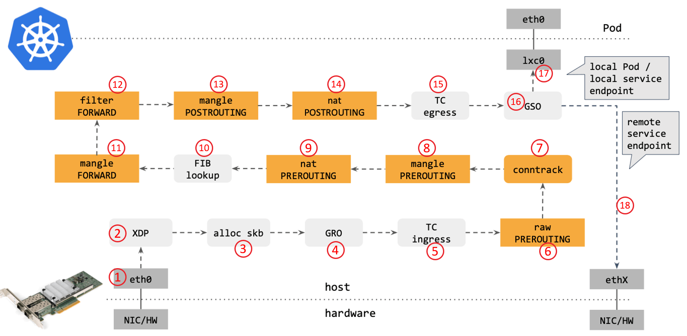

## 基于 eBPF 的 XDP 研究与应用

XDP 提供了一个内核态下高性能的可编程包处理框架，可在最早可以处理包的位置（即网卡驱动收到包的时刻）运行 BPF 程序，其具有非常优秀的数据面处理性能，打通了 Linux 网络处理的高速公路。本题目要求基于eBPF 和 XDP 进行研究，完成的内容包括：（1）分析 eBPF XDP实现的基本原理。（2）对比 XDP 和其它 Kernel Bypass 方案的优缺点，找出其适合的应用场景。（3）针对该应用场景进行编程设计，并可达到性能提升或安全性提升的效果。（4）可能的情况下，尝试将该工具部署在华为的鸿蒙系统上并进行测试。（加分项）

### XDP基本原理

XDP 可在最早可以处理包的位置（即网卡驱动收到包的时刻）运行 BPF 程序，并且暴露了一个可以加载 BPF 程序的网络钩子。在这个钩子中，程序能够对传入的数据包进行判别修改并快速决策，避免了内核内部处理带来的额外开销。
XDP 程序运行在内核网络协议栈之前，一个数据包经过网络协议栈的处理会产生相当大的开销，所以 XDP 提供了几种基本的能力，包括：

- XDP_DROP

丢弃且不处理数据包。eBPF 程序可以分析流量模式并使用过滤器实时更新 XDP 应用程序以丢弃特定类型的数据包（例如，恶意流量）。

- XDP_PASS

指示应将数据包转发到正常网络堆栈以进行进一步处理。XDP 程序可以在此之前修改包的内容。

- XDP_TX

将数据包（可能已被修改）转发到接收它的同一网络接口。

- XDP_REDIRECT

绕过正常的网络堆栈并通过另一个 NIC 将数据包重定向到网络。

关于XDP的其它内容，可以参考`./docs/xdp`目录其它文档：

XDP与题目应用背景：[backgroup.md](./docs/xdp/backgroud.md)

XDP基础内容：[xdp_basic.md](./docs/xdp/xdp_basic.md)

XDP与Kernel Bypass方案对比：[compare.md](./docs/xdp/compare.md)


### XDP iptables

#### 背景

netfilter/iptables 是 Linux 中内置的防火墙，其可以根据指定规则进行包过滤、重定向等功能。但是随着网络吞吐量的高速增长，netfilter/iptables 存在着很大的性能瓶颈，导致服务出现不可预测的延迟和性能下降。netfilter 框架在 IP 层，报文需要经过链路层，IP 层才能被处理，如果是需要丢弃报文，会白白浪费很多资源，影响整体性能，并且 netfilter 框架是一种可自由添加策略规则专家系统，并没有对添加规则进行合并优化，随着规模的增大，逐条匹配的机制也会影响性能。

利用 XDP 可以代替 netfilter/iptables 实现部分包过滤、重定向功能。XDP 可在最早可以处理包的位置运行 BPF 程序，根据预先设置的策略执行相应的动作，避免进入网络协议栈产生不必要的开销，从而提高系统的性能。根据测算，利用 XDP 技术的丢包速率要比 iptables 高 4 倍左右[1]。并且，通过改造匹配策略，借助 BPF HASH MAP ，可以进一步提升性能。

#### netfilter/iptables介绍与实现机制

netfilter/iptables 是采用数据包过滤机制工作的，它会对请求的数据包的包头进行分析，并根据预先设定的规则进行匹配来决定是否可以进入主机。它是一层一层过滤的，按照配置规则的顺序从上到下，从前到后进行过滤。iptables/netfilter 使用表来组织规则，根据用来做什么类型的判断标准，将规则分为不同表。在每个表内部，规则被进一步组织成链，内置的链是由内置的 hook 触发的。链基本上能决定规则何时被匹配。netfilter 在内核协议栈的各个重要关卡埋下了五个钩子。每一个钩子都对应是一系列规则，以链表的形式存在，所以俗称五链。当网络包在协议栈中流转到这些关卡的时候，就会依次执行在这些钩子上注册的各种规则，进而实现对网络包的各种处理。

关于 netfilter/iptables 以及其四表五链的其它内容，可以参考`./docs/iptables_netfilter`目录：

netfilter/iptables 具体介绍：[basic.md](./docs/iptables_netfilter/basic.md)

netfilter/iptables 内核实现：[kernel_implement.md](./docs/iptables_netfilter/kernel_implement.md)

#### 类O(1)匹配算法

本项目借助位图(bitmap)以及BPF HASH，实现了类O(1)匹配，具体实现原理介绍：[match.md](./docs/design/match.md)

#### 借助 eBPF XDP 实现 iptables 的部分功能，提升 kube-proxy / istio 流量劫持的性能

- 当前 kube-proxy 包转发路径：

</img>

- istio 流量劫持(以Bookinfo为例)：[2]

</img>

productpage 访问 reviews Pod，入站流量处理过程对应于图示上的步骤：1、2、3、4、Envoy Inbound Handler、5、6、7、8、应用容器。

reviews Pod 访问 rating 服务的出站流量处理过程对应于图示上的步骤是：9、10、11、12、Envoy Outbound Handler、13、14、15。

- 计划使用 eBPF XDP 以及 TC 实现代替 iptables 的部分能力，并且是对应用透明的。

在搜索相关内容时，找到了一个在今年三月开源的工具：Merbridge。

> Merbridge 专为服务网格设计，使用 eBPF 代替传统的 iptables 劫持流量，能够让服务网格的流量拦截和转发能力更加高效。相比传统的 iptables 流量劫持技术，基于 eBPF 的 Merbridge 可以绕过很多内核模块，缩短边车和服务间的数据路径，从而加速网络。Merbridge 没有对现有的 Istio 作出任何修改，原有的逻辑依然畅通。这意味着，如果您不想继续使用 eBPF，直接删除相关的 DaemonSet 就能恢复为传统的 iptables 方式，不会出现任何问题。[3]

该项目主要借助的是 eBPF 的 sockops 和 redir 能力，缩短了数据路径，类似于[4]的实现。

 </img>

对于同一 Node 内，不同 Pod 之间的通信，绕过了内核网络协议栈，提高了性能。

借助 XDP (native mode)，在不同 Node 之间的通信，也可以绕过 iptables 的部分功能，从而提高性能。

#### 运行

- XDP Filter

编写规则文件` ./src/xdp_filter/rules.txt`

```
sudo python3 ./src/xdp_filter/filter.py
```

- eBPF XDP Proxy

> 编写中...

### Ref

[1] [字节跳动技术团队 —— eBPF技术实践：高性能ACL](https://blog.csdn.net/ByteDanceTech/article/details/106632252)  

[2] [Istio 中的 Sidecar 注入、透明流量劫持及流量路由过程详解](https://jimmysong.io/blog/sidecar-injection-iptables-and-traffic-routing)

[3] [MERBRIDGE](https://merbridge.io/)

[4] [利用 ebpf sockmap/redirection 提升 socket 性能](https://arthurchiao.art/blog/socket-acceleration-with-ebpf-zh/)