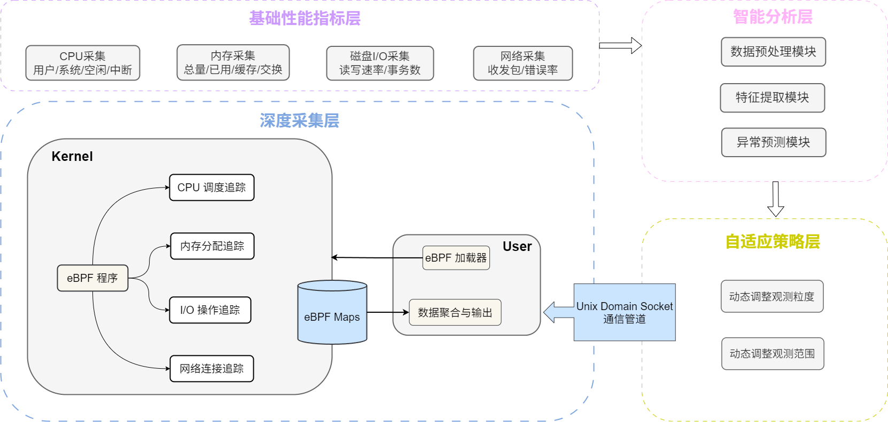

# 基于eBPF的系统性能自适应观测

## 🎯简介

​	本项目以自适应性能观测为核心目标，构建了一个面向系统运行态的实时自适应监测框架。该框架通过**性能数据采集-发现异常-自适应观测-深度采集异常定位**四个环节，实现了一个端到端的系统状态智能化感知闭环系统。整体思路首先是以轻量化的方式采集全局性能关键指标，当检测到异常波动或存在潜在性能瓶颈时，系统自动触发自适应机制，动态调整观测的粒度和范围，在异常发生的关键时刻自动加深采集，定位异常根因，构建了一种高效、智能、具备自适应能力的系统性能观测方法。

## 🏗框架设计

​	本项目是一个端到端的自适应性能观测的闭环系统，整体工作流程如下图所示：

<p align="center">
  
</p>


- **基础性能指标采集层**：周期性采集系统基础性能指标。
- **决策层**：分析数据，判s断系统状态并决定是否、以及如何触发深度采集。
- **深度采集层**：根据指令，动态加载eBPF程序，执行深度追踪。

## 📦 快速开始

**1. 克隆项目**

```shell
git clone <your-project-repo-url>
cd ebpf-adaptive-observation
```

**2. 安装依赖**

```shell
# 安装系统依赖
sudo apt update && sudo apt install -y clang llvm libelf-dev zlib1g-dev python3-pip

# 安装Python依赖
pip3 install -r requirements.txt
```

**3. 运行系统**

```
sudo ./start_collect.sh
```

## 🚀 使用方法

运行系统后，它将自动进入静默监控状态。可以通过以下方式测试其功能：

**1. 制造CPU异常**：

```shell
stress-ng --cpu 4 --timeout 60
```

观察控制台输出，系统应检测到CPU压力并自动触发CPU调度延迟的深度采集。

**2. 制造I/O异常**：

```
fio --name=test --ioengine=sync --rw=randwrite --bs=4k --size=1G --runtime=30
```

系统应检测到I/O压力并触发I/O读写监控，输出是哪个进程在进行大量I/O操作。

**3. 查看结果**：

- 所有监控数据、异常事件和深度采集结果均保存在 `data/metrics_with_bpf.csv`中。
- 实时日志请查看 `logs/realtime_monitor.log`。

## 📁 项目结构

```
.
├── docs/                    # 项目文档、说明书
├── src/
│   ├── ebpf/                # eBPF内核程序源码
│   │   ├── cpu_monitor.c    # CPU调度延迟追踪
│   │   ├── mem_monitor.c    # Slab内存分配追踪
│   │   ├── io_monitor.c     # 进程级I/O追踪
│   │   └── net_monitor.c    # TCP连接生命周期追踪
│   ├── collection/          # 基础数据采集模块
│   ├── ml/                  # 机器学习模型与异常检测模块
│   └── adaptive_monitor.py  # 自适应主控程序
├── data/                    # 数据目录（自动生成）
│   ├── cpu_metrics.csv
│   ├── metrics_with_bpf.csv # 综合输出结果
│   └── ...
├── logs/                    # 日志目录（自动生成）
└── README.md
```