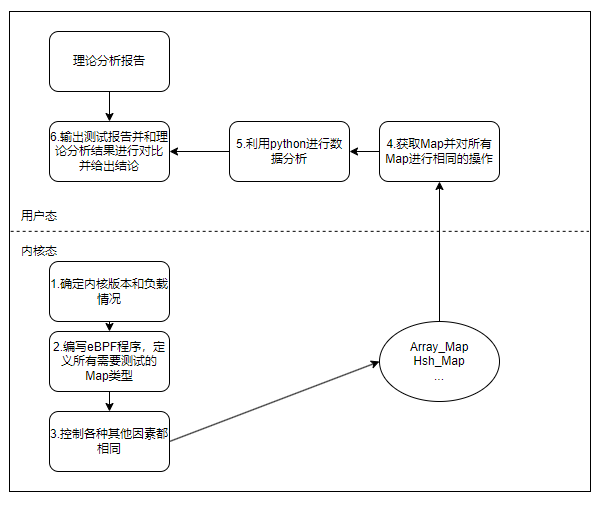
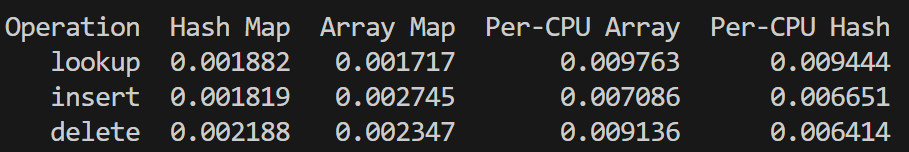
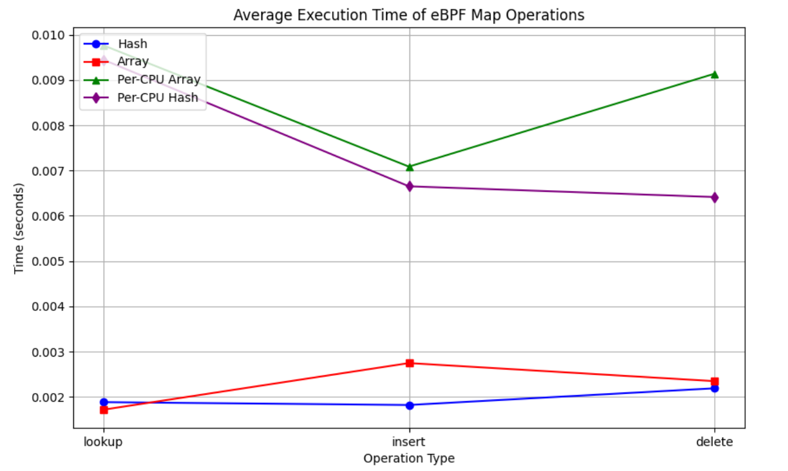
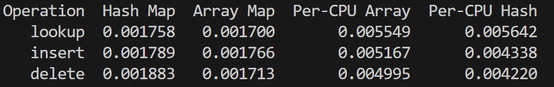
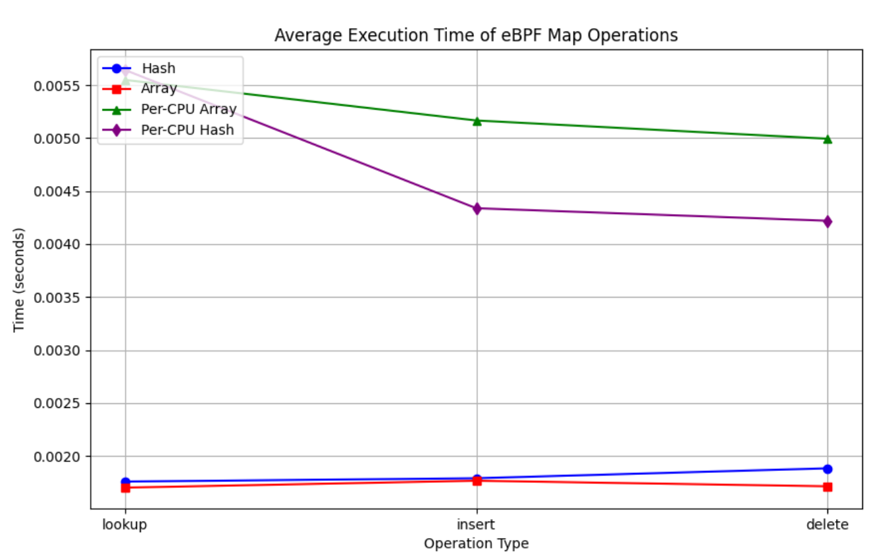
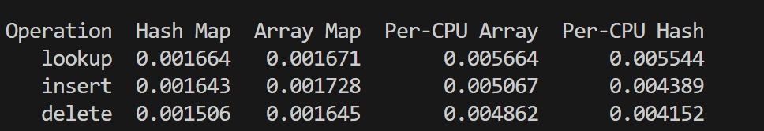
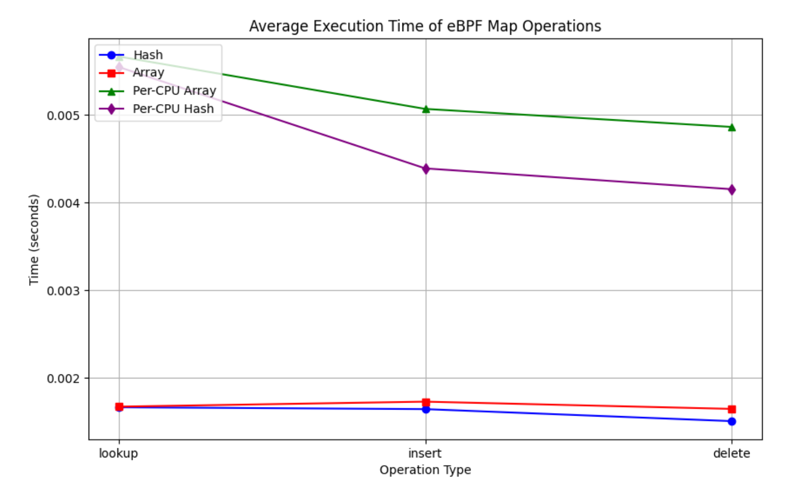
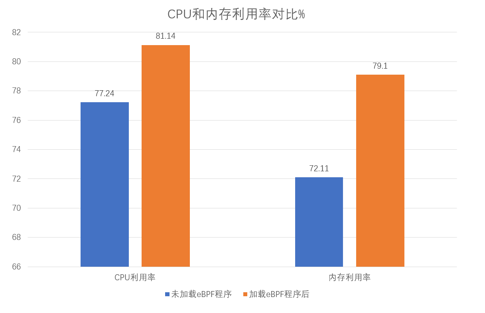
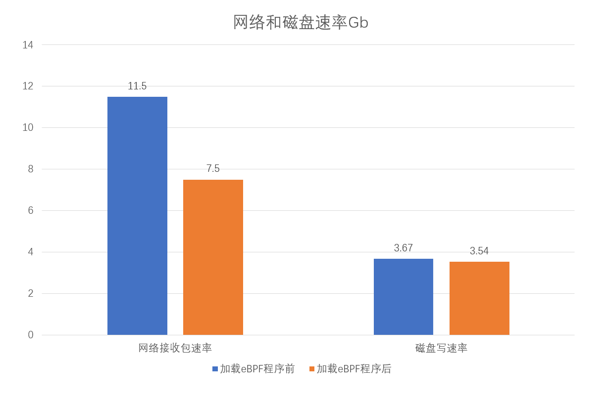

# eBPF多维度性能分析测试方案

## 一、测试准备

​	在本次eBPF性能分析以及测试中，将从多个维度去分析eBPF程序在不同内核版本下以及在不同负载情境下，不同Map类型和挂载点类型的性能差异。

​	首先，我们先在测试之前进行测试的一些必要的准备。

​	使用以下表格来说明本次测试需要的准备：

| 准备项         | 说明                               |
| -------------- | ---------------------------------- |
| 内核版本的选取 | 选取本次测试需要测试的内核版本     |
| 负载环境的选取 | 确定本次测试的负载方案             |
| Map类型的选取  | 确定好本次测试将要测试的Map类型    |
| 挂载点的选取   | 确定好本次测试将要测试的挂载点类型 |
| 测试机配置     | 说明测试机的各项配置               |

### **1.内核版本的选取：**

​	首先，在选取需要测试的Linux内核版本时，考虑两个方面，第一个是在eBPF发展中比较有转折点的内核版本，其次是目前企业应用和日常学习中，大家比较常用的Linux内核版本。首先，以下是eBPF技术在主要内核版本中的发展过程及其引入的功能（主要关注Map和程序类型）：

| 内核版本   | 时间    | 新增功能                                                     |
| ---------- | ------- | ------------------------------------------------------------ |
| Linux 3.18 | 2014.12 | 基础的eBPF Maps引入：最初引入的map类型有`hash map`和`array map` |
| Linux 4.6  | 2016.5  | 引入了`Per-CPU`的哈希表和数组类型                            |
| Linux 4.3  | 2015.11 | 支持了`kprobe`和`tracepoints`                                |
| Linux 4.14 | 2017.11 | 支持eBPF程序附加到`perf events`，用于性能分析和监控          |
| Linux 4.19 | 2018.10 | 引入了环形缓冲区类型的`Ring Buffer Map`                      |
| Linux 5.19 | 2022.7  | 增强了`XDP`和`BPF trampoline`功能，使得动态附加eBPF程序更加高效和灵活 |
| Linux 6.2  | 2023.2  | 增强了对 `fentry` 和 `fexit` 程序类型的支持，使得 eBPF 程序可以更灵活地附加到内核函数的入口和退出点 |
| Linux 6.5  | 2023.8  | 引入了新的机制`bpf_cookie`：允许 eBPF 程序为特定事件分配和管理 `cookie` |

​	通过查阅资料并进行调研，本次测试选取的内核版本为4.19、5.19、6.5三个Linux内核版本来进行分别的测试。

### 2.负载环境的选取：

#### 1.系统负载

​	在本次测试中，会使用负载工具（stress-ng）对整个系统进行加压，比如，对cpu、内存、IO速率进行加压。在这种系统高负载以及在内核版本固定，负载环境固定的情况下，比较不同Map类型和不同挂载点类型在高负载环境下的表现情况。

​	这种设计是考虑eBPF程序在整个系统高负载情况下不同Map类型、不同挂载点类型的性能测试。接下来，还需要测试在eBPF程序本身的高负载环境下，不同Map类型、不同挂载点类型的表现情况。

#### 2.程序内部高负载

​	在本次实验中，也会对eBPF的不同Map进行大量的增删改查操作，来模拟对Map操作的高负载情境。比如，控制eBPF的挂载点相同、内核版本相同、测试环境相同、对不同的Map类型进行相同且大量的增删改查操作，来对比不同Map类型在各种前提都相同，它们的操作在时间性能上存在的差异。

### 3.Map类型的选取：

​	在本次测试中，我们选取的Linux内核版本分别为：4.19、5.19、6.5这三个版本，接下来通过查看内核源码来查看这三个版本分别支持的Map类型，内核路径为：（/include/uapi/linux/bpf.h）

Linux4.19版本支持的Map类型：

```c
enum bpf_map_type {
	BPF_MAP_TYPE_UNSPEC,
	BPF_MAP_TYPE_HASH,
	BPF_MAP_TYPE_ARRAY,
	BPF_MAP_TYPE_PROG_ARRAY,
	BPF_MAP_TYPE_PERF_EVENT_ARRAY,
	BPF_MAP_TYPE_PERCPU_HASH,
	BPF_MAP_TYPE_PERCPU_ARRAY,
	BPF_MAP_TYPE_STACK_TRACE,
	BPF_MAP_TYPE_CGROUP_ARRAY,
	BPF_MAP_TYPE_LRU_HASH,
	BPF_MAP_TYPE_LRU_PERCPU_HASH,
	BPF_MAP_TYPE_LPM_TRIE,
	BPF_MAP_TYPE_ARRAY_OF_MAPS,
	BPF_MAP_TYPE_HASH_OF_MAPS,
	BPF_MAP_TYPE_DEVMAP,
	BPF_MAP_TYPE_SOCKMAP,
	BPF_MAP_TYPE_CPUMAP,
	BPF_MAP_TYPE_XSKMAP,
	BPF_MAP_TYPE_SOCKHASH,
	BPF_MAP_TYPE_CGROUP_STORAGE,
	BPF_MAP_TYPE_REUSEPORT_SOCKARRAY,
};//21种
```

Linux5.19版本支持的Map类型：

```c
enum bpf_map_type {
	BPF_MAP_TYPE_UNSPEC,
	BPF_MAP_TYPE_HASH,
	BPF_MAP_TYPE_ARRAY,
	BPF_MAP_TYPE_PROG_ARRAY,
	BPF_MAP_TYPE_PERF_EVENT_ARRAY,
	BPF_MAP_TYPE_PERCPU_HASH,
	BPF_MAP_TYPE_PERCPU_ARRAY,
	BPF_MAP_TYPE_STACK_TRACE,
	BPF_MAP_TYPE_CGROUP_ARRAY,
	BPF_MAP_TYPE_LRU_HASH,
	BPF_MAP_TYPE_LRU_PERCPU_HASH,
	BPF_MAP_TYPE_LPM_TRIE,
	BPF_MAP_TYPE_ARRAY_OF_MAPS,
	BPF_MAP_TYPE_HASH_OF_MAPS,
	BPF_MAP_TYPE_DEVMAP,
	BPF_MAP_TYPE_SOCKMAP,
	BPF_MAP_TYPE_CPUMAP,
	BPF_MAP_TYPE_XSKMAP,
	BPF_MAP_TYPE_SOCKHASH,
	BPF_MAP_TYPE_CGROUP_STORAGE,
	BPF_MAP_TYPE_REUSEPORT_SOCKARRAY,
	BPF_MAP_TYPE_PERCPU_CGROUP_STORAGE,
	BPF_MAP_TYPE_QUEUE,
	BPF_MAP_TYPE_STACK,
	BPF_MAP_TYPE_SK_STORAGE,
	BPF_MAP_TYPE_DEVMAP_HASH,
	BPF_MAP_TYPE_STRUCT_OPS,
	BPF_MAP_TYPE_RINGBUF,
	BPF_MAP_TYPE_INODE_STORAGE,
	BPF_MAP_TYPE_TASK_STORAGE,
	BPF_MAP_TYPE_BLOOM_FILTER,
};//31种
```

Linux6.5版本支持的Map类型：

```c
enum bpf_map_type {
	BPF_MAP_TYPE_UNSPEC,
	BPF_MAP_TYPE_HASH,
	BPF_MAP_TYPE_ARRAY,
	BPF_MAP_TYPE_PROG_ARRAY,
	BPF_MAP_TYPE_PERF_EVENT_ARRAY,
	BPF_MAP_TYPE_PERCPU_HASH,
	BPF_MAP_TYPE_PERCPU_ARRAY,
	BPF_MAP_TYPE_STACK_TRACE,
	BPF_MAP_TYPE_CGROUP_ARRAY,
	BPF_MAP_TYPE_LRU_HASH,
	BPF_MAP_TYPE_LRU_PERCPU_HASH,
	BPF_MAP_TYPE_LPM_TRIE,
	BPF_MAP_TYPE_ARRAY_OF_MAPS,
	BPF_MAP_TYPE_HASH_OF_MAPS,
	BPF_MAP_TYPE_DEVMAP,
	BPF_MAP_TYPE_SOCKMAP,
	BPF_MAP_TYPE_CPUMAP,
	BPF_MAP_TYPE_XSKMAP,
	BPF_MAP_TYPE_SOCKHASH,
	BPF_MAP_TYPE_CGROUP_STORAGE_DEPRECATED,
	BPF_MAP_TYPE_CGROUP_STORAGE = BPF_MAP_TYPE_CGROUP_STORAGE_DEPRECATED,
	BPF_MAP_TYPE_REUSEPORT_SOCKARRAY,
	BPF_MAP_TYPE_PERCPU_CGROUP_STORAGE,
	BPF_MAP_TYPE_QUEUE,
	BPF_MAP_TYPE_STACK,
	BPF_MAP_TYPE_SK_STORAGE,
	BPF_MAP_TYPE_DEVMAP_HASH,
	BPF_MAP_TYPE_STRUCT_OPS,
	BPF_MAP_TYPE_RINGBUF,
	BPF_MAP_TYPE_INODE_STORAGE,
	BPF_MAP_TYPE_TASK_STORAGE,
	BPF_MAP_TYPE_BLOOM_FILTER,
	BPF_MAP_TYPE_USER_RINGBUF,
	BPF_MAP_TYPE_CGRP_STORAGE,
};//34种
```

​	在本次测试中，将对三个内核版本进行分别的分析和测试。

​	目前，将分析并测试常用的Map类型，在Linux4.19内核版本中，将分析并测试以下Map类型：

```c
	BPF_MAP_TYPE_HASH,
	BPF_MAP_TYPE_ARRAY,
	BPF_MAP_TYPE_PERCPU_HASH,
	BPF_MAP_TYPE_PERCPU_ARRAY,
```

​	在Linux5.19内核版本中，将分析并测试常用的以下Map类型：

```c
	BPF_MAP_TYPE_HASH,
	BPF_MAP_TYPE_ARRAY,
	BPF_MAP_TYPE_PERCPU_HASH,
	BPF_MAP_TYPE_PERCPU_ARRAY,
	BPF_MAP_TYPE_RINGBUF,
```

​	在Linux6.5内核版本中，将分析并测试常用的以下Map类型：

```c
	BPF_MAP_TYPE_HASH,
	BPF_MAP_TYPE_ARRAY,
	BPF_MAP_TYPE_PERCPU_HASH,
	BPF_MAP_TYPE_PERCPU_ARRAY,
	BPF_MAP_TYPE_RINGBUF,
	BPF_MAP_TYPE_USER_RINGBUF,
```

### 4.挂载点类型的选取：

​	和上面的分析类似，我们先看不同内核版本所支持的挂载点类型：

Linux4.19版本支持的挂载点类型：

```c
enum bpf_prog_type {
	BPF_PROG_TYPE_UNSPEC,
	BPF_PROG_TYPE_SOCKET_FILTER,
	BPF_PROG_TYPE_KPROBE,
	BPF_PROG_TYPE_SCHED_CLS,
	BPF_PROG_TYPE_SCHED_ACT,
	BPF_PROG_TYPE_TRACEPOINT,
	BPF_PROG_TYPE_XDP,
	BPF_PROG_TYPE_PERF_EVENT,
	BPF_PROG_TYPE_CGROUP_SKB,
	BPF_PROG_TYPE_CGROUP_SOCK,
	BPF_PROG_TYPE_LWT_IN,
	BPF_PROG_TYPE_LWT_OUT,
	BPF_PROG_TYPE_LWT_XMIT,
	BPF_PROG_TYPE_SOCK_OPS,
	BPF_PROG_TYPE_SK_SKB,
	BPF_PROG_TYPE_CGROUP_DEVICE,
	BPF_PROG_TYPE_SK_MSG,
	BPF_PROG_TYPE_RAW_TRACEPOINT,
	BPF_PROG_TYPE_CGROUP_SOCK_ADDR,
	BPF_PROG_TYPE_LWT_SEG6LOCAL,
	BPF_PROG_TYPE_LIRC_MODE2,
	BPF_PROG_TYPE_SK_REUSEPORT,
};//22种
```

Linux5.19版本支持的挂载点类型：

```c
enum bpf_prog_type {
	BPF_PROG_TYPE_UNSPEC,
	BPF_PROG_TYPE_SOCKET_FILTER,
	BPF_PROG_TYPE_KPROBE,
	BPF_PROG_TYPE_SCHED_CLS,
	BPF_PROG_TYPE_SCHED_ACT,
	BPF_PROG_TYPE_TRACEPOINT,
	BPF_PROG_TYPE_XDP,
	BPF_PROG_TYPE_PERF_EVENT,
	BPF_PROG_TYPE_CGROUP_SKB,
	BPF_PROG_TYPE_CGROUP_SOCK,
	BPF_PROG_TYPE_LWT_IN,
	BPF_PROG_TYPE_LWT_OUT,
	BPF_PROG_TYPE_LWT_XMIT,
	BPF_PROG_TYPE_SOCK_OPS,
	BPF_PROG_TYPE_SK_SKB,
	BPF_PROG_TYPE_CGROUP_DEVICE,
	BPF_PROG_TYPE_SK_MSG,
	BPF_PROG_TYPE_RAW_TRACEPOINT,
	BPF_PROG_TYPE_CGROUP_SOCK_ADDR,
	BPF_PROG_TYPE_LWT_SEG6LOCAL,
	BPF_PROG_TYPE_LIRC_MODE2,
	BPF_PROG_TYPE_SK_REUSEPORT,
	BPF_PROG_TYPE_FLOW_DISSECTOR,
	BPF_PROG_TYPE_CGROUP_SYSCTL,
	BPF_PROG_TYPE_RAW_TRACEPOINT_WRITABLE,
	BPF_PROG_TYPE_CGROUP_SOCKOPT,
	BPF_PROG_TYPE_TRACING,
	BPF_PROG_TYPE_STRUCT_OPS,
	BPF_PROG_TYPE_EXT,
	BPF_PROG_TYPE_LSM,
	BPF_PROG_TYPE_SK_LOOKUP,
	BPF_PROG_TYPE_SYSCALL, 
};//32种
```

Linux6.5版本支持的挂载点类型：

```c
enum bpf_prog_type {
	BPF_PROG_TYPE_UNSPEC,
	BPF_PROG_TYPE_SOCKET_FILTER,
	BPF_PROG_TYPE_KPROBE,
	BPF_PROG_TYPE_SCHED_CLS,
	BPF_PROG_TYPE_SCHED_ACT,
	BPF_PROG_TYPE_TRACEPOINT,
	BPF_PROG_TYPE_XDP,
	BPF_PROG_TYPE_PERF_EVENT,
	BPF_PROG_TYPE_CGROUP_SKB,
	BPF_PROG_TYPE_CGROUP_SOCK,
	BPF_PROG_TYPE_LWT_IN,
	BPF_PROG_TYPE_LWT_OUT,
	BPF_PROG_TYPE_LWT_XMIT,
	BPF_PROG_TYPE_SOCK_OPS,
	BPF_PROG_TYPE_SK_SKB,
	BPF_PROG_TYPE_CGROUP_DEVICE,
	BPF_PROG_TYPE_SK_MSG,
	BPF_PROG_TYPE_RAW_TRACEPOINT,
	BPF_PROG_TYPE_CGROUP_SOCK_ADDR,
	BPF_PROG_TYPE_LWT_SEG6LOCAL,
	BPF_PROG_TYPE_LIRC_MODE2,
	BPF_PROG_TYPE_SK_REUSEPORT,
	BPF_PROG_TYPE_FLOW_DISSECTOR,
	BPF_PROG_TYPE_CGROUP_SYSCTL,
	BPF_PROG_TYPE_RAW_TRACEPOINT_WRITABLE,
	BPF_PROG_TYPE_CGROUP_SOCKOPT,
	BPF_PROG_TYPE_TRACING,
	BPF_PROG_TYPE_STRUCT_OPS,
	BPF_PROG_TYPE_EXT,
	BPF_PROG_TYPE_LSM,
	BPF_PROG_TYPE_SK_LOOKUP,
	BPF_PROG_TYPE_SYSCALL, 
	BPF_PROG_TYPE_NETFILTER,
};//33种
```

​	在测试这三个不同内核版本的挂载点表现差异时，我们选取常用的挂载点类型，如下所示：

```c
	BPF_PROG_TYPE_KPROBE,
	BPF_PROG_TYPE_TRACEPOINT,
	BPF_PROG_TYPE_XDP,
	BPF_PROG_TYPE_PERF_EVENT,
	BPF_PROG_TYPE_SYSCALL, 
```

### 5.测试机的配置

本次测试的主机配置如下所示：

| 名称         | 配置                                                   |
| ------------ | ------------------------------------------------------ |
| CPU          | 13th Gen Intel(R) Core(TM) i9-13900HX   2.20 GHz  16核 |
| 内存         | 16GB                                                   |
| 硬盘大小     | 100GB                                                  |
| 虚拟机       | VMware Workstation 上搭建的ubuntu 22.04.3 LTS          |
| 内核版本     | 4.19、5.19、6.5                                        |
| eBPF开发工具 | libbpf                                                 |

在测试之前，我们需要关闭CPU的P-states和C-states，来确保CPU频率一致性。**P-states** 是处理器的性能状态，用于调整 CPU 的工作频率和电压，以达到性能和功耗的平衡。P-states 允许处理器在不同的性能状态之间切换，以适应当前的计算负载。**C-states** 是处理器的休眠状态，用于降低 CPU 的功耗当其处于空闲状态时。C-states 允许处理器在不使用时进入更深的节能状态，从而减少功耗。

配置如下：

**关闭P-states：**

```shell
GRUB_CMDLINE_LINUX="resume=/dev/mapper/ao_anolis-swap rd.lvm.lv=ao_anolis/root rd.lvm.lv=ao_anolis/swap rhgb quiet"
更改为：
GRUB_CMDLINE_LINUX="resume=/dev/mapper/ao_anolis-swap rd.lvm.lv=ao_anolis/root rd.lvm.lv=ao_anolis/swap rhgb quiet intel_pstate=disable noacpi"
```

**关闭C-states：**

```shell
GRUB_CMDLINE_LINUX="resume=/dev/mapper/ao_anolis-swap rd.lvm.lv=ao_anolis/root rd.lvm.lv=ao_anolis/swap rhgb quiet intel_pstate=disable noacpi"
更改为：
GRUB_CMDLINE_LINUX="resume=/dev/mapper/ao_anolis-swap rd.lvm.lv=ao_anolis/root rd.lvm.lv=ao_anolis/swap rhgb quiet intel_pstate=disable noacpi processor.max_cstate=0"
```

## 二、测试工具引入：

​	在本次测试过程中，会使用以下工具来进行测试：

| 工具               | 工具说明                                                     |
| ------------------ | ------------------------------------------------------------ |
| libbpf             | 使用libbpf工具来进行eBPF程序的编写                           |
| stress-ng          | 通过该工具对系统进行加压，模拟高负载环境                     |
| Visual Studio Code | 使用该开发工具进行虚拟机控制和程序编写                       |
| Python             | 使用Python语言喝Python数据分析的相关库来对测试后的数据进行分析 |
| shell脚本          | 编写shell脚本来自动化测试用例和数据分析的运行                |
| Typora             | 编写测试相关的文档，包括测试分析和测试结果等                 |

## 三、测试计划

| 时间                       | 任务                                                         | 产出                                                         |
| -------------------------- | ------------------------------------------------------------ | ------------------------------------------------------------ |
| 7.20-8.2                   | 详细设计出测试方案，对后面做出详细的规划                     | 输出详细的测试方案                                           |
| Map：                      |                                                              |                                                              |
| 8.3-8.9                    | 对Map的各个类型进行详细的理论分析                            | 输出详细的Map类型分析报告并给出分析结论                      |
| 8.10-8.16                  | 编写测试代码并从时间维度，不同负载的情境下对不同Map进行测试  | 输出详细的测试结果                                           |
| 8.17-8.23                  | 完善测试并对结果进行分析                                     | 输出测试结果和理论分析，并不同版本的Map特性，结合理论分析给出一个操作指南 |
| eBPF程序对系统资源的影响： |                                                              |                                                              |
| 8.24-8.30                  | 对eBPF程序的资源消耗进行详细的理论分析                       | 输出详细的分析报告并给出分析结论                             |
| 8.31-9.6                   | 编写测试代码并收集在加载eBPF前后，系统整体的一个消耗情况。不同负载的情境下对不同挂载点进行测试 | 输出详细的测试结果                                           |
| 9.7-9.13                   | 完善测试并对结果进行分析                                     | 输出测试结果和理论分析，并给出不同eBPF的特性，结合理论分析给出一个操作指南 |
| 测试补充：                 |                                                              |                                                              |
| 9.14-9.20                  | 通过测试过程中发现的问题和遗漏，再补充一些需要的测试结果     | 初步输出一个项目总体测试文档，并查漏补缺                     |
| 9.21-9.30                  | 完善项目总体开发测试文档                                     | 输出最终的测试报告并整理项目代码                             |

## 四、测试方案

​	在测试之前，需要通过查阅资料和阅读内核源码给出一个详细且准确的理论分析报告，然后再通过下述的测试过程和测试结果来验证理论分析的正确性。并且最终给出一个eBPF最佳实践指南。

#### 4.1 Map类型的测试方案：

​	Map类型的测试方案说明了本次测试方案是从时间的角度去分析不同Map类型的差异。

**测试的流程如下图所示：**


对上图进行详细解释：

1.首先，通过上面的分析。我们需要在测试之前确定一些环境因素：

- 确定内核版本，本次测试将从内核版本6.5、5.19、4.19这个顺序来进行测试。
- 确定负载，本次测试将负载定为两大类，分别为：对系统进行加压负载、对Map的操作次数进行设置。
- 确定测试指标，本次测试会对不同Map类型定义相同的空间大小，并且进行相同的操作，来测试这些不同的Map类型在各种环境都确定的情况下，它们在时间维度上的差异。

2.接下来就是编写测试程序，这里会使用libbpf来编写，编写程序的关键点为：

- 根据前面分析的结果，定义选定内核版本需要测试的Map类型。
- 将定义好的所有Map结构体挂载在同一个函数上。
- 在用户态对这些定义的Map进行获取并进行相同次数的相同操作。
- 将每个Map类型的操作时间记录下来。
- 循环上述操作，获取多组测试数据。

3.最后，编写python脚本来对得出的操作时间进行数据分析，并编写shell脚本进行上述所有操作的整合，自动化测试程序：

- 通过测试程序输出的时间数据，进行数据分析。
- 将分析的结果以文件和图表的方式展现出来。
- 输出测试报告并结合理论分析的结果给出一个在Map方面的最佳实践指南。

通过上述的描述，接下来给出一个流程图来说明本次测试的具体过程：



测试用例设计：

用例1：

| 事项             | 内容                                                         |
| ---------------- | ------------------------------------------------------------ |
| 场景             | 在系统CPU高负载情况下（CPU使用率约为80%）并且CPU频率固定，针对不同类型的eBPF Map进行相同次数的增删改查操作，这里会多次变化操作次数来说明实验结果的正确性。查看每种类型的Map在CPU高负载的情况下对于不同操作次数的耗时情况。 |
| 测试目的         | 评估不同类型的eBPF Map在CPU高负载的情况下，进行相同次数的CRUD操作时的性能表现，特别是记录每种类型的Map在处理时间上的差异。 |
| 负载压力产生方法 | 使用stress-ng来对CPU进行加压，并且每次测试时，通过设置不同的操作次数来对ebpf程序进行CRUD的压力控制。 |
| 执行脚本         | map_difference_01.py                                         |
| 执行方法         | 执行./run_ebpf_and_process.sh脚本；查看分析结果              |
| 与生产环境差异   | 测试环境为隔离的虚拟机，实际的CPU核心数要比生产环境少，并且在负载压力产生方面，也和生产环境有差异。 |
| 指标要求         | 每次测试之前，要控制好每种Map类型的CRUD操作次数必须相同；相同操作次数下，不同Map类型的耗时差异不应超过理论分析的预期范围； |
| 测试结果         | 记录每种Map类型的CRUD操作时间，并汇总到报告中，生成柱状图或折线图展示不同Map类型的性能差异。 |
| 测试结果分析     | 通过测试结果的内容，并结合python的数据分析能力，来分析出在高CPU负载的情况下，哪种Map类型更适合使用，并且验证理论分析的结果是否正确。 |
| 后续Action       | 将详细的测试分析结果编写到文档中，并且给出一个不同Map类型的适用场景的有力指导。 |

用例2：

| 事项             | 内容                                                         |
| ---------------- | ------------------------------------------------------------ |
| 场景             | 在系统内存高负载情况下（内存使用率约为75%）并且CPU频率固定，针对不同类型的eBPF Map进行相同次数的增删改查操作，这里会多次变化操作次数来说明实验结果的正确性。查看每种类型的Map在内存高负载的情况下对于不同操作次数的耗时情况。 |
| 测试目的         | 评估不同类型的eBPF Map在内存高负载的情况下，进行相同次数的CRUD操作时的性能表现，特别是记录每种类型的Map在处理时间上的差异。 |
| 负载压力产生方法 | 使用stress-ng来对内存进行加压，并且每次测试时，通过设置不同的操作次数来对ebpf程序进行CRUD的压力控制。 |
| 执行脚本         | map_difference_02.py                                         |
| 执行方法         | 执行./run_ebpf_and_process.sh脚本；查看分析结果              |
| 与生产环境差异   | 测试环境为隔离的虚拟机，实际的内存总大小要比生产环境小，并且在负载压力产生方面，也和生产环境有差异。 |
| 指标要求         | 每次测试之前，要控制好每种Map类型的CRUD操作次数必须相同；相同操作次数下，不同Map类型的耗时差异不应超过理论分析的预期范围； |
| 测试结果         | 记录每种Map类型的CRUD操作时间，并汇总到报告中，生成柱状图或折线图展示不同Map类型的性能差异。 |
| 测试结果分析     | 通过测试结果的内容，并结合python的数据分析能力，来分析出在内存高负载的情况下，哪种Map类型更适合使用，并且验证理论分析的结果是否正确。 |
| 后续Action       | 将详细的测试分析结果编写到文档中，并且给出一个不同Map类型的适用场景的有力指导。 |

用例3：

| 事项             | 内容                                                         |
| ---------------- | ------------------------------------------------------------ |
| 场景             | 在系统开启CPU的P-states和C-states时，针对不同类型的eBPF Map进行相同次数的增删改查操作，这里会多次变化操作次数来说明实验结果的正确性。查看每种类型的Map在系统开启CPU的P-states和C-states的情况下对于不同操作次数的耗时情况。 |
| 测试目的         | 评估不同类型的eBPF Map在内存高负载的情况下，进行相同次数的CRUD操作时的性能表现，特别是记录每种类型的Map在处理时间上的差异。 |
| 负载压力产生方法 | 使用stress-ng来对系统进行加压，并且每次测试时，通过设置不同的操作次数来对ebpf程序进行CRUD的压力控制。 |
| 执行脚本         | map_difference_03.py                                         |
| 执行方法         | 执行./run_ebpf_and_process.sh脚本；查看分析结果              |
| 与生产环境差异   | 测试环境为隔离的虚拟机，实际的CPU频率变化与生产环境有一定的差异，并且在负载压力产生方面，也和生产环境有差异。 |
| 指标要求         | 每次测试之前，要控制好每种Map类型的CRUD操作次数必须相同；相同操作次数下，不同Map类型的耗时差异不应超过理论分析的预期范围； |
| 测试结果         | 记录每种Map类型的CRUD操作时间，并汇总到报告中，生成柱状图或折线图展示不同Map类型的性能差异。 |
| 测试结果分析     | 通过测试结果的内容，并结合python的数据分析能力，来分析出在内存高负载的情况下，哪种Map类型更适合使用，并且验证理论分析的结果是否正确。 |
| 后续Action       | 将详细的测试分析结果编写到文档中，并且给出一个不同Map类型的适用场景的有力指导。 |

用例4：

| 事项             | 内容                                                         |
| ---------------- | ------------------------------------------------------------ |
| 场景             | 在系统关闭CPU的P-states和C-states时，针对不同类型的eBPF Map进行相同次数的增删改查操作，这里会多次变化操作次数来说明实验结果的正确性。查看每种类型的Map在系统关闭CPU的P-states和C-states的情况下对于不同操作次数的耗时情况。 |
| 测试目的         | 评估不同类型的eBPF Map在内存高负载的情况下，进行相同次数的CRUD操作时的性能表现，特别是记录每种类型的Map在处理时间上的差异。 |
| 负载压力产生方法 | 使用stress-ng来对系统进行加压，并且每次测试时，通过设置不同的操作次数来对ebpf程序进行CRUD的压力控制。 |
| 执行脚本         | map_difference_04.py                                         |
| 执行方法         | 执行./run_ebpf_and_process.sh脚本，查看分析结果。            |
| 与生产环境差异   | 测试环境为隔离的虚拟机，实际的CPU频率变化与生产环境有一定的差异，并且在负载压力产生方面，也和生产环境有差异。 |
| 指标要求         | 每次测试之前，要控制好每种Map类型的CRUD操作次数必须相同；相同操作次数下，不同Map类型的耗时差异不应超过理论分析的预期范围； |
| 测试结果         | 记录每种Map类型的CRUD操作时间，并汇总到报告中，生成柱状图或折线图展示不同Map类型的性能差异。 |
| 测试结果分析     | 通过测试结果的内容，并结合python的数据分析能力，来分析出在关闭CPU的P-states和C-states的情况下，哪种Map类型更适合使用，并且验证理论分析的结果是否正确。 |
| 后续Action       | 将详细的测试分析结果编写到文档中，并且给出一个不同Map类型的适用场景的有力指导。 |

#### 4.2测试eBPF加载后对系统的性能消耗:

##### 4.2.1测试工具介绍

在本项测试中，采用到了以下工具：

1.使用glances工具来获取系统的性能指标：

​	Glances是一款功能强大、跨平台的系统监控工具，适用于Linux、Windows和macOS等多种操作系统。它能够监控CPU、内存、磁盘I/O、网络流量、系统负载、进程、文件系统等多种系统性能指标，提供全面的系统健康状况视图。Glances支持实时监控，让用户随时查看系统的运行状态和资源使用情况，有助于及时发现和处理性能问题。此外，它可以通过Web界面、命令行界面或API访问，使得监控方式更加灵活。Glances还支持多种输出格式，如CSV、JSON等，便于与其他工具集成和进一步分析。其安装和配置相对简单，适合不同技术水平的用户使用。总的来说，Glances以其全面的监控能力、跨平台支持和灵活的访问方式成为许多系统管理员和开发者的首选工具。

2.使用python进行数据分析：

​	使用了Python对从Glances采集的数据进行了详细分析，充分利用了pandas和matplotlib库的强大功能。通过pandas库，能够方便地对数据进行清洗、转换和操作。例如，可以轻松地读取Glances生成的CSV文件，将数据整理成适合分析的格式，并进行各种统计计算和数据聚合。pandas强大的数据操作能力，使得处理大规模数据集变得高效且简单。

​	在数据可视化方面，matplotlib库提供了丰富的绘图功能。可以使用matplotlib生成各种类型的图表，如折线图、柱状图、饼图、散点图等，以直观地展示系统性能指标的变化趋势和分布情况。这些图表不仅可以快速理解数据，还能用于生成报告和展示结果，从而支持决策和优化工作。

​	此外，结合这两种工具，能够进行更深入的分析。例如，可以根据不同时间段的数据进行对比，识别出系统性能的波动规律；也可以结合多个指标进行多维分析，找到性能瓶颈和优化点。通过这种方式，能够全面、细致地监控和分析系统性能，为工具的性能分析提供有力的帮助。

##### 4.2.2 分析eBPF加载后对系统的哪些资源消耗较大：

**1.CPU使用率**：

- eBPF 程序通常会附加到内核事件或网络流量上，频繁触发时会占用 CPU 资源。复杂的 eBPF 程序或大量的事件触发，可能会导致较高的 CPU 开销。
- 尤其是在处理网络数据包、跟踪系统调用或执行性能分析时，eBPF 代码需要解析、处理这些事件，消耗 CPU 资源。

**2.内存使用：**

- eBPF 使用的 map（如 `BPF_MAP_TYPE_HASH`, `BPF_MAP_TYPE_ARRAY` 等）会占用内存。不同类型的 map 有不同的内存占用特性。特别是对于 `BPF_MAP_TYPE_PERCPU_HASH` 和 `BPF_MAP_TYPE_PERCPU_ARRAY`，每个 CPU 都有独立的存储区域，因此内存开销可能更大。
- Map 的大小设置（如预分配的条目数量）也会显著影响内存使用，尤其是长时间运行时，内存消耗可能会随着 map 数据量增加而变得明显。

**3.I/O：**

- 如果 eBPF 程序频繁写入数据到用户空间或日志系统（如通过 `perf_event` 或 `ring buffer` 传输数据），会导致 I/O 的消耗。大量数据传输可能会增加系统的 I/O 负担，特别是在进行网络或文件系统监控的情况下。

**4.带宽：**

- 对于网络相关的 eBPF 程序（如 `XDP` 或 `TC`），网络流量处理会影响带宽，尤其是在需要处理高流量的场景下，可能会对网络性能产生一定影响，尽管 eBPF 的设计目标之一是以高效率处理网络数据包。

##### 4.2.3测试用例设计：

用例5：

| 事项             | 内容                                                         |
| ---------------- | ------------------------------------------------------------ |
| 场景             | 给系统的CPU、内存、磁盘IO、网络加压后。加载bcc工具中的biolatency、biosnoop、cpudist、offwaketime、filetop、tcpsubnet这6个eBPF工具，并且记录在加载这六个工具前后，系统的资源利用情况。 |
| 测试目的         | 评估加载eBPF程序对系统的资源消耗。                           |
| 负载压力产生方法 | 使用stress-ng来对系统的CPU、内存、磁盘IO、网络进行加压。     |
| 执行脚本         | resource_consume.py                                          |
| 执行方法         | 先记录未加载ebpf程序时，系统的各项资源使用情况，接下来再加载eBPF程序，记录系统的各项资源使用情况。最后执行resource_consume.py脚本，查看分析结果。 |
| 与生产环境差异   | 测试环境为隔离的虚拟机，实际的压力情况与生产环境有一定的差异，并且在负载压力产生方面，也和生产环境有差异。 |
| 指标要求         | 测试时，要基本保持系统的其他程序基本一致，尽量减少其他因素对系统的影响。 |
| 测试结果         | 通过Glances工具获取系统的各项指标，并且输出为.csv文件，方便后续对数据的分析。 |
| 测试结果分析     | 通过测试结果的内容，并结合python的数据分析能力，来分析出加载eBPF程序后，系统的资源消耗情况。 |
| 后续Action       | 将详细的测试分析结果编写到文档中，并且给出一个详细说明。     |

## 五、测试开发与执行

#### 5.1Map类型的测试程序：

```c
#ifndef __ANALYZE_MAP_H
#define __ANALYZE_MAP_H
#include "vmlinux.h"
#include <bpf/bpf_helpers.h>
#include <bpf/bpf_core_read.h>
#include <bpf/bpf_tracing.h>
#include "common.h"
struct {
    __uint(type, BPF_MAP_TYPE_HASH);
    __uint(max_entries, 1024);//12KB
    __type(key, u32);
    __type(value,u64);
} hash_map SEC(".maps");
struct {
    __uint(type, BPF_MAP_TYPE_ARRAY);
    __uint(max_entries, 1024);
    __type(key, u32);
    __type(value,u64);
} array_map SEC(".maps");
struct {
    __uint(type, BPF_MAP_TYPE_PERCPU_ARRAY);
    __uint(max_entries, 1024);
    __type(key, u32);
    __type(value,u64);
} percpu_array_map SEC(".maps");
struct {
    __uint(type, BPF_MAP_TYPE_PERCPU_HASH);
    __uint(max_entries, 1024);
    __type(key, u32);
    __type(value,u64);
} percpu_hash_map SEC(".maps");
//在内核态中将数据信息存入到相应的map中
volatile __u64 k = 0;
#define MAX_ENTRIES 1024
static int analyze_maps(struct trace_event_raw_sys_enter *args,void *rb,
                                 struct common_event *e){
    u32 idx,counts;
    u64 syscall_id = (u64)args->id;
    // 使用原子操作递增k，并获取递增前的值
    idx = __sync_fetch_and_add(&k, 1); 
    // 确保k在0到MAX_ENTRIES之间循环(避免同步问题)
    if (idx >= MAX_ENTRIES) {
        __sync_bool_compare_and_swap(&k, idx + 1, 0);
        idx = 0;
    }
    // 向hash、array类型的map中存入数据
    bpf_map_update_elem(&hash_map, &idx, &syscall_id, BPF_ANY);
    bpf_map_update_elem(&array_map, &idx, &syscall_id, BPF_ANY);
    bpf_map_update_elem(&percpu_array_map,&idx,&syscall_id,BPF_ANY);
    bpf_map_update_elem(&percpu_hash_map,&idx,&syscall_id,BPF_ANY);
    bpf_map_update_elem(&percpu_hash_map,&idx,&syscall_id,BPF_ANY);
    RESERVE_RINGBUF_ENTRY(rb, e);
    e->test_ringbuff.key = idx;
    e->test_ringbuff.value = syscall_id;
    bpf_ringbuf_submit(e, 0);
    bpf_printk("syscall_id = %llu\n", syscall_id);
    return 0;
}
#endif /* __ANALYZE_MAP_H */
```

首先，在程序中定义我们需要测试的Map类型，接下来将数据放入到所有对应的Map中，再接下来在用户态去处理这些数据，并计算每种类型在不同负载和坏境下的差异。

用户态程序如下：

```c
// 插入per_cpu_array_map
	clock_gettime(CLOCK_MONOTONIC, &start);
	for (key = 1; key < MAX_ENTRIES; key++) {
		random_number = (rand() % key);
		// 初始化每个CPU的值
		__u64 *values = malloc(value_size);
		for (int cpu = 0; cpu < MAX_CPUS; cpu++) {
			values[cpu] = random_number *
			              (cpu + 1); // 示例：每个CPU的值为随机数乘以CPU编号
		}

		if (bpf_map_update_elem(per_cpu_array_fd, &random_number, values,
		                        BPF_ANY) != 0) {
			fprintf(stderr,
			        "Failed to insert element into percpu_array_map: %d\n",
			        errno);
			return 1;
		}
		free(values);
	}
	clock_gettime(CLOCK_MONOTONIC, &end);
	elapsed = diff(start, end);
	snprintf(formatted_time, sizeof(formatted_time), "%ld.%09ld",
	         elapsed.tv_sec, elapsed.tv_nsec);
	printf("%-13s", formatted_time);
	fflush(stdout);
```

这里列举的用户态程序是处理插入per_cpu_array_map的处理时间计算方法，其他Map的操作时间统计和此方法类似。

#### 5.2测试结果展示

接下里我们来查看以上定义的用例在操作次数为1024次时的测试结果的展示：

**用例1：**

CPU高负载（利用率80%）：

```
stress-ng --cpu 8 --cpu-load 80 --timeout 600s
```



通过python脚本进行数据分析和处理，得到折线图：



**用例2：**

内存高负载（利用率75%）：

```
stress-ng --vm 1 --vm-bytes 90% --timeout 600s
```



通过python脚本进行数据分析和处理，得到折线图：



**用例3和4：**

由于在本人测试机上开启和关闭CPU的P-states和C-states时，差异几乎没有（因为测试机的整体性能相比生产环境小相差较大），因此我在这里只列举用例4的测试结果。

关闭CPU P-states和C-states：



通过python脚本进行数据分析和处理，得到折线图：



**用例5：**

加压指令：

```shell
sudo stress-ng --cpu 4 --cpu-method all --timeout 1200s \
                --vm 4 --vm-bytes 7G \
                --hdd 4 --timeout 1200s \
                --sock 4 --timeout 1200s
```

1.CPU和内存利用率对比：



2.网络接收速率和磁盘写速率对比：



## 六、测试分析

接下来会结合理论分析和测试结果进行一个详细的分析：

#### 6.1eBPF Map类型的性能表现：

##### 6.1.1 **BPF_MAP_TYPE_HASH**：

- **应用场景**：典型的键值对存储，适合需要频繁查找和插入的数据结构。常用于存储进程信息、网络连接状态等需要快速访问的动态数据。
- 优点
  - 具备良好的查找性能，尤其是当数据量不大时，哈希表的查找时间几乎是常数级别的。
- 缺点
  - 当哈希冲突较多时，性能会受到影响。特别是在高并发场景下，哈希表可能会面临严重的冲突，导致性能下降。
  - 插入和删除操作在冲突时需要链式或者开放寻址法处理，增加了操作的复杂性和开销。
- **测试结果预期**：查找操作的平均时间应较低且稳定，但插入和删除操作的耗时可能会增加，尤其是在多线程或高并发下，随着数据量增大，性能可能逐渐退化。

##### 6.1.2 **BPF_MAP_TYPE_ARRAY**：

- **应用场景**：适用于需要快速随机访问的数据存储。典型场景包括定长数组存储，比如为每个CPU存储统计信息等。
- 优点
  - 查找性能非常优异，因为数组查找只需要通过索引直接访问。适合频繁读取的场景。
  - 插入操作通常不需要进行复杂的哈希计算或冲突处理，因此插入速度较快。
- 缺点
  - 缺乏灵活性。数组的大小是固定的，适合小数据量的场景，难以处理动态大小的数据集。
  - 需要事先确定数组的大小，因此对内存有较大的消耗，特别是在数据量较大的情况下。
- **测试结果预期**：查找、插入和删除操作都应当表现出极低的耗时，因为它依赖于数组的直接索引访问。在多线程场景中，由于没有锁争用，性能也应保持稳定。

##### 6.1.3 **BPF_MAP_TYPE_PERCPU_HASH**：

- **应用场景**：为每个CPU提供单独的哈希表存储，减少多核系统上的锁竞争，适用于每个CPU都有独立统计数据或状态的场景。
- 优点
  - 避免了在多核系统上多个CPU对同一数据结构进行并发访问的锁争用问题，提高了并发性能。
  - 每个CPU都有独立的哈希表，因此在高并发下查找和插入操作的性能表现优异。
- 缺点
  - 占用更多内存，因为为每个CPU分配了独立的哈希表。如果系统有大量CPU，内存开销会显著增加。
  - 数据汇总的复杂性较高。例如，当需要对所有CPU的数据进行统计或合并时，需要手动遍历每个CPU的数据，这会带来额外的开销。
- **测试结果预期**：查找操作的性能应接近于标准的哈希表，但插入和删除操作的开销较高，尤其在多核环境下，需要考虑数据在不同CPU间的合并复杂性。

##### 6.1.4 **BPF_MAP_TYPE_PERCPU_ARRAY**：

- **应用场景**：每个CPU有独立的数组存储，适合频繁读取和写入的场景，并且可以避免CPU之间的锁竞争。
- 优点
  - 类似于标准数组，查找和插入操作非常快。
  - 每个CPU有独立的存储空间，避免了锁争用问题，特别适合高并发写入场景。
- 缺点
  - 和`BPF_MAP_TYPE_PERCPU_HASH`类似，占用大量内存，特别是在有多个CPU的情况下。
  - 数据需要合并时会带来额外开销，特别是在读取数据时需要遍历每个CPU的数组。
- **测试结果预期**：查找和插入性能非常好，几乎没有锁竞争，性能曲线应非常平稳。在数据合并时可能有一些额外开销，但由于每个CPU独立存储，这部分开销主要体现在数据读取阶段。

#### 6.2 **性能影响因素的深入分析**：

##### 6.2.1 **CPU缓存命中率**：

- **数组型Map的优势**：由于内存布局连续，数组型Map在内存访问时具有很高的CPU缓存命中率。CPU通常以缓存行（cache line）为单位进行数据加载，连续的内存布局意味着更多的相关数据可以一次性被加载到缓存中。这使得查找和更新操作的速度非常快，特别是在`BPF_MAP_TYPE_ARRAY`和`BPF_MAP_TYPE_PERCPU_ARRAY`中。

##### 6.2.2 **锁竞争和多核性能**：

- **Hash类Map的劣势**：在多核系统中，Hash类Map容易出现锁争用，特别是在频繁插入和删除的场景下。即使在无冲突的情况下，多个CPU同时对同一哈希表进行读写操作也会导致锁竞争。`BPF_MAP_TYPE_PERCPU_HASH`通过为每个CPU分配独立的哈希表，解决了这一问题，但会带来内存开销和数据合并的复杂性。

##### 6.2.3 **系统资源消耗**：

- **内存开销分析**：Per-CPU类型的Map需要为每个CPU分配独立的数据结构，这对内存的消耗是非常显著的。假设一个系统有16个CPU，而每个CPU都需要存储大量的数据，内存开销将成倍增加。因此，在内存有限的情况下，应谨慎使用Per-CPU Map类型。
- **CPU消耗**：在高并发负载下，CPU的消耗主要体现在锁竞争和数据合并上。Array类Map没有锁争用，因此CPU使用率较低，而Hash类Map在处理大量插入和删除操作时，可能会消耗更多的CPU资源。

#### **6.3. 理论解释与优化建议**：

#####  **6.3.1不同场景下的Map选择建议**：

- **高并发场景**：对于需要处理大量并发写入的场景，`BPF_MAP_TYPE_PERCPU_HASH`或`BPF_MAP_TYPE_PERCPU_ARRAY`是较好的选择，能够避免锁竞争并提高并发性能。然而，需要权衡内存开销和数据汇总的复杂性。
- **只读场景**：如果系统大部分操作是只读的，`BPF_MAP_TYPE_ARRAY`或`BPF_MAP_TYPE_HASH`会更合适，它们能够提供非常快的查找操作并且内存占用较小。
- **数据合并复杂性**：在需要频繁合并数据的场景下，标准的Hash和Array Map可能更适合，因为Per-CPU Map虽然提高了并发性能，但数据合并的复杂性会增加程序的总体处理时间。

##### 6.3.2 **内存与性能的平衡**：

- **Array vs Hash**：当系统内存较为有限时，使用标准的数组型Map（`BPF_MAP_TYPE_ARRAY`）会更加节省内存，并且能够提供快速的访问性能。如果数据集较为动态且需要频繁的插入和删除，Hash类Map（如`BPF_MAP_TYPE_HASH`）会更具弹性，但内存开销和冲突处理需小心对待。

通过以上的分析，不同的Map类型在eBPF中的应用场景和性能特征各不相同。在高并发和数据存储的平衡上，Array和Per-CPU类型的Map提供了优异的读写性能，但需要考虑内存开销与数据合并的复杂性。而Hash类型Map在应对动态数据集时表现良好，但在高并发情况下可能遇到锁争用问题。
