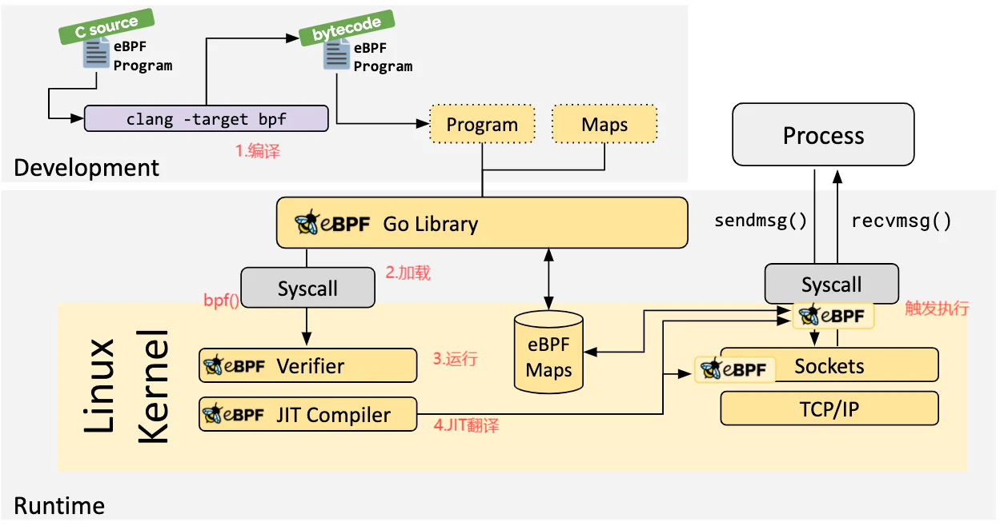
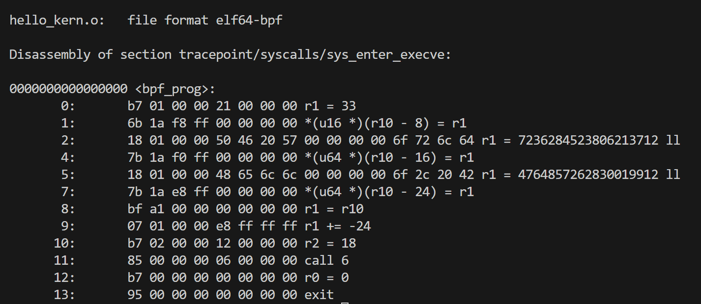
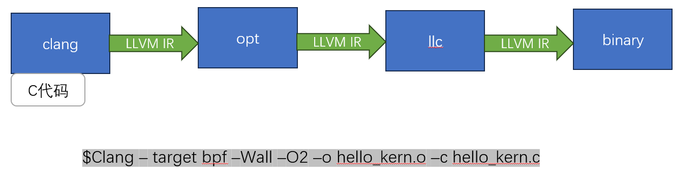
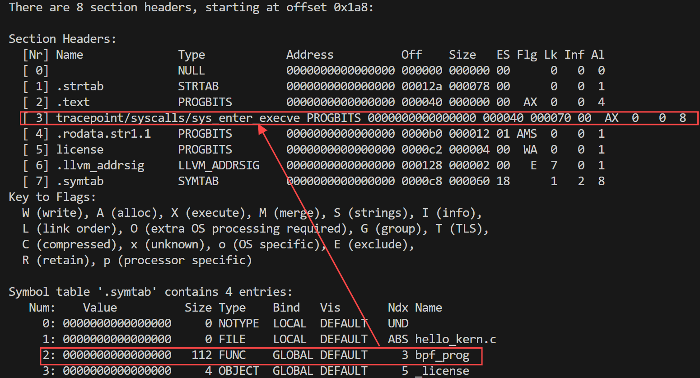
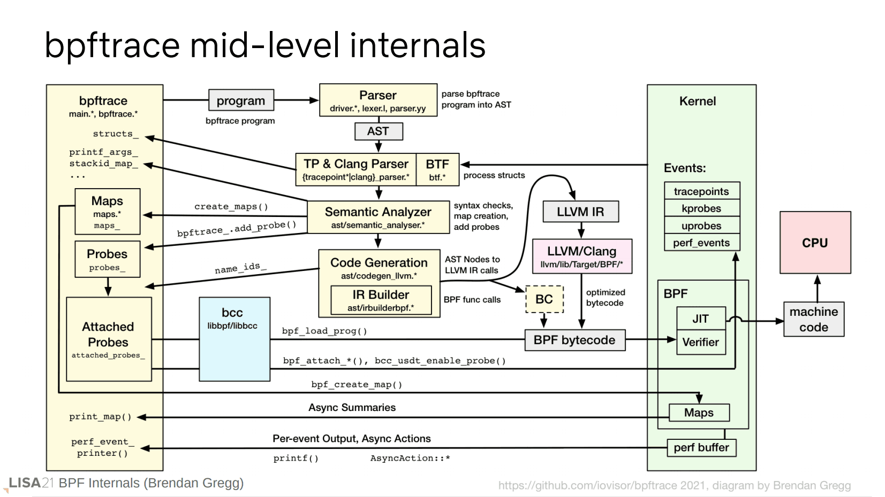
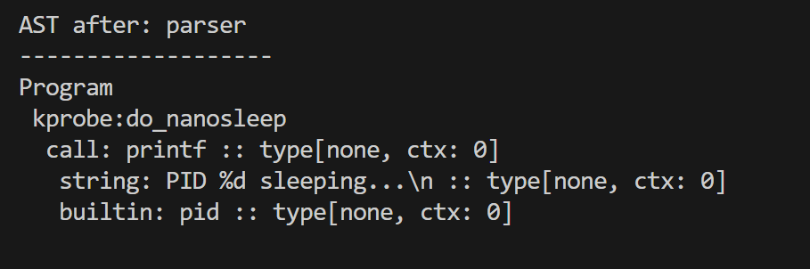
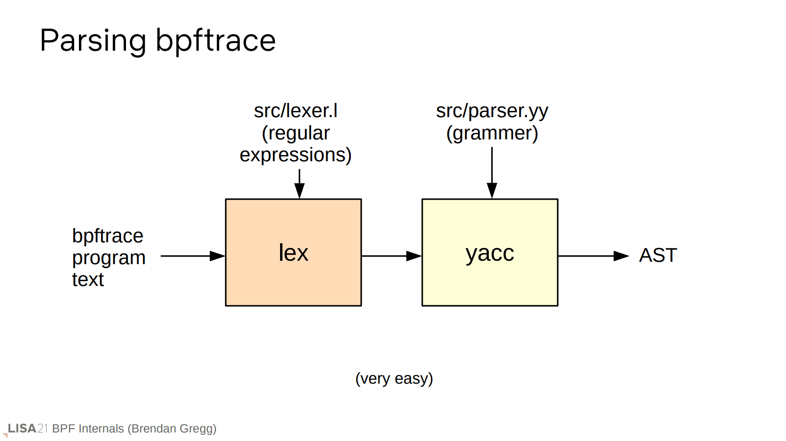
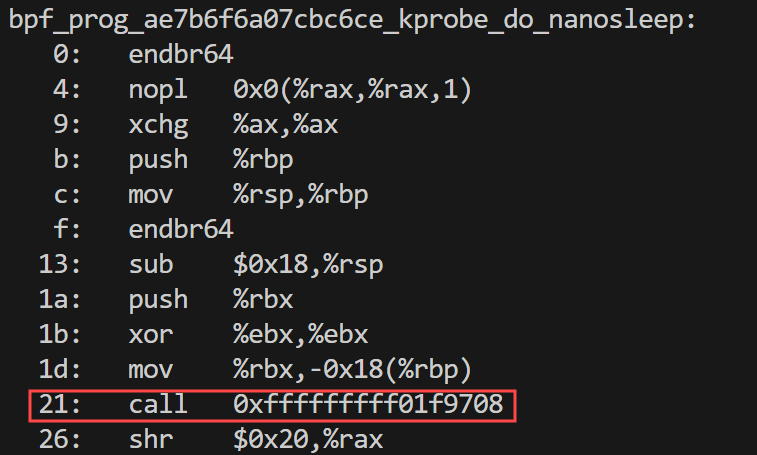
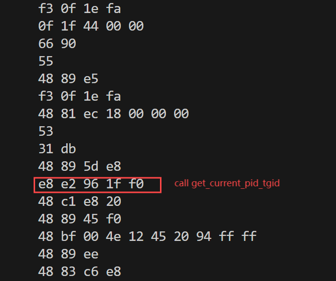

# 深入探析 eBPF：从程序编写到执行的全流程解析

在现代Linux内核中，**eBPF**（Extended Berkeley Packet Filter）已经成为强大的工具，用于高效地在内核中执行定制代码，帮助用户监控、分析和优化系统性能。然而，eBPF的执行机制背后蕴含着一套复杂的流程：从编写用户态程序、编译、加载到内核，验证，再到最终的执行，涉及多个关键步骤。在这篇文章中，我将从eBPF用户态代码开始分析，一步一步地去分析eBPF程序从编写代码到最终执行的整个过程。并且通过分析libbpf、bpftrace以及内核的源代码和一些调试信息，让大家对eBPF程序的编译、加载、验证、执行有一个清晰且完整的认识。

本文将重点从以下四个方面来分析eBPF的执行原理：

1. 编译：分析eBPF程序的编译过程。
2. 加载：分析eBPF程序的加载过程。
3. 验证：分析BPF虚拟机如何进行验证。
4. JIT：分析eBPF字节码如何转化为本地机器指令。

首先，我们先编写两个ebpf程序：

1.使用libbpf库来编写eBPF程序：（hello_kern.c）

```c
#include <linux/bpf.h>
#define SEC(NAME) __attribute__((section(NAME), used))

static int (*bpf_trace_printk)(const char *fmt, int fmt_size,
                                ...) = (void *)BPF_FUNC_trace_printk;

SEC("tracepoint/syscalls/sys_enter_execve")
int bpf_prog(void *ctx) { 
    char msg[] = "Hello, BPF World!";  
    bpf_trace_printk(msg, sizeof(msg));
    return 0;
}

char _license[] SEC("license") = "GPL";      
```

以上程序实现了一个简单的打印功能，我们后面会详细对这个程序进行分析。

2.使用bpftrace编写eBPF程序：

```shell
bpftrace -e 'kprobe:do_nanosleep { printf("PID %d sleeping...\n", pid); }'
```

这个bpftrace程序追踪了`do_nanosleep` 内核函数（该函数会在进程睡眠时触发），并打印出触发该函数的进程PID。

写好了这两个程序，接下来我会通过这两个例子来详细介绍eBPF程序的整个执行过程。首先，我会使用一张图来给大家宏观介绍一下eBPF程序的执行流程。



这张图是eBPF官方给出的图，接下来我会从图中标注的四个重点步骤来简要说明一下：

> 1.编译：
>
> - eBPF 程序以 C 语言编写，使用 `clang -target bpf` 编译器将 C 源代码编译为 eBPF 字节码。这个字节码是内核可以理解并执行的代码格式。
> - 编译之后，生成的 eBPF 程序字节码和与之相关的 eBPF 映射（Maps）可以通过用户态程序进行管理。
>
> 2.加载：
>
> - 编译生成的 eBPF 程序会通过 `libbpf` 库加载到 Linux 内核中。这个步骤涉及使用 `bpf()` 系统调用将 eBPF 程序提交给内核进行处理。
> - 同时，eBPF Maps（存储 eBPF 程序运行时数据的结构）也会在用户态与内核之间进行交互。
>
> 3.验证：
>
> - 在程序加载后，eBPF 验证器会检查字节码，确保程序的安全性和合法性，防止 eBPF 程序破坏内核的稳定性。验证通过后，eBPF 程序通过 eBPF JIT（Just-In-Time）编译器进一步优化，将字节码转换为机器码以提升执行效率。
>
> 4.JIT：
>
> - 通过 JIT，eBPF 字节码被直接编译成底层的机器代码，程序可以直接在 CPU 上执行，无需经过解释过程。

有了上述的介绍，想必大家对eBPF程序的执行过程已经有了一个大致的认识了吧，接下来我们开始详细分析每个关键步骤。

## 一、编译阶段：

由于使用libbpf库编写的ebpf程序和使用bpftrace编写的eBPF程序在编译阶段的过程有一些不同，因此在本章节中我会说明每个工具在编译过程中特有的内容。

在编译阶段所做的事情可以总结为一句话：将用户写好的eBPF程序编译成eBPF字节码。那么什么是eBPF字节码？话不多是，直接看图：

```shell
//1.使用clang编译器对我们编写的hello_kern.c源代码进行编译：
clang -O2 -target bpf -c hello_kern.c -o hello_kern.o
//2.输出 eBPF 字节码和汇编指令
llvm-objdump -S hello_kern.o
```



如上图所示，每行中的左边一串16进制内容就是eBPF的指令字节码，右边是汇编指令。

接下来我们来分析Clang/LLVM是如何将ebpf的.c程序编译成字节码文件的。

### 1.1 Clang/LLVM编译eBPF程序过程



| 操作工具              | 功能                                                         |
| --------------------- | ------------------------------------------------------------ |
| clang                 | Clang负责将C源码（如`hello_kern.c`）编译成LLVM中间表示（LLVM IR），`-target bpf`标志表明目标架构是BPF（用于生成eBPF字节码）。命令中的`-Wall`启用所有警告，`-O2`用于优化代码以提高性能。 |
| opt（高层优化）       | 这一步通过多次优化（Pass 1到Pass N）对生成的LLVM IR进行高层次优化。这些优化可以包括代码清理、消除冗余代码、循环优化等，从而提高生成代码的效率和性能。 |
| llc（LLVM静态编译器） | LLC将优化后的LLVM IR转换为最终的二进制格式（即BPF字节码）。该字节码最终以ELF格式输出，适用于eBPF程序在内核空间中的加载和执行。 |
| binary                | eBPF字节码。                                                 |

上述内容分析了通过Clang编译器来进行编译的详细过程，接下来我们查看一下编译好的字节码文件中的内容（ELF文件内容）：

```shell
//llvm-readelf用于读取和显示ELF文件信息的工具，-S表示显示ELF文件中的节头，-s用于显示ELF文件中的符号表
llvm-readelf -S -s hello_kern.o
```



通过上述内容我们可以看到eBPF字节码文件的节头和符号表信息，里面包含了我们编写的程序通过编译后的各项信息。比如：在这里我们可以看到`SEC("tracepoint/syscalls/sys_enter_execve")`代码对应的Section信息，通过查看符号表，可以看到`bpf_prog`函数符号，大小为112个字节，位于第三个节 (`Ndx = 3`，对应 `tracepoint/syscalls/sys_enter_execve`)。

上述所讲解的Clang/LLVM编译eBPF程序的过程是libbpf库和bpftrace使用Clang/LLVM编译eBPF程序的共有过程，但是编译使用bpftrace编写的eBPF程序还需要在这个过程之前有一些操作，接下来详细解释。

### 1.2 bpftrace编译过程

libbpf编写的程序会通过`clang` 编译器将 C 代码转化为 eBPF 字节码。而bpftrace 程序的编译经过AST，LLVM IR（1.1分析内容），BPF bytecode这几个阶段，而接下来我会补充AST这个阶段：

为了方便讲解，在这里使用图片来展示bpftrace的编译加载等过程：



简单来讲，在AST这个阶段就是将我们使用bpftrace编写的程序转化为AST格式。然后进行语义分析等工作，最终交给Clang/LLVM工作，最终形成eBPF字节码。那么通过AST处理后的最终结果是什么呢？请看下图：

```
// AST 的结构示意可以使用 -d 查看
bpftrace -d -e 'kprobe:do_nanosleep { printf("PID %d sleeping...\n", pid); }'
```



那么这个结果是怎么获得的呢？



上面这张图展示了从编写的bpftrace程序到AST结构的处理流程，接下来我会通过如何解析pid这个字段来从源码的角度说明这个过程：

1.首先，由于使用了 pid（bpftrace 内置变量），因此在 lex 查表过程中识别为 **builtin**：（bpftrace/src/lexer.l）

```c
ident    [_a-zA-Z][_a-zA-Z0-9]*
map      @{ident}|@
var      ${ident}
hspace   [ \t]
vspace   [\n\r]
space    {hspace}|{vspace}
path     :(\\.|[_\-\./a-zA-Z0-9#+\*])+
builtin  arg[0-9]|args|cgroup|comm|cpid|numaid|cpu|ctx|curtask|elapsed
|func|gid|pid|probe|rand|retval|sarg[0-9]|tid|uid|username|jiffies
```

2.进一步在 yacc 中匹配**BULITIN**就能分配一个关于 `pid` 的 AST 结点。

```.C
primary_expr:
                IDENT              { $$ = driver.ctx.make_node<ast::Identifier>($1, @$); }
        |       int                { $$ = $1; }
        |       STRING             { $$ = driver.ctx.make_node<ast::String>($1, @$); }
        |       STACK_MODE         { $$ = driver.ctx.make_node<ast::StackMode>($1, @$); }
        |       BUILTIN            { $$ = driver.ctx.make_node<ast::Builtin>($1, @$); }
        |       CALL_BUILTIN       { $$ = driver.ctx.make_node<ast::Builtin>($1, @$); }
        |       LPAREN expr RPAREN { $$ = $2; }
        |       param              { $$ = $1; }
        |       map_or_var         { $$ = $1; }
        |       "(" vargs "," expr ")"
                {
                  auto &args = $2;
                  args.push_back($4);
                  $$ = driver.ctx.make_node<ast::Tuple>(std::move(args), @$);
                }
                ;
```

最终，我们就获取到了AST结构信息。再通过语义分析和LLVM/Clang的处理就可以得到eBPF字节码文件了。

## 二、加载阶段：

通过编译阶段得到了eBPF字节码文件，接下来我们来分析eBPF字节码是如何加载进内核的。本章节我会通过libbpf的源码来分析这个阶段：（libbpf/src/bpf.c）

```c
int bpf_prog_load(enum bpf_prog_type prog_type,
		  const char *prog_name, const char *license,
		  const struct bpf_insn *insns, size_t insn_cnt,
		  struct bpf_prog_load_opts *opts)
{
	const size_t attr_sz = offsetofend(union bpf_attr, prog_token_fd);
	void *finfo = NULL, *linfo = NULL;
	const char *func_info, *line_info;
	__u32 log_size, log_level, attach_prog_fd, attach_btf_obj_fd;
	__u32 func_info_rec_size, line_info_rec_size;
	int fd, attempts;
	union bpf_attr attr;
	char *log_buf;
	// 增加系统的 memlock 资源限制
	bump_rlimit_memlock();
	// 检查传入的选项是否有效
	if (!OPTS_VALID(opts, bpf_prog_load_opts))
		return libbpf_err(-EINVAL);
	// 尝试次数选项处理，若尝试次数小于 0 返回错误，若为 0 则设置为默认尝试次数
	attempts = OPTS_GET(opts, attempts, 0);
	if (attempts < 0)
		return libbpf_err(-EINVAL);
	if (attempts == 0)
		attempts = PROG_LOAD_ATTEMPTS;
	// 初始化 bpf_attr 结构体
	memset(&attr, 0, attr_sz);
	// 设置 eBPF 程序的类型和附加选项
	attr.prog_type = prog_type;
	attr.expected_attach_type = OPTS_GET(opts, expected_attach_type, 0);
	// 设置 BTF 和其他相关的选项
	attr.prog_btf_fd = OPTS_GET(opts, prog_btf_fd, 0);
	attr.prog_flags = OPTS_GET(opts, prog_flags, 0);
	attr.prog_ifindex = OPTS_GET(opts, prog_ifindex, 0);
	attr.kern_version = OPTS_GET(opts, kern_version, 0);
	attr.prog_token_fd = OPTS_GET(opts, token_fd, 0);
	// 如果程序名称存在并且支持功能特性，则复制程序名称
	if (prog_name && feat_supported(NULL, FEAT_PROG_NAME))
		libbpf_strlcpy(attr.prog_name, prog_name, sizeof(attr.prog_name));
	attr.license = ptr_to_u64(license);
	// 指令数量检查，如果指令数量超过 UINT_MAX 则返回错误
	if (insn_cnt > UINT_MAX)
		return libbpf_err(-E2BIG);
	// 设置指令和指令数量
	attr.insns = ptr_to_u64(insns);
	attr.insn_cnt = (__u32)insn_cnt;
	// 获取附加的程序 FD 和 BTF 对象 FD
	attach_prog_fd = OPTS_GET(opts, attach_prog_fd, 0);
	attach_btf_obj_fd = OPTS_GET(opts, attach_btf_obj_fd, 0);
	// 检查 attach_prog_fd 和 attach_btf_obj_fd 的冲突情况
	if (attach_prog_fd && attach_btf_obj_fd)
		return libbpf_err(-EINVAL);
	// 设置 BTF 附加 ID 和相应的 FD
	attr.attach_btf_id = OPTS_GET(opts, attach_btf_id, 0);
	if (attach_prog_fd)
		attr.attach_prog_fd = attach_prog_fd;
	else
		attr.attach_btf_obj_fd = attach_btf_obj_fd;
	// 获取日志缓冲区和日志选项
	log_buf = OPTS_GET(opts, log_buf, NULL);
	log_size = OPTS_GET(opts, log_size, 0);
	log_level = OPTS_GET(opts, log_level, 0);
	// 确保日志缓冲区和日志大小的一致性
	if (!!log_buf != !!log_size)
		return libbpf_err(-EINVAL);
	// 获取函数信息和行信息的记录大小
	func_info_rec_size = OPTS_GET(opts, func_info_rec_size, 0);
	func_info = OPTS_GET(opts, func_info, NULL);
	attr.func_info_rec_size = func_info_rec_size;
	attr.func_info = ptr_to_u64(func_info);
	attr.func_info_cnt = OPTS_GET(opts, func_info_cnt, 0);
	line_info_rec_size = OPTS_GET(opts, line_info_rec_size, 0);
	line_info = OPTS_GET(opts, line_info, NULL);
	attr.line_info_rec_size = line_info_rec_size;
	attr.line_info = ptr_to_u64(line_info);
	attr.line_info_cnt = OPTS_GET(opts, line_info_cnt, 0);
	// 设置 fd 数组
	attr.fd_array = ptr_to_u64(OPTS_GET(opts, fd_array, NULL));
	// 设置日志相关的选项，如果启用了日志
	if (log_level) {
		attr.log_buf = ptr_to_u64(log_buf);
		attr.log_size = log_size;
		attr.log_level = log_level;
	}
	// 调用系统调用加载 eBPF 程序
	fd = sys_bpf_prog_load(&attr, attr_sz, attempts);
	OPTS_SET(opts, log_true_size, attr.log_true_size);
	if (fd >= 0)
		return fd;
	// 如果加载失败且 errno 为 E2BIG，尝试调整 func_info 和 line_info 并重试加载
	while (errno == E2BIG && (!finfo || !linfo)) {
		if (!finfo && attr.func_info_cnt &&
		    attr.func_info_rec_size < func_info_rec_size) {
			// 修正 func_info 并重新尝试
			finfo = alloc_zero_tailing_info(func_info,
							attr.func_info_cnt,
							func_info_rec_size,
							attr.func_info_rec_size);
			if (!finfo) {
				errno = E2BIG;
				goto done;
			}

			attr.func_info = ptr_to_u64(finfo);
			attr.func_info_rec_size = func_info_rec_size;
		} else if (!linfo && attr.line_info_cnt &&
			   attr.line_info_rec_size < line_info_rec_size) {
			// 修正 line_info 并重新尝试
			linfo = alloc_zero_tailing_info(line_info,
							attr.line_info_cnt,
							line_info_rec_size,
							attr.line_info_rec_size);
			if (!linfo) {
				errno = E2BIG;
				goto done;
			}
			attr.line_info = ptr_to_u64(linfo);
			attr.line_info_rec_size = line_info_rec_size;
		} else {
			break;
		}
		// 再次尝试加载 eBPF 程序
		fd = sys_bpf_prog_load(&attr, attr_sz, attempts);
		OPTS_SET(opts, log_true_size, attr.log_true_size);
		if (fd >= 0)
			goto done;
	}
	// 如果没有启用日志，但提供了日志缓冲区，重新尝试加载并启用日志
	if (log_level == 0 && log_buf) {
		attr.log_buf = ptr_to_u64(log_buf);
		attr.log_size = log_size;
		attr.log_level = 1;
		fd = sys_bpf_prog_load(&attr, attr_sz, attempts);
		OPTS_SET(opts, log_true_size, attr.log_true_size);
	}
done:
	// 释放分配的内存
	free(finfo);
	free(linfo);
	return libbpf_err_errno(fd);
}
```

这段代码 `bpf_prog_load` 是 `libbpf` 库中用于加载 eBPF 程序到内核的重要函数，它执行了一系列步骤，将编译好的 eBPF 程序通过系统调用加载到内核中，并附加到特定的内核事件或子系统上。以下是程序中的一些关键部分及其解释：

1.`bump_rlimit_memlock()`函数：

- 这个函数提高了 `RLIMIT_MEMLOCK` 限制，确保在加载 eBPF 程序时**有足够的锁定内存可用**。加载 eBPF 程序可能需要锁定一定量的内存，因此必须调整这个限制。

2.准备 `union bpf_attr` 结构体：

union bpf_attr是一个内核接口，包含了加载 eBPF 程序所需的所有参数。函数开始时，代码将这个结构体初始化，并填充有关 eBPF 程序的详细信息，比如：

- `prog_type`: eBPF 程序的类型（如 `BPF_PROG_TYPE_XDP` 或 `BPF_PROG_TYPE_TRACEPOINT`）。
- `insns`: 指向编译好的 eBPF 字节码的指针。
- `insn_cnt`: eBPF 指令的数量。
- `license`: eBPF 程序的许可证信息。
- `prog_flags`: 可选的程序标志。

3.设置与附加点相关的字段:

- 如果 eBPF 程序需要附加到某个特定的内核钩子点（如 tc 或 XDP），则会设置 `attach_prog_fd` 或 `attach_btf_obj_fd`，这些字段告诉内核要将 eBPF 程序附加到哪。

4.调用 `sys_bpf_prog_load`:

- 核心部分：加载 eBPF 程序的关键步骤是调用系统调用 `sys_bpf_prog_load`，这是直接与内核通信的接口。它将填充好的 `union bpf_attr` 传递给内核，内核验证并尝试加载程序。
- `sys_bpf_prog_load` 函数会返回一个文件描述符（`fd`），表示成功加载的 eBPF 程序。如果失败，会返回一个负值，并设置 `errno`。

接下来再往下追踪`sys_bpf_prog_load`函数，最终追踪到了系统调用层面。

```c
static inline int sys_bpf(enum bpf_cmd cmd, union bpf_attr *attr,
			  unsigned int size)
{
	return syscall(__NR_bpf, cmd, attr, size);
}
```

总结一下，在加载阶段，会将编译阶段的eBPF字节码文件进行进一步的处理，并通过系统调用加入到内核空间中去 。

加载之后，内核就可以运行eBPF程序了吗？那当然不行，加载进内核的程序肯定是要安全可靠的，要是eBPF程序有问题，进而造成内核崩溃，那后果可太严重了。针对此问题，内核虚拟机里的验证器发挥了巨大作用。

## 三、验证阶段

验证阶段的工作非常繁琐，总之它的作用就是要验证你的程序对于内核来说是无害的。以下是内核中eBPF 验证器的主要入口函数代码：（/kernel/bpf/verifier.c）

```c
int bpf_check(struct bpf_prog **prog, union bpf_attr *attr, bpfptr_t uattr)
{
	u64 start_time = ktime_get_ns(); // 获取验证器开始时间，用于计算验证时间
	struct bpf_verifier_env *env; // 定义验证器环境
	struct bpf_verifier_log *log; // 定义日志
	int i, len, ret = -EINVAL; // 初始化一些变量
	bool is_priv; // 检查用户是否拥有特权权限

	// 为 bpf_verifier_env 分配内存。它包含了程序的验证状态和日志信息
	env = kzalloc(sizeof(struct bpf_verifier_env), GFP_KERNEL);
	if (!env)
		return -ENOMEM; // 如果内存分配失败，返回错误
	log = &env->log; // 初始化日志指针

	len = (*prog)->len; // 获取程序的指令长度
	// 分配内存给每条指令的辅助数据，保存原始索引信息
	env->insn_aux_data = vzalloc(array_size(sizeof(struct bpf_insn_aux_data), len));
	ret = -ENOMEM;
	if (!env->insn_aux_data)
		goto err_free_env; // 如果内存分配失败，跳转到清理部分
	for (i = 0; i < len; i++)
		env->insn_aux_data[i].orig_idx = i; // 初始化每条指令的原始索引
	env->prog = *prog; // 将程序指针赋值给验证环境
	env->fd_array = make_bpfptr(attr->fd_array, uattr.is_kernel); // 生成文件描述符数组指针
	is_priv = bpf_capable(); // 检查是否具有执行 eBPF 的权限

	// 初始化验证器状态
	mark_verifier_state_clean(env);

	// 处理 BPF_LD_IMM64 伪指令，这是将立即数加载到寄存器的特殊指令
	ret = resolve_pseudo_ldimm64(env);
	if (ret < 0)
		goto skip_full_check; // 如果处理失败，跳转到后续部分

	// 检查程序的控制流图，确保它是合法的
	ret = check_cfg(env);
	if (ret < 0)
		goto skip_full_check; // 如果控制流检查失败，跳过后续的完整检查

	// 验证子程序（如果有的话）模拟整个运行过程，特别是对于指针访问的每个细节进行检查
	//！！！！！这里就是经常编写ebpf程序容易报错的地方
	ret = do_check_subprogs(env);   
	ret = ret ?: do_check_main(env); // 验证主程序

skip_full_check:
	// 释放在验证期间分配的状态表内存
	kvfree(env->explored_states);

	// 优化程序中的循环结构
	if (ret == 0)
		ret = optimize_bpf_loop(env);

	// 如果用户有特权，移除程序中的死代码
	if (is_priv) {
		if (ret == 0)
			ret = opt_remove_dead_code(env);
	} else {
		// 如果没有特权，只清理死代码（不移除）
		if (ret == 0)
			sanitize_dead_code(env);
	}

	// 转换上下文中的特定访问，如对网络包字段的访问
	if (ret == 0)
		ret = convert_ctx_accesses(env);

	// 修正函数调用参数，确保其合法性
	if (ret == 0)
		ret = fixup_call_args(env);   

	// 记录验证所花费的总时间
	env->verification_time = ktime_get_ns() - start_time;

err_free_env:
	// 清理分配的验证器环境
	kfree(env);
	return ret;
}
```

这里列举的代码并不全面，读者要是想深入了解验证器的实现过程，请自行阅读源码。验证器所需要验证的内容和所需做的工作如下图所示：


## 四、JIT阶段

要是使用eBPF字节码再加上eBPF指令解释器来运行eBPF程序效率是很低的，JIT（即时编译，Just-In-Time compilation）很好的解决了这个问题，并且目前大多数机器支持了这个功能。使用JIT的优势如下：

1. 通过 JIT，eBPF 字节码被直接编译成底层的机器代码，程序可以直接在 CPU 上执行，无需经过解释过程。因此，JIT 编译可以显著提高 eBPF 程序的执行速度，尤其是在高频调用或性能关键场景下。
2. 解释器在逐条执行 eBPF 字节码时，需要进行大量的上下文切换和检查操作，增加了运行的开销。而 JIT 编译后的机器代码是直接在内核态执行的，这减少了指令解释、寄存器管理、栈管理等操作的开销。
3. eBPF 常用于网络包处理、性能监控等高性能场景。JIT 编译后的程序执行速度接近于内核中的原生代码，非常适合这些需要低延迟、高吞吐量的任务。特别是像 XDP（eXpress Data Path）这种需要处理每一个网络包的应用场景中，JIT 编译极大地减少了延迟。
4. 不同的 CPU 体系结构（如 x86、ARM）可以通过 JIT 编译生成最适合当前架构的机器代码，充分利用硬件资源，从而进一步提升运行效率。

接下来我们来查看一下eBPF字节码如何翻译成机器指令（x86体系结构），由于我们开始编写的bpftrace程序：`bpftrace -e 'kprobe:do_nanosleep { printf("PID %d sleeping...\n", pid); }'`使用到了pid变量，其实是调用了`get_current_pid_tgid`这个帮助函数，以此这里以call指令的翻译过程来举例：（arch/x86/net/bpf_jit_comp.c）

```c
static int do_jit(struct bpf_prog *bpf_prog, int *addrs, u8 *image, u8 *rw_image,
		  int oldproglen, struct jit_context *ctx, bool jmp_padding)
{
......
    case BPF_JMP | BPF_CALL: {
                int offs;

                func = (u8 *) __bpf_call_base + imm32;
                if (tail_call_reachable) {
                    RESTORE_TAIL_CALL_CNT(bpf_prog->aux->stack_depth);
                    if (!imm32)
                        return -EINVAL;
                    offs = 7 + x86_call_depth_emit_accounting(&prog, func);
                } else {
                    if (!imm32)
                        return -EINVAL;
                    offs = x86_call_depth_emit_accounting(&prog, func);
                }
                if (emit_call(&prog, func, image + addrs[i - 1] + offs))
                    return -EINVAL;
                break;
            }
......
}
```

通过分析，我们再追踪`emit_call`函数：

```c
static int emit_call(u8 **pprog, void *func, void *ip)
{
	return emit_patch(pprog, func, ip, 0xE8);
}
```

最终，call指令翻译到x86中的操作码是0xE8。

通过反汇编查看指令`get_current_pid_tgid`指令：

```shell
bpftool prog dump jited id 965
```



第11行是`get_current_pid_tgid`函数的汇编指令。

接下来我们通过bpftool工具来查看eBPF程序通过JIT翻译后的的机器码：

```shell
#这里的965是本机ebpf程序的编号
bpftool prog dump jited id 965 opcodes | grep -v :
```



可以发现，第十一行的call指令被翻译成了e8，正好与JIT翻译后的CALL指令的机器码一致。

## 五、总结

通过本文对 eBPF 原理的分析，希望能帮助大家在 eBPF 实现原理层面获得更深入的认识。虽然本文在某些细节上尚未进行深入探讨，但我们相信它能为您提供 eBPF 程序运行全过程的初步认知，并为您后续深入学习特定方面奠定基础。若文中存在理解不准确的地方，欢迎指正，感谢各位读者的耐心阅读。

**参考资料：**

- 性能专家 Brendan Gregg（《性能之巅》作者）在 USENIX 上做的关于 eBPF 工作原理的演讲和相关文档
- 《Linux内核观测技术BPF》译者之一，狄卫华老师关于eBPF原理讲解视频。
- 书籍：《BPF之巅》