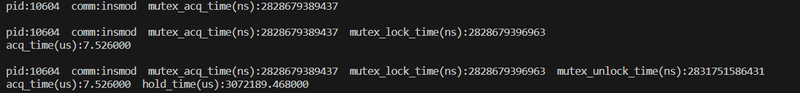

# mutex_development_record

## 开发思路

<div align='center'></div>

### 情形1

eBPF程序内核态程序设计：

- 挂载点选择：

  - kprobe:mutex_lock
  - kretprobe:mutex_lock
  - kretprobe:mutex_unlock

- 统计事件：

  ```
  struct mutex_event{
      int pid;
      char comm[TASK_COMM_LEN];
      long long unsigned int mutex_acq_time;
      long long unsigned int mutex_lock_time;
      long long unsigned int mutex_unlock_time;
  };
  ```

- kprobe:mutex_lock

  初始化mutex_event，完成pid、comm、mutex_acq_time数据的采集，并建立哈希map；通过ringbuf完成第一次输出。

- kretprobe:mutex_lock

  通过哈希map，找到mutex_event，并写入mutex_lock_time；通过ringbuf完成第二次输出。

- kretprobe:mutex_unlock

  通过哈希map，找到mutex_event，并写入mutex_unlock_time；通过ringbuf完成第三次输出。

eBPF程序用户态程序设计：

- 指定画像进程pid以及跟踪时间

- 对ringbuf中的事件进行分类输出

  ```
  if(e->mutex_unlock_time!=0){
      printf("pid:%d  comm:%s  mutex_acq_time:%llu  mutex_lock_time:%llu  mutex_unlock_time:%llu\n",
  		e->pid,e->comm,e->mutex_acq_time,e->mutex_lock_time,e->mutex_unlock_time);
  	acq_time = (e->mutex_lock_time - e->mutex_acq_time)*1.0/1000.0;
  	hold_time = (e->mutex_unlock_time - e->mutex_lock_time)*1.0/1000.0;
  	printf("acq_time:%lf  hold_time:%lf\n",acq_time,hold_time);
  }else if(e->mutex_lock_time!=0){
  	printf("pid:%d  comm:%s  mutex_acq_time:%llu  mutex_lock_time:%llu\n",
  		e->pid,e->comm,e->mutex_acq_time,e->mutex_lock_time);
  	acq_time = (e->mutex_lock_time - e->mutex_acq_time)*1.0/1000.0;
  	printf("acq_time:%lf\n",acq_time);
  }else{
  	printf("pid:%d  comm:%s  mutex_acq_time:%llu\n",
  		e->pid,e->comm,e->mutex_acq_time);
      }
  ```

### 情形2

### 情形3

## 实验记录

### 情形1

为了验证eBPF程序的正确性，设计测试程序mutex_test1.c（./mutex_test1.c），测试程序逻辑如下：

```
......
mutex_lock(&my_mutex);
ssleep(3); 					// Sleep for 3 seconds
mutex_unlock(&my_mutex);
......
```

运行结果：

<div align='center'></div>

实验分析：从运行结果中可以看出互斥锁的持有时间为3072189.468000微秒（即3.072189468秒），再结合测试程序，测试程序在持有锁期间睡眠3秒即释放锁，运行结果的误差在合理的范围之内，因此该程序在准确性上满足要求，可以成功的对情形1进行进程互斥锁的画像。

## 下一步迭代计划