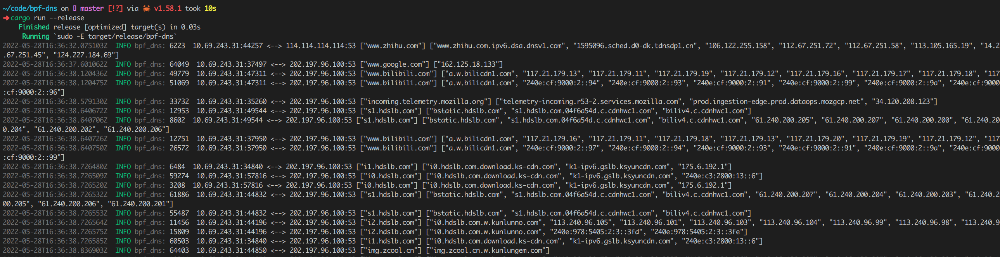

# 背景

本程序目前是 [基于eBPF的DNS Cache实现](https://www.gitlink.org.cn/glcc/subjects/detail/257) 的一个 demo。


# 运行
通过 docker 运行

```shell
docker run --rm --privileged=true --net=host -v /var/run/docker.sock:/var/run/docker.sock ghcr.io/7rah/ebpf-dns-cache:latest
```

安装 Rust toolchain，参照 redbpf 的[安装教程](https://github.com/foniod/redbpf#install=)安装所需程序，确保系统中的 `llvm` 版本号为 13。

安装完依赖，键入如下命令运行

```shell
$ cargo run --release
```


