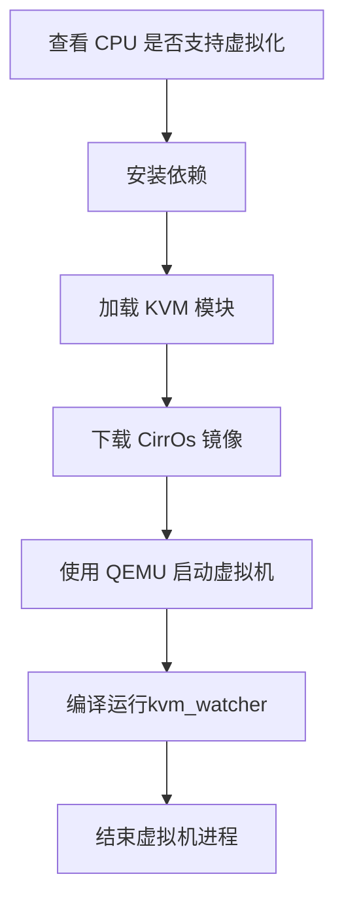

# kvm_watcher项目

## 一、项目简介

`kvm_watcher` 是一个基于 eBPF 技术的项目，旨在在宿主机侧监控和提取 KVM 虚拟机的性能指标，用于诊断对 `kvm` 可见的客户机行为，特别是与客户机相关的问题。同时对宿主机性能影响较小。该项目基于 eBPF 的实时监控方案，通过在宿主机中执行eBPF程序，实时捕获有关 KVM 虚拟机的关键性能数据和性能事件，提供全面的性能数据，帮助管理员优化虚拟化环境，改善虚拟机的运行效率和响应性，并且允许用户根据实际需求选择监控的指标和事件，实现个性化配置。

> 局限：鉴于不同体系结构的硬件辅助虚拟化技术，目前我们只适用于intel中的vmx技术。

## 二、功能介绍

`kvm_watcher`是一款基于eBPF的kvm虚拟机检测工具，其旨在使用户方便快捷在宿主机侧获取kvm虚拟机中的各种信息，报告所有正在运行的guest行为。


目前，其实现的功能主要包括：

- **[VM Exit 事件分析](./docs/kvm_exit.md)**
- **[KVM mmu事件分析](./docs/kvm_mmu.md)**
- **[vCPU相关指标分析](./docs/kvm_vcpu.md)**
- **[kvm中中断注入记录](./docs/kvm_irq.md)**
- **[hypercall信息统计](./docs/kvm_hypercall.md)**

## 三、使用方法

> 环境：
>
> Kernel: Linux6.2  
>
> OS: Ubuntu 23.04
>
> QEMU emulator version 7.2.0

**安装依赖：**

```
make deps
```


**编译运行：**

```
make bpf
sudo ./kvm_watcher [options]
make clean
```

**参数介绍：**

`kvm_watcher`通过一系列命令参数来控制其具体行为：

```
 _  ____     ____  __  __        ___  _____ ____ _   _ _____ ____  
| |/ /\ \   / /  \/  | \ \      / / \|_   _/ ___| | | | ____|  _ \ 
| ' /  \ \ / /| |\/| |  \ \ /\ / / _ \ | || |   | |_| |  _| | |_) |
| . \   \ V / | |  | |   \ V  V / ___ \| || |___|  _  | |___|  _ < 
|_|\_\   \_/  |_|  |_|    \_/\_/_/   \_\_| \____|_| |_|_____|_| \_|
Usage: kvm_watcher [OPTION...]
BPF program used for monitoring KVM event

  -c, --kvm_irqchip          Monitor the irqchip setting information in KVM
                             VM.
  -d, --mark_page_dirty      Monitor virtual machine dirty page information.
  -e, --vm_exit              Monitoring the event of vm exit(including exiting
                             to KVM and user mode).
  -f, --kvmmmu_page_fault    Monitoring the data of kvmmmu page fault.
  -h, --hypercall            Monitor the hypercall information in KVM VM 
  -i, --irq_inject           Monitor the virq injection information in KVM VM 
  -l, --kvm_ioctl            Monitoring the KVM IOCTL.
  -m, --mmio                 Monitoring the data of mmio page fault.(The -f
                             option must be specified.)
  -n, --halt_poll_ns         Monitoring the variation in vCPU halt-polling
                             time.
  -o, --vcpu_load            Monitoring the load of vcpu.
  -p, --vm_pid=PID           Specify the virtual machine pid to monitor.
  -t, --monitoring_time=SEC  Time for monitoring.
  -T, --kvm_timer            Monitoring the KVM hv or software timer.
  -v, --verbose              Verbose debug output.
  -w, --vcpu_wakeup          Monitoring the wakeup of vcpu.
  -?, --help                 Give this help list
      --usage                Give a short usage message
  -V, --version              Print program version

Mandatory or optional arguments to long options are also mandatory or optional
for any corresponding short options.

Report bugs to <nanshuaibo811@163.com>.
```

`-H`：输出帮助信息

`-e`：统计vm exit事件信息

`-f`：记录kvmmmu缺页信息

`-c`：记录kvm中断芯片设置相关信息

`-h`：统计hypercall发生的信息

`-m`：记录mmio缺页信息（需要和`-f`一同使用）

`-d`：记录kvm脏页信息

`-h`：记录hypercall超级调用信息

`-n`：记录vcpu的halt-polling相关信息

`-w`：记录vcpu唤醒时的相关信息

`-l`：记录kvm相关ioctl系统调用命令字

`-o`：统计VCPU在PCPU上的运行时间及相关信息

`-p`：指定kvm虚拟机进程pid

`-t`：监控时间

## 四、代码结构

```
├── docs                         //功能模块说明文档
│   ├── kvm_exit.md
│   ├── kvm_hypercall.md
│   ├── kvm_irq.md
│   ├── kvm_mmu.md
│   └── kvm_vcpu.md
├── include
│   ├── bpf                      //内核态bpf程序
│   │   ├── kvm_exits.h
│   │   ├── kvm_hypercall.h
│   │   ├── kvm_ioctl.h
│   │   ├── kvm_irq.h
│   │   ├── kvm_mmu.h
│   │   └── kvm_vcpu.h
│   ├── common.h           		  //内核态和用户态公共头文件
│   └── helpers					        //用户态帮助函数
│       ├── trace_helpers.h
│       └── uprobe_helpers.h
├── Makefile                    //编译脚本
├── README.md
├── src
│   ├── helpers					        //用户态帮助函数
│   │   ├── trace_helpers.c
│   │   └── uprobe_helpers.c
│   ├── kvm_watcher.bpf.c       //内核态bpf程序入口
│   └── kvm_watcher.c           //用户态bpf程序
└── temp                        //临时文件目录
```

## 五、测试

Makefile 提供了测试命令来进行测试。即使您没有设置过 KVM 虚拟化环境，也可以使用 Makefile 来测试程序的功能。

程序测试流程如下：



- **使用方法**

  要运行测试，请执行以下命令：

  ```
  make deps test
  ```

  这将自动执行上述测试流程，并在结束后提供测试结果。