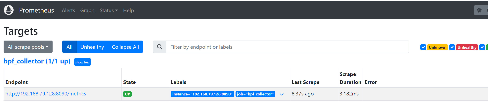
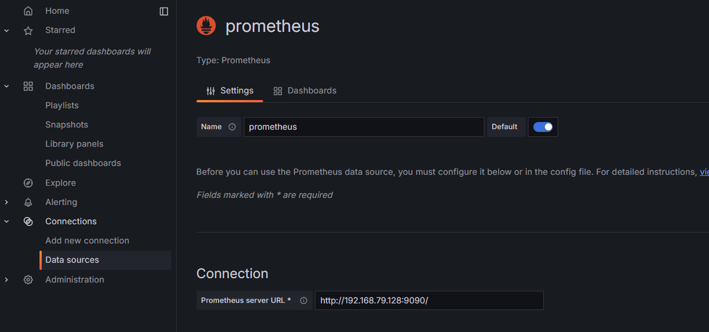
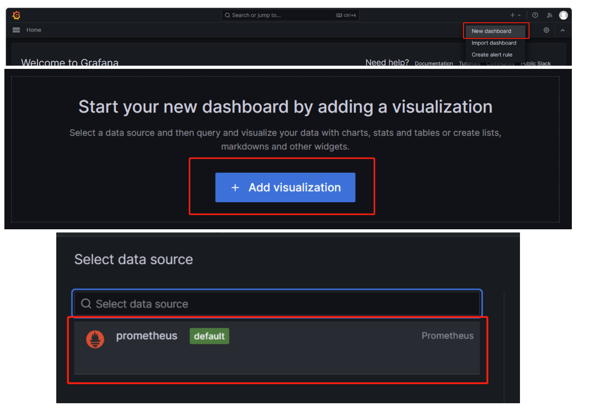

# KVM_WATCHER可视化指南

​	结合2023年开源之夏项目《使用 Prometheus 和 Grafana 构建 Linux 内核监控平台（基于 eBPF 程序采集内核数据）》进行可视化。

### 一、可视化策略：

**1.工具介绍：**

**Prometheus** 是一个开源的系统监控和报警工具，最初由SoundCloud开发，现在是CNCF（Cloud Native Computing Foundation）的一部分。

**Grafana** 是一个开源的分析和可视化平台，广泛用于数据可视化监控系统中。它能够与多种数据源集成，包括Prometheus。

Prometheus和Grafana常常一起使用，以实现全面的监控和可视化解决方案：

1. **数据收集**：Prometheus负责从各种服务和应用程序中收集时间序列数据，并将这些数据存储在其时间序列数据库中。
2. **数据可视化**：Grafana通过Prometheus数据源连接到Prometheus，使用PromQL查询数据，并在仪表盘中进行可视化展示。
3. **报警**：虽然Prometheus可以独立管理报警，但与Grafana结合使用时，可以在Grafana中直观地配置和管理报警规则，并利用Grafana的通知渠道。

​	通过kvm_watcher工具将虚拟机的各项指标采集出来，并将其放入到Prometheus所支持的Metrics中，利用http服务将采集出的Metrics数据通过端口的形式暴露出来，并将其存储到Prometheus的数据库中。接下来再通过grafana工具对Prometheus数据库中的数据进行可视化渲染，最终可以输出直观的监测结果。

**2.可视化流程：**


### 二、使用说明：

环境要求：

```shell
golang 1.19+
Docker version 24.0.4+
```

数据格式要求：

数据的格式必须要满足第一行是各项指标的名称，之后的每一行是数据（且是数字类型），并都以空格分隔。

```
pid          tid          total_time   max_time     min_time     counts       vcpuid      
6898         6908         2.0879       0.2376       0.0737       12           0                  
6970         6979         0.5860       0.2039       0.1088       4            0                      
6970         6980         1.6281       0.2237       0.1169       9            1                     
6898         6908         2.0206       0.2355       0.0632       13           0            
```

#### **1.安装Golang：**

```shell
#通过APT包下载go语言
sudo apt install golang
#查看go版本：
go version
```

#### **2.安装docker：**

```shell
请大家在docker官网的说明文档中，自行安装符合自己linux发行版的docker，链接如下：
https://docs.docker.com/engine/install/ubuntu
#开启docker服务
sudo service docker start
#若如下指令出现hello-world，则表明docker创建成功
sudo docker run hello-world
```

#### **3.运行可视化工具：**

在运行可视化工具之前，我们需要先配置需要被监控机器的地址：

配置文件目录：lmp/eBPF_Visualization/eBPF_prometheus/prom_core/prometheus.yaml 

```
#全局配置部分，应用于所有的 job 配置
global:
  # 设置全局的抓取间隔，即 Prometheus 将每隔 15 秒收集一次指标
  scrape_interval: 15s

# 抓取配置部分，用于指定要抓取的目标和相应的设置
scrape_configs:
  # 定义一个 job，命名为 'bpf_collector'，这个 job 用于配置 Prometheus 如何抓取数据
  - job_name: 'bpf_collector'
    # 指定从目标获取指标的路径，即采集路径
    metrics_path: '/metrics'
    # 配置静态目标的部分，其中的目标地址是静态的，不会动态变化
    static_configs:
      - targets: ["192.168.79.128:8090"]
```

这里我们需要将 - targets: ["192.168.79.128:8090"]配置项的192.168.79.128改为需要被采集的主机IP或者域名。

**3.1编译工具**

```shell
#进入lmp/eBPF_Visualization/eBPF_prometheus目录

#执行make指令，编译可视化的go语言工具
make
```

**3.2开启prometheus和grafana容器服务：**

```shell
#进入lmp/eBPF_Visualization/eBPF_prometheus目录，执行以下操作
make start_service
```

**3.3开启ebpf程序**

```shell
#进入lmp/eBPF_Visualization/eBPF_prometheus目录，执行以下操作
#开启ebpf程序，并且向8090端口推送ebpf程序采集的数据，发送给prometheus服务端
#这里以监测vcpu调度的数据来举例：
#目前-e、-o、-i、-f -m功能的数据格式已经适配了可视化工具，请读者使用以上四种功能的数据来进行可视化展示
./data-visual collect lmp/eBPF_Supermarket/kvm_watcher/kvm_watcher -o -p [进程号]
```

#### **4.可视化工具**

**4.1metrics:**

在浏览器中输入http://192.168.79.128:8090/metrics（IP地址是自己需要采集数据的主机地址），就可以查看ebpf程序输出的metrics数据了。


**4.2 prometheus**

在浏览器中输入http://192.168.79.128:9090，就可以进入到prometheus管理界面，在Status/Targets选项中，就可以看到上面的metrics信息了。



**4.3Grafana**

在浏览器中输入http://192.168.79.128:3000/，就可以进入到Grafana管理界面。

点击【Home-Connection-Add new connection】，选择Prometheus，建立与Prometheus服务器的连接：



这里的Prometheus server URL为被监测主机的IP+9090端口。

进入可视化配置界面：



选择需要可视化的数据，并点击Run queries,最后点击右上角的Apply，即可生成可视化图像：


### 三、说明

​	Prometheus和Grafana提供了许多强大的查询和运算功能，大家可以在环境搭建好以后，自己去定制化自己想要的可视化图表。总结一下，在对kvm_watcher进行可视化的时候，必须要注意数据的输出格式，并且要注意涉及的工具版本。