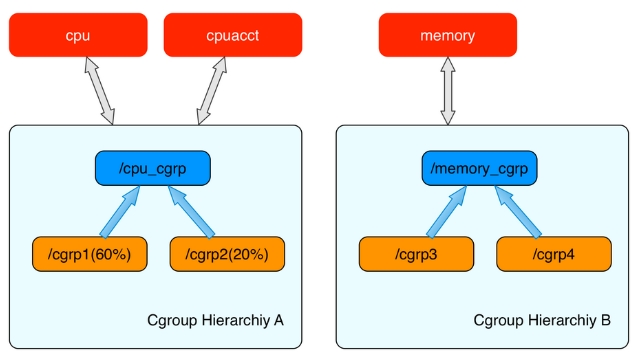
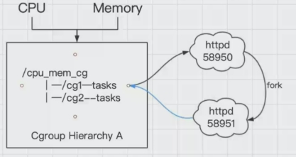

### cgroup相关概念
cgroups是linux内核中的一种机制，这种机制可以根据特定的行为把一系列的任务、子任务整合或者分离，按照资源划分的等级的不同，从而实现资源统一控制的框架。cgroup可以控制、限制、隔离进程所需要的物理资源，包括cpu、内存、IO，为容器虚拟化提供了最基本的保证，是构建docker一系列虚拟化的管理工具。

#### 1、cgroup提供了以下四个功能：
- 资源控制：
  cgroup通过进程组对资源总额进行限制，如程序使用内存时，要为程序设定可以使用主机的多少内存；
- 优先级分配：
  使用硬件的权重值，当两个程序都需要进程读取cpu，通过优先级来进行控制哪个先哪个后；
- 资源统计：
  可以统计硬件资源的用量，如cpu或内存使用了多长时间；
- 进程控制：
  可以对进程组实现挂起/恢复的操作。

#### 2、基本概念
- task-任务：
  表示系统中的某一个进程；
- cgroup-资源控制组：
  Cgroups中的资源控制都以cgroup为单位实现的，cgroup由task组成，表示按照某种资源控制标准而划分成的任务组（cgroup可以包含不同的子系统？）但是组名不能相同；
- subsystem-子系统：
  资源调度控制器，控制具体的使用资源，如cpu子系统控制cpu的时间分配、内存子系统可以控制某个cgroup内task的内存使用量、硬盘的子系统可以控制硬盘的读写等等；
  查看cgroup的子系统可以用以下命令：
  ```
    root@lmp:~# ll /sys/fs/cgroup/
    total 0
    drwxr-xr-x 15 root root 380 Mar 17 11:10 ./
    drwxr-xr-x 11 root root   0 Mar 17 11:10 ../
    dr-xr-xr-x  4 root root   0 Mar 17 11:10 blkio/
    lrwxrwxrwx  1 root root  11 Mar 17 11:10 cpu -> cpu,cpuacct/
    lrwxrwxrwx  1 root root  11 Mar 17 11:10 cpuacct -> cpu,cpuacct/
    dr-xr-xr-x  4 root root   0 Mar 17 11:10 cpu,cpuacct/
    dr-xr-xr-x  2 root root   0 Mar 17 11:10 cpuset/
    dr-xr-xr-x  4 root root   0 Mar 17 11:10 devices/
    dr-xr-xr-x  2 root root   0 Mar 17 11:10 freezer/
    dr-xr-xr-x  2 root root   0 Mar 17 11:10 hugetlb/
    dr-xr-xr-x  4 root root   0 Mar 17 11:10 memory/
    lrwxrwxrwx  1 root root  16 Mar 17 11:10 net_cls -> net_cls,net_prio/
    dr-xr-xr-x  2 root root   0 Mar 17 11:10 net_cls,net_prio/
    lrwxrwxrwx  1 root root  16 Mar 17 11:10 net_prio -> net_cls,net_prio/
    dr-xr-xr-x  2 root root   0 Mar 17 11:10 perf_event/
    dr-xr-xr-x  4 root root   0 Mar 17 11:10 pids/
    dr-xr-xr-x  2 root root   0 Mar 17 11:10 rdma/
    dr-xr-xr-x  5 root root   0 Mar 17 11:10 systemd/
    dr-xr-xr-x  5 root root   0 Mar 17 11:10 unified/
  ```

- hierarchy-层级树；
  可以由多个cgroup构成，每个hierarchy通过绑定的子系统（可绑定多个）对资源进行控制，且每个hierarchy可以包含多个子节点，子节点继承父节点的属性。

整体关系可以理解为：
整个系统可以有多个层级树hierarchy；
每个层级树是多个资源控制组cgroup的形成的树状关系，且这个层级树与特定的子系统subsystem进行了绑定；
一个资源控制组中可以由多个任务task。
如下图所示：


其他规则：
1）虽然一个层级树可以绑定多个子系统，但是每个子系统仅仅可以附加到多个没有任何子系统的层级树中；


2）一个进程可以被放在不同的资源控制组cgroup中，但是不能放在属于同一个层级树的不同cgroup中；


3）子进程刚产生时与父进程属性一致，即存在于同一个cgroup中，但是之后会根据需求移动到其它的cgroup中。


#### 3、cgroup使用举例-控制进程的cpu利用率
进入cpu目录：
> \# cd /sys/fs/cgroup/cpu

创建一个test目录，实际就是挂载了一个cpu子系统：
> \# mkdir test
> \# cd test

后台创建一个死循环命令使得该进程把cpu利用率占到100%：
> \# while : ; do : ; done &
[1] 125480

> \# top
PID USER      PR  NI    VIRT    RES    SHR S  %CPU %MEM     TIME+ COMMAND                
125480 root      20   0   22656   1660      0 R  **99.7**  0.0   0:42.55 bash                   
... 

对新的cpu子系统test做利用率的限制(-1表示不限制，50000表示50%)：
> \# cat cpu.cfs_quota_us 
-1

> \# echo 50000 > cpu.cfs_quota_us 
> \# cat cpu.cfs_quota_us 
50000

把进程pid加入到test子系统的任务中：
> \# echo 125480 > tasks 

重新查看使用率：
> \# top
PID USER      PR  NI    VIRT    RES    SHR S  %CPU %MEM     TIME+ COMMAND                
125480 root      20   0   22656   1660      0 R  **49.7**  0.0   4:01.71 bash  

#### 4、cgroup部分数据结构
在task_struct结构中有以下字段：
```c
struct task_struct
{
...
#ifdef CONFIG_CGROUPS
	/* Control Group info protected by css_set_lock */
	struct css_set __rcu *cgroups;
	/* cg_list protected by css_set_lock and tsk->alloc_lock */
	struct list_head cg_list;
#endif
...
}
```
每个进程对应一个css_set结构，css_set存储了与进程相关的cgropus信息;
cg_list用于将连到同一个css_set的进程组织成一个链表，进程和css_set的关系是多对一关系，如下图：


css_set代码如下：
```c
struct css_set {
	/* css_set的引用数，因为一个css_set可以被多个进程共用 */
	atomic_t refcount;

	/*用于把所有css_set组织成一个hash表，这样内核可以快速查找特定的css_set*/
	struct hlist_node hlist;

	/*
	 * Lists running through all tasks using this cgroup group.
	 * mg_tasks lists tasks which belong to this cset but are in the
	 * process of being migrated out or in.  Protected by
	 * css_set_rwsem, but, during migration, once tasks are moved to
	 * mg_tasks, it can be read safely while holding cgroup_mutex.
	 */
	struct list_head tasks; //tasks指向所有连到此css_set的进程连成的链表
	struct list_head mg_tasks;

	/*
	 * List of cgrp_cset_links pointing at cgroups referenced from this
	 * css_set.  Protected by css_set_lock.
	 */
	struct list_head cgrp_links;

	/* the default cgroup associated with this css_set */
	struct cgroup *dfl_cgrp;

	/*
	Subsys是一个指针数组，存储一组指向cgroup_subsys_state的指针。一个cgroup_subsys_state就是进程与一个特定子系统相关的信息。通过这个指针数组，进程就可以获得相应的cgroups控制信息了。
	 */
	struct cgroup_subsys_state *subsys[CGROUP_SUBSYS_COUNT];

...

};
```

cgroup子系统状态结构体如下：
```c
struct cgroup_subsys_state {
	/* PI: the cgroup that this css is attached to */
	struct cgroup *cgroup;

	/* PI: the cgroup subsystem that this css is attached to */
	struct cgroup_subsys *ss;

	/* reference count - access via css_[try]get() and css_put() */
	struct percpu_ref refcnt;

	/* PI: the parent css */
	struct cgroup_subsys_state *parent;

	/* siblings list anchored at the parent's ->children */
	struct list_head sibling;
	struct list_head children;

	/*
	 * PI: Subsys-unique ID.  0 is unused and root is always 1.  The
	 * matching css can be looked up using css_from_id().
	 */
	int id;

	unsigned int flags;

	/*
	 * Monotonically increasing unique serial number which defines a
	 * uniform order among all csses.  It's guaranteed that all
	 * ->children lists are in the ascending order of ->serial_nr and
	 * used to allow interrupting and resuming iterations.
	 */
	u64 serial_nr;

	/*
	 * Incremented by online self and children.  Used to guarantee that
	 * parents are not offlined before their children.
	 */
	atomic_t online_cnt;

	/* percpu_ref killing and RCU release */
	struct rcu_head rcu_head;
	struct work_struct destroy_work;
};

```

cgroup结构存放子系统的相关信息，代码如下：
```c
struct cgroup {
	/* self css with NULL ->ss, points back to this cgroup */
	struct cgroup_subsys_state self;

	unsigned long flags;		/* "unsigned long" so bitops work */

	int id;

	int level;

	int populated_cnt;

	struct kernfs_node *kn;		/* cgroup kernfs entry */
	struct cgroup_file procs_file;	/* handle for "cgroup.procs" */
	struct cgroup_file events_file;	/* handle for "cgroup.events" */

	unsigned int subtree_control;
	unsigned int child_subsys_mask;

	/* Private pointers for each registered subsystem */
	struct cgroup_subsys_state __rcu *subsys[CGROUP_SUBSYS_COUNT];

	struct cgroup_root *root; //root指向了一个cgroupfs_root的结构，就是cgroup所在的层级对应的结构体

	struct list_head cset_links;

	struct list_head e_csets[CGROUP_SUBSYS_COUNT];

	struct list_head pidlists;
	struct mutex pidlist_mutex;

	/* used to wait for offlining of csses */
	wait_queue_head_t offline_waitq;

	/* used to schedule release agent */
	struct work_struct release_agent_work;

	/* ids of the ancestors at each level including self */
	int ancestor_ids[];
};

```

过以上三个结构，进程就可以和cgroup连接起来了：task_struct->css_set->cgroup_subsys_state->cgroup。


#### 5、cgroup文件系统
上面提到的的cgroup目录是系统启动后挂载的一个文件系统：
```
# mount | grep cgroup
tmpfs on /sys/fs/cgroup type tmpfs (ro,nosuid,nodev,noexec,mode=755)
cgroup on /sys/fs/cgroup/unified type cgroup2 (rw,nosuid,nodev,noexec,relatime,nsdelegate)
cgroup on /sys/fs/cgroup/systemd type cgroup (rw,nosuid,nodev,noexec,relatime,xattr,name=systemd)
cgroup on /sys/fs/cgroup/devices type cgroup (rw,nosuid,nodev,noexec,relatime,devices)
cgroup on /sys/fs/cgroup/cpu,cpuacct type cgroup (rw,nosuid,nodev,noexec,relatime,cpu,cpuacct)
cgroup on /sys/fs/cgroup/memory type cgroup (rw,nosuid,nodev,noexec,relatime,memory)
cgroup on /sys/fs/cgroup/rdma type cgroup (rw,nosuid,nodev,noexec,relatime,rdma)
cgroup on /sys/fs/cgroup/blkio type cgroup (rw,nosuid,nodev,noexec,relatime,blkio)
cgroup on /sys/fs/cgroup/hugetlb type cgroup (rw,nosuid,nodev,noexec,relatime,hugetlb)
cgroup on /sys/fs/cgroup/net_cls,net_prio type cgroup (rw,nosuid,nodev,noexec,relatime,net_cls,net_prio)
cgroup on /sys/fs/cgroup/freezer type cgroup (rw,nosuid,nodev,noexec,relatime,freezer)
cgroup on /sys/fs/cgroup/perf_event type cgroup (rw,nosuid,nodev,noexec,relatime,perf_event)
cgroup on /sys/fs/cgroup/cpuset type cgroup (rw,nosuid,nodev,noexec,relatime,cpuset)
cgroup on /sys/fs/cgroup/pids type cgroup (rw,nosuid,nodev,noexec,relatime,pids)
```

系统通过VFS使得用户态进程使用到cgroups的功能，也是linux“一切皆文件”理念的贯彻，其定义大部分在文件/kernel/cgroup.c中：

文件系统类型
```c
static struct file_system_type cgroup_fs_type = {
	.name = "cgroup",
	.mount = cgroup_mount,
	.kill_sb = cgroup_kill_sb,
};
```
挂载的时候调用到cgroup_mount方法，这个方法会生成一个cgroups_root（cgroups层级结构的根）并返回目录结构dentry；

挂载过程
```c
static struct dentry *cgroup_mount(struct file_system_type *fs_type,
			 int flags, const char *unused_dev_name,
			 void *data)
{
    bool is_v2 = fs_type == &cgroup2_fs_type;
	struct super_block *pinned_sb = NULL;
	struct cgroup_subsys *ss;
	struct cgroup_root *root;
	struct cgroup_sb_opts opts;
	struct dentry *dentry;
	int ret;
	int i;
	bool new_sb;

	/*
	 * The first time anyone tries to mount a cgroup, enable the list
	 * linking each css_set to its tasks and fix up all existing tasks.
	 */
	if (!use_task_css_set_links)
		cgroup_enable_task_cg_lists();

	if (is_v2) {
		if (data) {
			pr_err("cgroup2: unknown option \"%s\"\n", (char *)data);
			return ERR_PTR(-EINVAL);
		}
		cgrp_dfl_root_visible = true;
		root = &cgrp_dfl_root;
		cgroup_get(&root->cgrp);
		goto out_mount;
	}

	mutex_lock(&cgroup_mutex);

	/* First find the desired set of subsystems */
	ret = parse_cgroupfs_options(data, &opts);
	if (ret)
		goto out_unlock;

	/*
	 * Destruction of cgroup root is asynchronous, so subsystems may
	 * still be dying after the previous unmount.  Let's drain the
	 * dying subsystems.  We just need to ensure that the ones
	 * unmounted previously finish dying and don't care about new ones
	 * starting.  Testing ref liveliness is good enough.
	 */
	for_each_subsys(ss, i) {
		if (!(opts.subsys_mask & (1 << i)) ||
		    ss->root == &cgrp_dfl_root)
			continue;

		if (!percpu_ref_tryget_live(&ss->root->cgrp.self.refcnt)) {
			mutex_unlock(&cgroup_mutex);
			msleep(10);
			ret = restart_syscall();
			goto out_free;
		}
		cgroup_put(&ss->root->cgrp);
	}

	for_each_root(root) {
		bool name_match = false;

		if (root == &cgrp_dfl_root)
			continue;

		/*
		 * If we asked for a name then it must match.  Also, if
		 * name matches but sybsys_mask doesn't, we should fail.
		 * Remember whether name matched.
		 */
		if (opts.name) {
			if (strcmp(opts.name, root->name))
				continue;
			name_match = true;
		}

		/*
		 * If we asked for subsystems (or explicitly for no
		 * subsystems) then they must match.
		 */
		if ((opts.subsys_mask || opts.none) &&
		    (opts.subsys_mask != root->subsys_mask)) {
			if (!name_match)
				continue;
			ret = -EBUSY;
			goto out_unlock;
		}

		if (root->flags ^ opts.flags)
			pr_warn("new mount options do not match the existing superblock, will be ignored\n");

		/*
		 * We want to reuse @root whose lifetime is governed by its
		 * ->cgrp.  Let's check whether @root is alive and keep it
		 * that way.  As cgroup_kill_sb() can happen anytime, we
		 * want to block it by pinning the sb so that @root doesn't
		 * get killed before mount is complete.
		 *
		 * With the sb pinned, tryget_live can reliably indicate
		 * whether @root can be reused.  If it's being killed,
		 * drain it.  We can use wait_queue for the wait but this
		 * path is super cold.  Let's just sleep a bit and retry.
		 */
		pinned_sb = kernfs_pin_sb(root->kf_root, NULL);
		if (IS_ERR(pinned_sb) ||
		    !percpu_ref_tryget_live(&root->cgrp.self.refcnt)) {
			mutex_unlock(&cgroup_mutex);
			if (!IS_ERR_OR_NULL(pinned_sb))
				deactivate_super(pinned_sb);
			msleep(10);
			ret = restart_syscall();
			goto out_free;
		}

		ret = 0;
		goto out_unlock;
	}

	/*
	 * No such thing, create a new one.  name= matching without subsys
	 * specification is allowed for already existing hierarchies but we
	 * can't create new one without subsys specification.
	 */
	if (!opts.subsys_mask && !opts.none) {
		ret = -EINVAL;
		goto out_unlock;
	}

	root = kzalloc(sizeof(*root), GFP_KERNEL);
	if (!root) {
		ret = -ENOMEM;
		goto out_unlock;
	}

	init_cgroup_root(root, &opts);

	ret = cgroup_setup_root(root, opts.subsys_mask);
	if (ret)
		cgroup_free_root(root);

out_unlock:
	mutex_unlock(&cgroup_mutex);
out_free:
	kfree(opts.release_agent);
	kfree(opts.name);

	if (ret)
		return ERR_PTR(ret);
out_mount:
	dentry = kernfs_mount(fs_type, flags, root->kf_root,
			      is_v2 ? CGROUP2_SUPER_MAGIC : CGROUP_SUPER_MAGIC,
			      &new_sb);
	if (IS_ERR(dentry) || !new_sb)
		cgroup_put(&root->cgrp);

	/*
	 * If @pinned_sb, we're reusing an existing root and holding an
	 * extra ref on its sb.  Mount is complete.  Put the extra ref.
	 */
	if (pinned_sb) {
		WARN_ON(new_sb);
		deactivate_super(pinned_sb);
	}

	return dentry;
}
```
