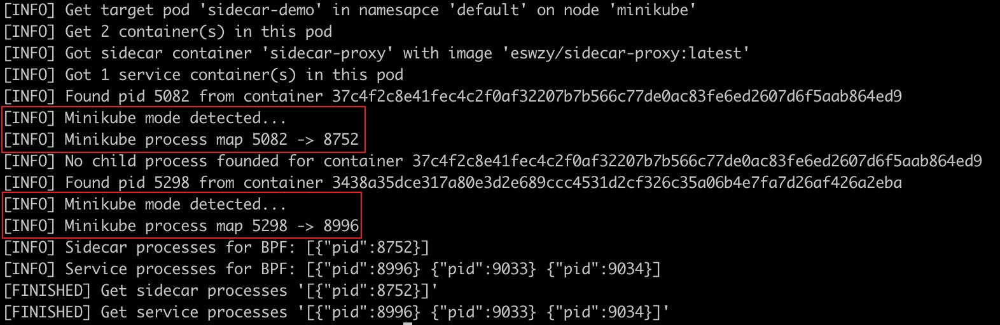

# 项目报告

## 项目信息

### 项目链接

<https://github.com/linuxkerneltravel/lmp/tree/develop/eBPF_Supermarket/sidecar>

### 项目名称

基于 eBPF 的云原生场景下 sidecar 的性能监测和优化分析

### 方案描述

在云原生场景中，为了便于对微服务进行流量治理，常常将与网络流量相关的认证、鉴权、服务发现、服务治理等相关功能封装为 sidecar 模式进行实施，以便全面接管微服务应用的上下行网络请求流量。但由于引进了新的组件，不可避免地造成了性能上的损失，特别是在 RPS（每秒请求次数）极高的情况下，sidecar 的性能指标甚至会成为限制微服务的重要瓶颈。

出于对 sidecar 的无侵入性和轻量化考量，很难在其内部进行数据抓取和暴露，所以通过高效的 BPF 工具在内核态和用户态进行全面监测必将是最优的选择。另外，基于 BPF 的强大的可观测性，可以对 sidecar 的关键性能事件进行细致地观察和分析，有助于发掘性能瓶颈，提高性能优化的针对性。

因此，本项目的目标是：基于 sidecar 模式下的业务调用逻辑和网络通信规律，通过 BPF 实现 sidecar 和业务容器之间网络栈调用关系；在此基础上，实现 CPU、内存、网络等热点资源消耗情况的数据采集和展示。进一步地，针对监控和分析中暴露的问题进行调整和优化。具体实施方案细节见本项目的时间规划部分。

### 时间规划

#### 准备工作（第一周、第二周）

根据项目目标，在第一周和第二周进行如下准备和配置工作：

1. 配置项目所需基础设施：搭建 3 节点的 [Kubernetes](https://github.com/kubernetes/kubernetes) 开发测试集群，并部署 sidecar 类型的微服务工作 pod（通常使用 [Istio](https://github.com/istio/istio) 实现，或使用自己实现的 sidecar 进行测试）。
2. 开发目标 pod 定位程序：通过 Go 或 Python 语言，实现对目标 pod 的定位。找出目标 pod 中的容器，根据规则确定业务容器和 sidecar 容器。最后根据容器定位符，确定其内部的若干进程，以便基于 BPF 进行目标进程定位。

#### 分析工作（第三周～第十一周）

##### 内核态分析（第三周～第五周）

1. 基于 sidecar 的业务类型，分析其中所需的性能事件（如磁盘 I/O、内存、网络、进程与线程模型等）。
2. 按照各类 sidecar 业务类型，通过基准测试工具设置负载，进行分类测试。
3. 通过 BPF 程序监控对应的性能事件，记录性能异常日志、统计分布、调用路径、资源消耗等信息。
4. 在测试过程中，对系统的整体状态进行监控，分析系统中其它部分是否对业务 pod 存在影响（如抢占等）。

##### 用户态分析（第六周～第七周）

1. 分析 sidecar 功能，按照不同的业务类型，选出对应的处理逻辑。
2. 通过 BPF 程序，无侵入式地跟踪用户态逻辑的状态，监控并记录 sidecar 用户态逻辑的资源消耗和工作时长。

##### 网络调用栈分析和优化（第八周～第十一周）

1. 通过 PID、源 IP、目的 IP 等信息，定位两种 pod-sidecar 之间的流量信息。
2. 通过基准测试工具设置负载模拟网络请求，并调节不同的网络状态进行分类测试。
3. 对其间的网络调用栈通过 BPF 程序进行监控，确定各部分的资源消耗和工作时延。
4. 通过 BPF 特有的内核协议栈数据包转发功能，进行套接字层面的数据包重定向，从而将网络协议栈短路，降低转发时延和资源消耗。

#### 数据收集和处理工作（第十二周、第十三周）

1. 将获取的数据进行清洗和整理，基于可视化技术的要求，将数据转换为易于可视化的格式，如 JSON、CSV 等，并对接到可视化框架中进行可视化展示。
2. 总结项目工作效果，整理和撰写项目文档，并撰写项目结项报告

## 项目总结

### 项目产出

本项目完整地实现了计划中的内容，并有所提高和扩展。本项目最终产出了一个名为 [PMOAS（Performance Monitoring and Optimization Analysis of Sidecar）](https://github.com/linuxkerneltravel/lmp/tree/develop/eBPF_Supermarket/sidecar) 的子项目。PMOAS 是一个基于 eBPF 的基于 sidecar 的 pod 全面监控和可视化工具，能够提供高效强大的监控和可视化功能，并提供了网络数据的优化功能。其中的功能包括：

- 对 sidecar 和业务容器的网络收发事件进行捕获和分析
- 探查 pod 内部网络协议栈中数据包的流转情况
- 基于 Socket Redirection 的本机网络数据传输优化
- 获取 pod 内部的容器资源消耗（内存、CPU、网络、I/O）
- 在业界常用的可视化平台上进行可视化
- 用于云原生领域的 BPF 开发工具链

#### 网络收发事件的捕获和分析

本项目通过 BPF 技术手段，实现了无侵入式地对网络收发数据包事件的监听和抓取。底层的 BPF 探测工具包括：

1. [TCP Accept Event Probe](https://github.com/linuxkerneltravel/lmp/blob/develop/eBPF_Supermarket/sidecar/bpf/tcpaccept)：捕获 TCP accept 事件及其信息。
2. [TCP Connect Event Probe](https://github.com/linuxkerneltravel/lmp/blob/develop/eBPF_Supermarket/sidecar/bpf/tcpconnect)：捕获 TCP connect 事件及其信息。
3. [TCP Close Event Probe](https://github.com/linuxkerneltravel/lmp/blob/develop/eBPF_Supermarket/sidecar/bpf/tcpclose)：捕获 TCP 关闭事件及其信息。

通过上述工具可以获得事件的基本信息带有基本信息和流量统计。通过[对事件的 PID、源 IP、目的 IP、源端口、目的端口，以及事件的类型进行解析和分析](https://github.com/linuxkerneltravel/lmp/blob/develop/eBPF_Supermarket/sidecar/perf/net/connect.go)，能够准确地感知到事件的状态，并进行记录和分析。

由于本项目是对 sidecar 进行监控，所以需要提取出 sidecar 容器和业务容器的 PID，用 PID 对网络事件进行分组，并且提取出特定的 accept 和 connect 事件的发生时间。这样就可以计算出 sidecar 在转发流量时的时延，以及从 sidecar 到业务容器的连接建立的时延。随后就能够对这些数据进行存储和展示，以供后续分析。可视化效果如下所示。

#### Pod 内部网络协议栈中数据包的流转监测

在对网络事件的捕获和分析测试过程中发现，在高并发请求的情况下 sidecar 到业务容器的连接会发生合并现象。经过调查分析探明，这是由于 sidecar 与业务容器之间保持了长连接。长连接会降低连接建立时的时间消耗，但这种情况会使不少 TCP 无法捕获，影响对网络事件的观测分析。因此为了提高对 pod 内外的网络事件的观测能力，本项目也实现了对 pod 内外的、与 sidecar 和业务容器相关的全链路网络数据包流动的捕获和抓取。

为了实现对网络事件的细致跟踪，一方面要将数据的抓取点位下移，在网络协议栈不同的位置进行数据捕获；另一方面需要对协议栈中的数据传递格式（skb）进行解析，获取到感兴趣的信息。其中的数据抓取点位包括但不限于：

- netif_rx
- netif_receive_skb
- tpacket_rcv
- packet_rcv
- napi_gro_receive
- __dev_queue_xmit
- br_handle_frame
- br_handle_frame_finish
- br_nf_pre_routing
- br_nf_pre_routing_finish
- br_pass_frame_up
- br_netif_receive_skb
- br_forward
- __br_forward
- deliver_clone
- br_forward_finish
- br_nf_forward_ip
- br_nf_forward_finish
- br_nf_post_routing
- br_nf_dev_queue_xmit
- ip_rcv
- ip_rcv_finish
- ip_output
- ip_finish_output

此外，为了实现对不同点位的数据抓取的扩展性，本项目也对 skb 的解析过程进行封装。这样在添加新的点位时就可以快速适配，提取感兴趣的指标。

[将以上的代码进行总结和封装](https://github.com/linuxkerneltravel/lmp/tree/develop/eBPF_Supermarket/sidecar/bpf/podnet)，可以获得的指标数据包括：网络数据的四元组、进程信息、网卡信息、TCP状态信息、skb 的信息等等。基于这些内核态信息，以及先前获得的用户层面的 pod、容器等信息，就可以[将网络数据包进行分组和分类，并进行数据的分析计算并可视化](https://github.com/linuxkerneltravel/lmp/blob/develop/eBPF_Supermarket/sidecar/perf/net/stack.go)。

数据包的分组包括 pod 内部的数据流动以及 pod 外部的数据流动。在 pod 内部一般是指从 sidecar 到业务容器，在 pod 外部一般是指从调用者 pod 到监控的 pod。

数据包的分类一般是基于当前数据包的协议以及协议状态来确定的。对于 TCP 来说，会解析出数据包当前所属的状态字，例如连接建立、数据传输以及连接关闭三大部分。而 UDP 协议的数据包一般是在跨主机网络中使用的覆盖网络通信。

一个具体的解析案例参见文末的[文档链接](./REPORT.md#网络协议栈事件解析案例)。

在解析完成后，就可以根据抓取的点位以及当前的数据包状态、流向、时间等信息计算出感兴趣的指标，比如：

- 数据包在协议栈两点之间的耗时情况，例如：
  - 路由查询耗时
  - iptables的过滤与处理耗时
  - pod 虚拟网卡转发耗时
  - 字段的添加与修改耗时
  - 检验和计算耗时
  - 其他步骤的耗时
- 某状态下的总耗时情况，例如：
  - 单向数据传输或 ACK 的全链路耗时
  - TCP 握手、数据传输、挥手阶段的耗时
- 用户态处理时间
  - sidecar 的数据处理与转发时延
  - 业务容器的用户态处理时间
- 网络请求 span 的可视化
- 等等

#### 基于 Socket Redirection 的本机网络数据传输优化

本项目也实现了[通过套接字层的转发加速网络数据传输的功能](https://github.com/linuxkerneltravel/lmp/tree/develop/eBPF_Supermarket/sidecar/bpf/sockops)。本项目在两个连接的握手过程中，将两端的 socket option 进行保存，在数据传输过程中，读取远端的 socket 位置。在获取目的 socket 之后，使用 `bpf_msg_redirect_hash` 将网络数据包直接重定向到远端接受者。

Socket 层面的转发能够实现在 socket 之间的转发，从而跳过整个网络协议栈，大大加速网络的传输效率。基于先前的网络协议栈中数据包的流转监测技术进行监测，发现在网络协议栈中抓取不到相关的数据包流动，并且整体的请求耗时也有较大程度的降低。

在全过程耗时的测试中，未优化时的单次请求耗时为 14.893286ms，而优化后的请求耗时为 10.276038ms，耗时降低 31.0%；在数据传输过程耗时的测试中，未优化时的数据传输耗时为 6.003148ms，而优化后的数据传输耗时为 1.391398ms，降低了 76.8%。由此看出，大部分时间消耗过程都是握手和挥手导致的，因此在传输数据量大的时候优化效果会更加明显。

#### Pod 内部的容器资源消耗信息获取

本项目通过开源工具以及本项目实现的 exporter 实现对性能指标的获取和暴露。使用到的工具及其作用如下所示：

- [Prometheus Node Exporter](https://github.com/prometheus/node_exporter)：获取主机设备的性能信息，CPU、内存等。
- [cAdvisor（Container Advisor）](https://github.com/google/cadvisor)：获得容器层级性能指标数据，如容器对 CPU、内存、网络、文件系统等资源的占用。
- 自建 [Prometheus exporter](https://github.com/prometheus/client_golang/)： 分析和暴露 BPF 获取的各种性能数据。

在通过工具获取以上的数据之后，会暂存在主机的内存中，并通过 exporter 以 web 形式对外暴露，等待数据存储和可视化组件进行抓取和处理。

#### 数据的收集与可视化

数据的收集和可视化过程主要通过可视化组件以及查询语言 PromQL 实现的。使用到的工具包括：

- [Prometheus](https://github.com/prometheus/prometheus)：监控系统状态，保存到时间序列数据库中，等待可视化展示
- [Grafana](https://github.com/grafana/grafana)：将数据导出展示为动态仪表盘，对实时工作状态进行监控和分析
- [Jaeger](https://github.com/jaegertracing/jaeger)：基于 [OpenTracing](https://opentracing.io/) 协议，将网络数据包在 pod 内外的流转情况，以流水线的形式进行展示和分析

本项目的整体仪表盘可视化效果如下所示，包括了传统的 CPU、内存、文件系统 I/O、网络吞吐量等 pod 指标的监控信息，也包括了本项目中的 BPF 程序获得的连接中的时延信息。通过本仪表盘，管理员可以清楚地掌握当前的系统状态和 pod 工作状态。

另外，通过对 Pod 内部网络协议栈中数据包的流转情况进行监测和分析，对其进行排序、分组、分类，并通过 OpenTracing 和 Jaeger 工具的可视化，得到网络请求中的各部分的流水图。在图中，根据左侧的注释，能够清晰看出 sidecar、远端调用者、业务容器之间的握手、数据传输以及挥手过程，并且根据 span 间隔的大小能够计算出每个部分的耗时情况。通过此部分的分析展示，可以让管理者清楚地看到哪一部有异常的时延情况并加以解决。效果如下所示：

#### 用于云原生领域的 BPF 开发工具链

在云原生场景下，应用几乎全部以容器的形式进行部署，并且通过 Kubernetes 进行编排。简单地说，容器就是云计算系统中的进程；容器镜像就是系统里的安装包；Kubernetes 就是操作系统。

Kubernetes 会通过 pod 概念来实现对容器的管理：

- 一个 Pod 相当于一台独立的主机
- 内部包含了若干个容器，同时共享一个网络命名空间
- Kubernetes 就是通过对 pod 的调度来实现对应用的管理
- 包括创建、销毁、扩缩容等操作

由于 Pod 是 Kubernetes 的最小调度单位，所以本项目也是基于 pod 来进行监控。

为了筛选出感兴趣的内核事件，最常用的手段就是进程的 PID。因此要根据 pod 的逐层封装，自顶向下地解析出所需要的进程 PID。

首先是根据指定的 pod 名称获取全部的容器信息。这里是通过 [Kubernetes 的 client-go 开发包](https://github.com/kubernetes/client-go)，向 Kubernetes 的资源管理组件发送请求信息，获取 pod 中的全部容器。其中包括容器 ID 等信息。

然后是获取容器中的进程信息：以 Docker 为例，通过 [Docker 的 Go 开发包](https://github.com/moby/moby/tree/master/client)，基于容器 ID，请求容器信息。其中包括进程 PID、根目录等。

最后一步就是获取进程的全部子进程。一般来说，sidecar 容器和微服务业务容器会以多进程的形式工作。为了保证不缺失 BPF 事件信息，需要主动探测并获取容器进程的子进程。

本项目通过将以上过程进行抽象和封装，构建了一套灵活高效的云原生 BPF 开发工具链，便于后续的进一步开发和扩展。

### 方案进度

本项目完整实现了预期的进度，并在此基础上进行了提高。实现了对 pod、容器、sidecar 等多个维度的指标数据采集、存储和可视化。实现了细致的网络子系统的监控和可视化。在此基础上，也进行了网络数据传输的优化，大大提高了网络数据传输的效率。

### 问题及解决方案

在项目的开发过程中，也遇到了一些问题，并在均在调查与研究中进行解决。

#### 主机指标的采集与暴露

在项目设计之初，曾经希望通过手动编写代码来读取机器上的各种指标。但经过测试发现，主机上的指标浩如烟海，仅仅通过手动获取工作量大，而且收集的类型肯定有所缺失。因此转而通过现有开源工具进行实现。在开发时使用到了诸如 Prometheus node exporter 和 cAdvisor 以及 Prometheus export 等开源工具。通过已有的可视化工具能够实现对目标的高效快速的监控和可视化。

#### 网络协议栈监测逻辑的设计

在通过 accept 事件和 connect 事件对 sidecar 和业务容器之间的连接建立进行监控的过程中，在高并发场景下，经常会发现仅仅有 sidecar 的而 accept 事件而没有看到 sidecar 到业务容器的 connect 事件以及业务隆起的 accept 事件。这就说明了 sidecar 成功接收到了来自调用者的请求而在业务容器上没有新的链接产生。但此时查看调用者的返回，调用者也能成功获得所需要的数据。通过对网络进行抓包和调查其他资料得知，这是由于 sidecar 到业务容器之间的连接没有关闭，而是多次连接合并到一条连接上。这样的好处就是可以大大降低连接建立时的资源消耗，但这样也会造成网络事件的缺失。因此在本项目开发的过程中，就希望通过一种更加底层的方式，监控数据包在网络协议栈中的流转，提高对网络系统的可观察性。在并发数为 20 的场景下，出现长连接合并请求的次数如下所示：

因此，下一步的目标就是对 pod 内部的网络协议栈中数据包的流转进行监测。网络子系统是 Linux 内核中的一个重要组成部分，其中的 kprobe 和 tracepoint 有成百上千个，其参数格式也不尽相同。经过对网络协议栈关键路径的分析和相关资料的查阅，选取了一组有代表性的插桩测试点，并且选择通过对 skb 的解析实现网络数据包的分析。skb 数据结构包含了丰富的内容，通过解析skb能够实现较好的流量识别效果。

#### 网络事件解析过程中的问题

这对网络事件的调用者进行筛选的过程中发现，在某些情况下网络数据包所在的处理进程，并不是所预期的用户态进程，而是由内核进程 ksoftirq 等等进行处理，有时甚至会发现有其他进程代为处理的现象发生。因此本项目在筛选网络事件的过程中仅仅将 PID 作为一个辅助筛选条件，而是通过 IP、端口和 PID 共同对网络事件进行筛选，这样大大提高了网络事件的分类准确率。

#### Minikube 场景下的问题与解决办法

在很多情况中，不具备使用多节点集群进行开发的条件，因此，不少开发者都会使用 [Minikube](https://minikube.sigs.k8s.io/) 来进行辅助开发。为了简化开发难度，本项目也对 Minikube 进行了支持。在开发的过程中也遇到了一些棘手的问题，经过数周的分析和测试，这些问题得到了解决。

[当 Minikube 的驱动是 Docker 时，集群的所有组件都被封装在一个巨大容器当中运行](https://minikube.sigs.k8s.io/docs/drivers/docker/)，其中会包括诸如 Docker daemon 等组件。Docker 容器的基本信息如下所示：

本项目在对 pod 进行分析时，需要对容器的信息进行获取，而通常情况下容器的信息获取是和 Docker daemon 进行交互而获得的。但由于 Minikube 中的 Docker daemon 在一个容器当中，因此本项目在程序运行之时，通过环境变量的方式，将 Minikube 中的 Docker daemon 的 IP 和端口传递给程序，并让程序借此进行进一步的容器信息获取，这样就能够获取到 Minikube 中的某个 pod 的容器信息。

另外，在 Minikube 中获取进程的根命名空间下的 PID 也是一个难度较高的事情。先前提到，在使用 Docker 作为驱动的 Minikube 中，所有的进程都是被封装为一个巨大的的 Docker container 的，其进程 PID 排布也都使用的是这个容器的命名空间之下的组织形式。在通过容器信息获取到的进程信息与 PID 也是与主机上的根命名空间的信息是不同的。经过对文献资料的查找以及对 `/proc` 文件系统的测试，本项目在运行时，会去读取 `/proc` 文件系统中的所有进程的 `status` 子文件的 `NSpid` 字段，这个字段包括了进程在嵌套的 PID 命名空间中的 PID。示意图如下所示：

因此本项目通过对其进行索引，并结合 Minikube 「大容器」的根进程的 PID 信息获取到 Minikube 的全部子进程。通过这种方式筛选出在该命令空间之下的 PID 的映射。这样就可以通过这个映射获取到根命令空间之下的进程 PID，并通过这个 PID 进行事件筛选。经过测试发现，这种筛选形式也能够准确地对 Minikube 中的各种网络事件进行筛选。PID 的转换过程如下所示。

#### BPF 开发中遇到的问题

在开发事件获取的程序时，需要保持事件的结构体以 8 个字节为单位对齐。如果编写了不对齐的代码，编译器总是会做一些不可知的事情，自动添加一些 padding 或调整字段的位置。另外，C 的编译器和 Go 的编译器有时也会以不同的方式组织结构体。这样，当从 C 到 Go 中读取二进制数据时，会造成数据的紊乱。因此，就需要保持数据结构对齐以避免上述问题。

在 [iovisor/bcc@ffff0ed](https://github.com/iovisor/bcc/commit/ffff0edc00ad249cffbf44d855b15020cc968536) 中，BCC 的开发人员更改了 bcc_func_load 的签名。然而，gobpf 在这方面仍然缺乏维护。作为一种解决方法，本项目在开发过程中，提维护了一个新库，只需在 `go.mod` 文件中使用 `replace` 指令替换 `github.com/iovisor/gobpf => github.com/eswzy/gobpf v0.2.1-0.20220720201619-9eb793319a76`（这是通过 `go get github.com/eswzy/gobpf@0.24.0` 获得的)。

### 项目完成质量

本项目在开发的过程中也非常注重项目的质量，时刻保证工程结构合理（文件组织、抽象逻辑）、提供多角度测试（单元测试和集成测试）、文档完备。

本项目按照代码的功能逻辑，将代码分别置于不同的文件夹目录，当中符合工程设计的规范。此外，本项目也注重对代码逻辑的抽象和封装，代码中的错误处理也会通过 Go 语言的 `error` 逐层向上传递。

本项目的文件功能如下所示：

- bpf：BPF 程序及其处理代码
- cmd：命令行管理控制逻辑
- dev：用于开发测试的组件代码（自建 sidecar 等）
- doc：项目文档以及入门手册
- k8s：Kubernetes 交互与信息处理代码
- optimize：系统优化工具
- perf：性能监测代码
- policy：项目中使用到的分类逻辑（区分 sidecar 类型等）
- tools：本项目的通用处理工具
- visualization：可视化组件及其代码

此外，在项目的根目录当中，也存放了本项目的 CI 文件，通过单元测试和集成测试对本项目进行多角度的测试，保证开发的过程中运行结果的正确。

### 与导师的沟通和反馈情况

在项目的开发过程中，通过多种手段进行项目进展的沟通：

1. 每周进行项目总结和未来工作计划汇报，能够和导师在会议上及时沟通，指出当前的工作中的不足和未来的开发方向。
2. 在完成某个功能需求后，会通过 PR 的形式进行代码提交。导师和社会维护人员会及时进行代码评审。
3. 当项目有较大进展时，通过直播分享的形式进行社区汇报，听取社区维护者和听众的意见反馈。

## 相关资料

### 网络协议栈事件解析案例

<https://docs.qq.com/sheet/DZm9UcHNjR1hrTkpW?tab=BB08J2>
