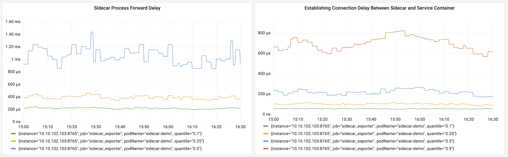
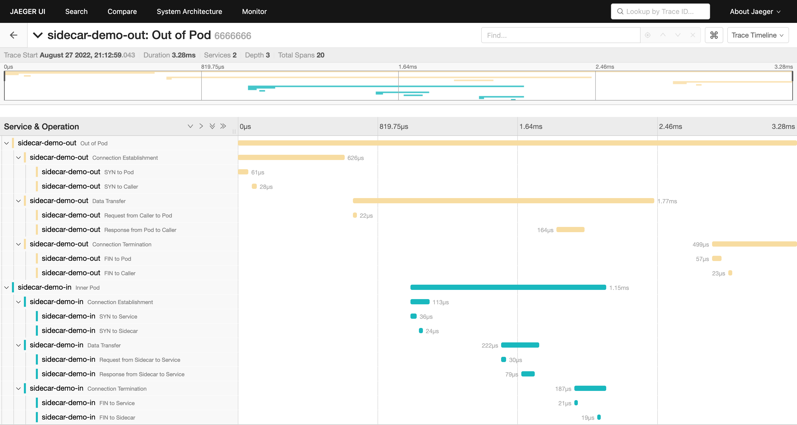

# Performance Monitoring and Optimization Analysis of Sidecar

<!---->

## Introduction

PMOAS is a eBPF-based tool for comprehensive monitoring and visualization of pods with sidecar, which provides efficient and powerful monitoring and visualization tools. It includes network event capture, flow of data packets in the pod's internal network protocol stack, container resource consumption acquisition in pod and so on, with visualization on the industry's common used visualization platforms.

## Background

In the cloud native scenario, in order to facilitate traffic governance of microservices, the service discovery, load balance, rate limiting, service routing and other service governance functions related to network traffic are often encapsulated into sidecar for implementation. The sidecar is always deployed near the microservices to take over the upstream and downstream network request traffic of microservices applications.

Although the intrusion into the business code can be greatly reduced through the sidecar mode, the introduction of a new component for traffic management will inevitably cause performance losses. Especially, in the case of extremely high RPS, the performance of sidecar will even become an important bottleneck to limit microservices.

Therefore, monitoring the resource consumption and network delay related to the sidecar can provide sufficient data support in terms of business code organization, network structure optimization, and reasonable resource scheduling, and verify whether the optimization effect is manifested.

## Functionality Overview

### Easy way to get Kubernetes resources

Due to the need of a lot of k8s data, this project encapsulates a large number of relevant information extraction steps, from top-level pod status information to container information to bottom-level process information.

The process of extracting data and information from Kubernetes and Docker containers:

```
$ sudo -E pmoas monitor all --pod sidecar-demo
[PREFLIGHT] Got default kubeconfig from '/home/zy/.kube/config'
[PREFLIGHT] Got node name 'minikube'
[PREFLIGHT] Got container runtime 'docker://20.10.17'
[INFO] Minikube root pid: 1567433
[INFO] Get target pod 'sidecar-demo' in namesapce 'default' on node 'minikube'
[INFO] Get 2 container(s) in this pod
[INFO] Got sidecar container 'sidecar-proxy' with image 'eswzy/sidecar-proxy:latest'
[INFO] Got 1 service container(s) in this pod
[INFO] Found pid 2414 from container 1b0dceedc2a228604baf1b527148ec880dd07c3ba133116b8700a1f04e2b1045
[INFO] Minikube mode detected...
[INFO] Minikube process map 2414 -> 1570049
[INFO] No child process founded for container 1b0dceedc2a228604baf1b527148ec880dd07c3ba133116b8700a1f04e2b1045
[INFO] Found pid 2366 from container 187099e8d36af07c3335c521f9ef5c5d2f0fbc219141971dd4397cfeb41dcf7b
[INFO] Minikube mode detected...
[INFO] Minikube process map 2366 -> 1570001
[INFO] Sidecar processes for BPF: [{"pid":1570049}]
[INFO] Service processes for BPF: [{"pid":1570001} {"pid":1570157} {"pid":1570158}]
[FINISHED] Get sidecar processes '[{"pid":1570049}]'
[FINISHED] Get service processes '[{"pid":1570001} {"pid":1570157} {"pid":1570158}]'
[INFO] got pod IP: 172.17.0.2, host IP: 192.168.49.2
```

### Flexible sidecar differentiation strategy

At the beginning of the design, this project focused on the flexible classification of sidecars, which can support both common sidecars and customized sidecars.

### TCP accept and connect between sidecar and service probe

As a proxy commonly used in the microservice field, sidecars often handle many short connections. Therefore, a large number of accept and connect events will be generated in those pods. Thus, with the powerful observability of eBPF, this project first uses network request events [accept(2)](https://man7.org/linux/man-pages/man2/accept.2.html) and [connetc(2)](https://man7.org/linux/man-pages/man2/connect.2.html) as the basic analysis dimension to monitor the occurrence and statistical indicators of network requests.



### Panoramic view of network protocol stack analysis

In some high-concurrency scenarios, based on the optimization of kernel mode and user mode, sidecar request connections to business containers may be merged. This will cause many network events to be skipped. In order to avoid this obstacle to observability and improve the monitoring of the status of the pod's internal network, this project uses eBPF to analyze the entire network protocol stack, and displays it in a pipelined way, so that the analyst can clearly recognize the current flow of network packets.



### Data transmission acceleration based on socket redirecting

This is a network forwarding feature based on the unique function of eBPF, which can realize direct communication between sockets, thereby allowing data to bypass the entire network protocol stack. This method can [greatly speed up the transmission of network packets](./doc/demo/sockops.md) between the sidecar and the business container, and also supports the forwarding of ALL LOCAL SOCKETS! Accelerate together!

### Metrics collection, storage and visualization

Monitoring of performance is an important part of this project. Then the display of monitoring results is also an indispensable part. To achieve this, we use Prometheus and Grafana stacks, which is common used, open system, and also easy to integrate with existing systems.


## Getting Started

- [Why This Project?](#introduction)
- [Getting Started](./doc/gettingstarted/getting-started.md)
- [Architecture and Concepts](./doc/overviews/component-overview.md)
- [Visualization Component Installing](./visualization/components/README.md)
- [Development Guide of BPF](./bpf/README.md)

## Roadmap

This is the development roadmap for the project. If you are interested in this project, you can get involved through the following features.

### Monitor

- [ ] Refine the network events in the network protocol stack, and count the interval time of any event of interest
- [ ] Calculate and export richer network statistical indicators and visualize them

### Optimization

- [ ] Replace NAT inside a pod via BPF programs
- [ ] Based on the above functions, manage the behavior of traffic passing through sidecar to adapt to some extreme cases (e.g. sidecar-unsupported traffic protocol or a breakdown of sidecar)

### Architecture

- [ ] Package and encapsulate the project as a DaemonSet for automated deployment on Kubernetes platform
- [x] Improve command line management logic
