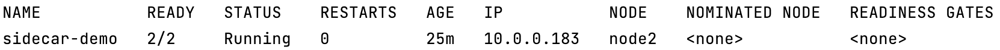

# Development Environment Setup

This directory is about development environment setup, for quick setup for development environment and demo presentation.

There are three subdirectories, they are:
 - [init](init): to build an init image for Kubernetes pod network configuration
 - [sidecar](sidecar): to build a sidecar image to provide a proxy for service pod
 - [service](service): to build a service image to provide a webserver service

## Usage

```shell
kubectl create namespace sidecar
kubectl label nodes YOUR_NODE_NAME sidecar-demo-node=dev
make all
kubectl apply -f sidecar-demo.yaml -n sidecar
kubectl get pods -o wide -n sidecar
```



## Benchmark

```
# ab -c 1000 -n 1000000 http://10.0.0.253:80/
This is ApacheBench, Version 2.3 <$Revision: 1430300 $>
Copyright 1996 Adam Twiss, Zeus Technology Ltd, http://www.zeustech.net/
Licensed to The Apache Software Foundation, http://www.apache.org/

Benchmarking 10.0.0.253 (be patient)
Completed 100000 requests
Completed 200000 requests
Completed 300000 requests
Completed 400000 requests
Completed 500000 requests
Completed 600000 requests
Completed 700000 requests
Completed 800000 requests
Completed 900000 requests
Completed 1000000 requests
Finished 1000000 requests


Server Software:        sidecar-proxy
Server Hostname:        10.0.0.253
Server Port:            80

Document Path:          /
Document Length:        615 bytes

Concurrency Level:      1000
Time taken for tests:   190.543 seconds
Complete requests:      1000000
Failed requests:        0
Write errors:           0
Total transferred:      830000000 bytes
HTML transferred:       615000000 bytes
Requests per second:    5248.17 [#/sec] (mean)
Time per request:       190.543 [ms] (mean)
Time per request:       0.191 [ms] (mean, across all concurrent requests)
Transfer rate:          4253.89 [Kbytes/sec] received

Connection Times (ms)
              min  mean[+/-sd] median   max
Connect:        0   51  30.9     51     216
Processing:     1  139  60.9    126     583
Waiting:        0  113  54.7    100     569
Total:          1  190  57.8    184     646

Percentage of the requests served within a certain time (ms)
  50%    184
  66%    204
  75%    219
  80%    230
  90%    264
  95%    298
  98%    339
  99%    364
 100%    646 (longest request)
```
