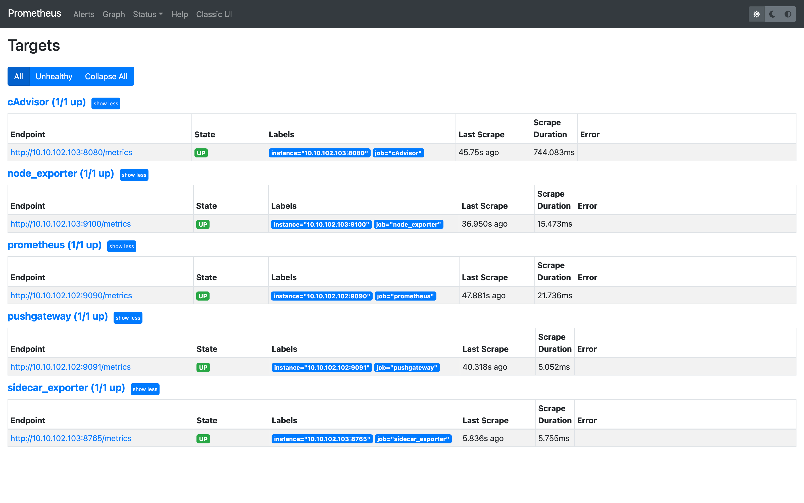
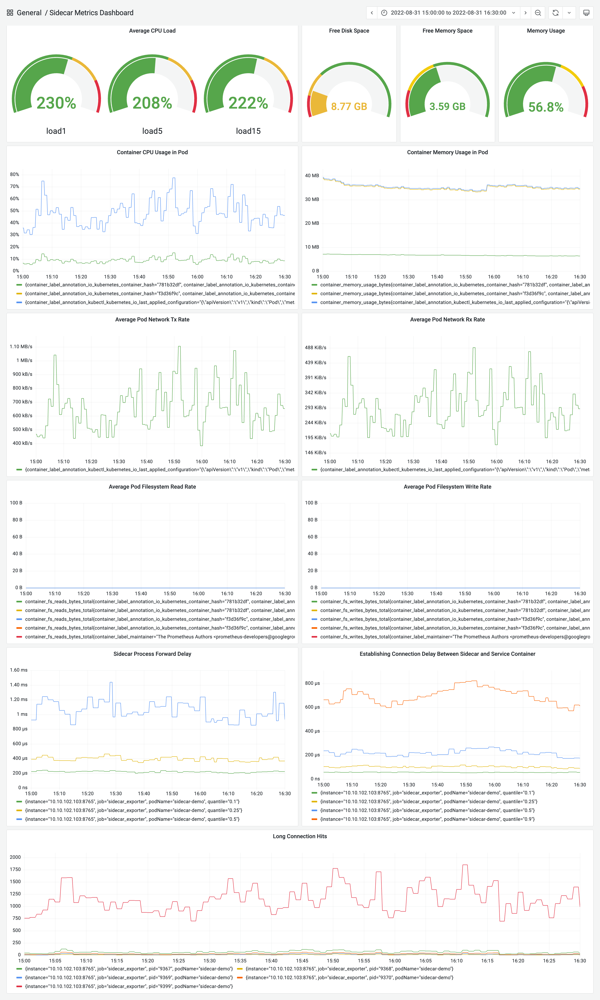

# Visualization

To visualize the performance of pod with sidecar, we need to set up some toolchain components.

## Architecture

For visualization, this project uses the following components:

- Node Exporter: exports the resource consumption of the node host
- cAdvisor: exports the resource consumption of containers
- Prometheus Exporter: defines metrics, analyzes, calculates and exposes them
- Prometheus: pulls，stores and queries specific metrics
- Grafana: exports data and displays it as dynamic dashboard to monitor and analyzes real-time work status
- Jaeger: displays network request span through pipeline format

## Steps

For all machines, run commands following.

Note that, if you want to deploy your components on different machines, you need to specify the following environment values. And, you can also edit the corresponding part of [Makefile](Makefile) to modify port configuration. 

```shell
export LOCAL_IP=$(YOUR_LOCAL_IP)
export SIDECAR_IP=$(YOUR_SIDECAR_NODE_IP)
export VISUALIZE_IP=$(YOUR_VISUALIZATION_NODE_IP)

make pull
make deploy
```

To stop all, just run:

```shell
make stop
make rm
```

It will stop all containers and delete it, but not the images.

After deploying all visualization components, you can see the data collection status of all components in the targets page of Prometheus.



If all components work properly, you can [import data source](https://grafana.com/docs/grafana/latest/datasources/add-a-data-source/) and configure dashboards on the Grafana page. 

As one of the visualization functions, this project also provides a dashboard to display system resource information, pod working status, and sidecar-related performance indicators. [The dashboard is saved as JSON](./sidecar-grafana-dashboard.json), and you can also import the dashboard into Grafana. The effect is as follows.


