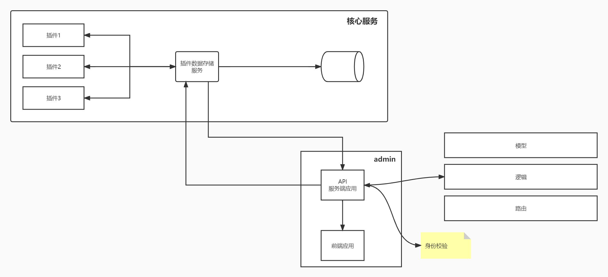

# 插件数据可视化部分thought log

#### 2022-04-08

今天开始使用thought log的形式记录项目方案的更迭。

`LMP可视化` 重构前的可视化方案采用的是集成现有的成熟组件，前端 + 后端（golang） + mysql + influxdb + grafana，这样的方案在企业或者生产环境是比较适用的，但是对于个人用户、轻量级用户来说，环境配置本身就比较繁琐。

因此目前的想法是把 `LMP可视化` 重构成一个非常轻量的、可配置的工具，不只是设计上，还有使用方法上，数据的存储默认提供一个内嵌数据库，然后把数据写入、获取这些留出接口，可以对接外部的数据库、可视化工具这样。

目前先暂时不考虑 `场景化分析可视化` ，所以核心功能其实是数据的获取和存储，一个草图：



使用方式分为两种，也就是有两个可执行文件会被编译出来：

第一种是命令行工具形式，例如：

```bash
$ lmp run YOUR_BPF_PROGRAM
```

执行后就可以把工具的输出进行本地化存储，并自动导出成 csv 格式，以便后续的 ML 算法。

第二种方法是 web 操作方法，前端部分 admin 和核心服务交互，`API服务端应用`负责解析前端参数，主要是解析出来需要执行哪个插件，然后将信息传递给`插件数据存储服务`，然后`插件数据存储服务`调用插件并执行，在插件执行后，`插件数据存储服务`会把插件的输出内容进行重定向，解析处理之后存储到内嵌数据库；

有个问题就是`插件数据存储服务`和`API服务端应用`之间怎么交互比较好，（消息队列？），还有就是这种场景下有没有一些适用的设计模式或者架构上比较好的设计。

另外我们想让 BPF 开发者以尽量小的代价完成数据的导出，要求如下：

- 是一个ELF或者python文件

- 第二个是输出格式要类似于这样子

```bash
[TIME|INTEGER         READ/s|INTEGER  WRITE/s|INTEGER ]
21:07:20                         1368                      105        
21:07:21                          136                       107       
21:07:22                          132                       105        
21:07:23                          132                       105        
21:07:24                          134                       108       
21:07:25                          131                       104      
```

第一行是指标的名称只需要指定指标的数据类型，下面就是每个指标具体的数据，除此之外，不需要限制输出数据中指标的个数，不需要在 eBPF 代码中加入任何的API,

--- 

更新：

以上是最核心的部分，而我们也提供外部的组件或者说是模块，例如说web部分，也就是图中的admin，可以接入核心服务，实现web页面下eBPF程序管理、web可视化功能等；

---


