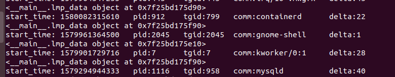

+++
title = "插件：cpu/runqlat.py"
description = "针对插件：plugins/cpu/runqlat.py 的分析"
weight = 5
+++

## 插件说明

插件地址： plugins/cpu/runqlat.py

## 插件功能说明

统计并总结CPU运行队列延迟情况。

## 插件代码解读

等待队列用于使得进程等待某一特定事件的发生，无需频繁的轮询，进程在等待周期中睡眠，当时间发生后由内核自动唤醒。

runqlat是一个BCC和bpftrace工具，用于测量CPU调度程序延迟，通常称为运行队列延迟(即使不再使用运行队列实现)。这对于识别和量化CPU饱和问题很有用，在CPU饱和问题中，对CPU资源的需求超出了服务能力。runqlat度量的指标是每个线程(任务)等待其打开CPU所花费的时间。


bpf_text ：

```
#include <uapi/linux/ptrace.h>
#include <linux/sched.h>
#include <linux/nsproxy.h>
#include <linux/pid_namespace.h>

typedef struct pid_key {
    u64 id;    // work around
    u64 delta;
    //char task[TASK_COMM_LEN];
} pid_key_t;

typedef struct pidns_key {
    u64 id;    // work around
    u64 delta;
    //char task[TASK_COMM_LEN];
} pidns_key_t;

typedef struct  original_data_key {
    u32 pid;
    u32 tgid;
    u64 timestamp;
    char comm[TASK_COMM_LEN];
    u64 cpu;
} original_data_key_t;

BPF_HASH(start, u32);
STORAGE

struct rq;


// record enqueue timestamp
static int trace_enqueue(u32 tgid, u32 pid)
{
    if (FILTER || pid == 0)
        return 0;
    u64 ts = bpf_ktime_get_ns();
    start.update(&pid, &ts);
    return 0;
}                        
```

bpf代码主程序部分，定义了所需的数据结构，完成了BPF_HASH映射，其中“STORAGE”、“FILTER”会根据参数不同替换为不同的代码。

bpf_text_kprobe：

```
int trace_wake_up_new_task(struct pt_regs *ctx, struct task_struct *p)
{
    return trace_enqueue(p->tgid, p->pid);
}

int trace_ttwu_do_wakeup(struct pt_regs *ctx, struct rq *rq, struct task_struct *p,
    int wake_flags)
{
    return trace_enqueue(p->tgid, p->pid);
}

// calculate latency
int trace_run(struct pt_regs *ctx, struct task_struct *prev)
{
    u32 pid, tgid;
    u64 timestamp;
    u32 cpu;

    // ivcsw: treat like an enqueue event and store timestamp
    //ivcsw：将其视为排队事件并存储时间戳
    if (prev->state == TASK_RUNNING) {
        tgid = prev->tgid;
        pid = prev->pid;
        if (!(FILTER || pid == 0)) {
            u64 ts = bpf_ktime_get_ns();
            start.update(&pid, &ts);

        }
    }

    tgid = bpf_get_current_pid_tgid() >> 32;
    pid = bpf_get_current_pid_tgid();
    cpu = bpf_get_smp_processor_id();
    if (FILTER || pid == 0)
        return 0;
    u64 *tsp, delta;

    // fetch timestamp and calculate delta
    //获取时间戳并计算增量
    tsp = start.lookup(&pid);
    if (tsp == 0) {
        return 0;   // missed enqueue 错过入队
    }
    timestamp= bpf_ktime_get_ns();
    delta = timestamp - *tsp;
    FACTOR

    // store as histogram
    //存储为直方图
    STORE

    start.delete(&pid);
    return 0;
}

```

kprobe实现，trace_wake_up_new_task函数将获取task被唤醒时的时刻，trace_ttwu_do_wakeup函数将获取task真正唤醒时的时刻，trace_run函数处理数据，并计算延迟。

bpf_text_raw_tp 

```
RAW_TRACEPOINT_PROBE(sched_wakeup)
{
    // TP_PROTO(struct task_struct *p)
    struct task_struct *p = (struct task_struct *)ctx->args[0];
    return trace_enqueue(p->tgid, p->pid);
}

RAW_TRACEPOINT_PROBE(sched_wakeup_new)
{
    // TP_PROTO(struct task_struct *p)
    struct task_struct *p = (struct task_struct *)ctx->args[0];
    return trace_enqueue(p->tgid, p->pid);


RAW_TRACEPOINT_PROBE(sched_switch)
{
    // TP_PROTO(bool preempt, struct task_struct *prev, struct task_struct *next)
    struct task_struct *prev = (struct task_struct *)ctx->args[1];
    struct task_struct *next = (struct task_struct *)ctx->args[2];
    u32 pid, tgid;
    u64 timestamp;
    u64 cpu;

    // ivcsw: treat like an enqueue event and store timestamp
    if (prev->state == TASK_RUNNING) {
        tgid = prev->tgid;
        pid = prev->pid;
        if (!(FILTER || pid == 0)) {
            u64 ts = bpf_ktime_get_ns();
            start.update(&pid, &ts);
        }
    }

    tgid = next->tgid;
    pid = next->pid;
    cpu=next->cpu;
    if (FILTER || pid == 0)
        return 0;
    u64 *tsp, delta;

    // fetch timestamp and calculate delta
    tsp = start.lookup(&pid);
    if (tsp == 0) {
        return 0;   // missed enqueue
    }
    timestamp = bpf_ktime_get_ns();
    delta = timestamp - *tsp;
     FACTOR

    // store as histogram
    STORE


    start.delete(&pid);
    return 0;
}
      
```

TRACEPOINT实现，原理与kprobe一样。


```
# code substitutions
if args.pid:
    # pid from userspace point of view is thread group from kernel pov
    bpf_text = bpf_text.replace('FILTER', 'tgid != %s' % args.pid)
else:
    bpf_text = bpf_text.replace('FILTER', '0')
if args.milliseconds:
    bpf_text = bpf_text.replace('FACTOR', 'delta /= 1000000;')
    label = "msecs"
else:
    bpf_text = bpf_text.replace('FACTOR', 'delta /= 1000;')
    label = "usecs"
if args.pids or args.tids:
    section = "pid"
    pid = "tgid"
    if args.tids:
        pid = "pid"
        section = "tid"
    bpf_text = bpf_text.replace('STORAGE',
        'BPF_HASH(dist, pid_key_t);')
    bpf_text = bpf_text.replace('STORE',
        'pid_key_t key = {.id = ' + pid + ', .delta = delta }; ' +
        'dist.increment(key);')

elif args.pidnss:
    section = "pidns"
    bpf_text = bpf_text.replace('STORAGE',
        'BPF_HASH(dist, pidns_key_t);')
    bpf_text = bpf_text.replace('STORE', 'pidns_key_t key = ' +
        '{.id = prev->nsproxy->pid_ns_for_children->ns.inum, ' +
        '.delta = delta}; dist.increment(key);')

else:
    #section = ""
    bpf_text = bpf_text.replace('STORAGE', 'BPF_HASH(dist, original_data_key_t);')
    if is_support_raw_tp:
        bpf_text = bpf_text.replace('STORE',
            'original_data_key_t key; key.pid = pid;' + 'key.tgid= tgid;' +'bpf_probe_read_kernel_str(key.comm, sizeof(key.comm), next->comm);'+'key.cpu=cpu;'+
            'key.timestamp=timestamp;'+'dist.update(&key,&delta);')
    else:
        bpf_text = bpf_text.replace('STORE',
            'original_data_key_t key; key.pid = pid;' + 'key.tgid= tgid;' +'bpf_get_current_comm(key.comm, sizeof(key.comm);'+ 'key.cpu=cpu; '+
            'key.timestamp=timestamp;'+'dist.update(&key,&delta);')


if debug or args.ebpf:
    print(bpf_text)
    if args.ebpf:
        exit()
```

根据参数选择不同的代码替换。

```
# load BPF program
b = BPF(text=bpf_text)
if not is_support_raw_tp:
    b.attach_kprobe(event="ttwu_do_wakeup", fn_name="trace_ttwu_do_wakeup")
    b.attach_kprobe(event="wake_up_new_task", fn_name="trace_wake_up_new_task")
    b.attach_kprobe(event_re="^finish_task_switch$|^finish_task_switch\.isra\.\d$",
                    fn_name="trace_run")

print("Tracing run queue latency... Hit Ctrl-C to end.")


```


**runqlat原理总结：**

通过检测调度程序唤醒和上下文切换事件来确定从唤醒到运行的时间。


## 插件使用

### 后台运行方式





## 插件运行版本

### 插件适用版本

Ubuntu 18.04 (4.15.0-generic)及之后版本

### 已经测试过的版本

Ubuntu 18.04 (4.15.0-generic)

