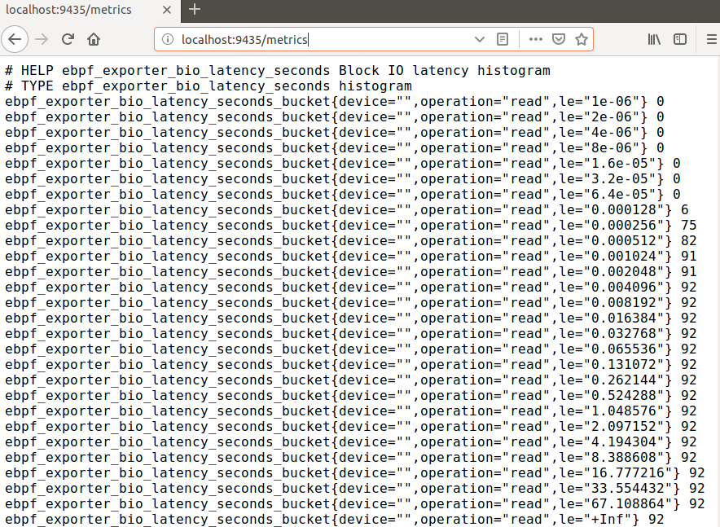

## 1. 前言
Prometheus 是高扩展性的监控和报警系统。它采用拉取策略获取指标数据，并规定了获取数据的API，用户可以通过exporter收集系统数据。eBPF Exporter 是一个将自定义BPF跟踪数据导出到prometheus的工具，它实现了prometheus获取数据的API，prometheus可以通过这些API主动拉取到自定义的BPF跟踪数据。具体来说，我们只需要编写一个yaml的配置文件，在配置文件中嵌入BPF代码，运行ebpf_exporter就可以实现导出BPF跟踪数据，而这些数据是可以被prometheus主动拉取到的，进而实现BPF跟踪数据的存储、处理和可视化展示。本文档可用于lmp项目数据采集和实现分布式做参考。

## 2. ebpf_exporter 环境搭建
ebpf_exporter 运行依赖环境：

- bcc环境(环境配置可参考http://kerneltravel.net/blog/2020/ebpf_ljr_no1/) 
- go语言环境（环境配置可参考https://blog.csdn.net/qq_34258344/article/details/106270047）

安装最新ebpf_exporter：
```bash
$ go get -u -v github.com/cloudflare/ebpf_exporter/...
```


```bash
cp -ip go/bin/ebpf_exporter /usr/local/bin/ebpf_exporter
```


> 如果安装不成功的话，第一请检查ebpf_exporter安装路径，第二请检查bcc环境，例如libbpf库的不同版本也会导致ebpf_exporter安装失败。

运行一个eBPF程序提取磁盘IO延时的示例：
```bash
$ sudo ebpf_exporter --config.file=src/github.com/cloudflare/ebpf_exporter/examples/bio.yaml
```

输出结果如下：


浏览器访问9435端口，输出结果如下：


访问`http://localhost:9435/metrics`就可以看到 `ebpf_exporter` 导出的数据：



其中 HELP 用于解释当前指标的含义，TYPE 则说明当前指标的数据类型。

## 3. Prometheus 与 Grafana 配置

prometheus 和 grafana 环境搭建，prometheus配置拉取数据，grafana 可视化展示请参考[这篇](http://kerneltravel.net/blog/2021/ljr-ebpf10/)，本文不再赘述。
```
http://kerneltravel.net/blog/2021/ljr-ebpf10/
```
Prometheus拉取ebpf_exporter导出的数据，参考配置：
```yaml
# my global config
global:
  scrape_interval:     15s # Set the scrape interval to every 15 seconds. Default is every 1 minute.
  evaluation_interval: 15s # Evaluate rules every 15 seconds. The default is every 1 minute.
  # scrape_timeout is set to the global default (10s).

# Alertmanager configuration
alerting:
  alertmanagers:
  - static_configs:
    - targets:
      # - alertmanager:9093

# Load rules once and periodically evaluate them according to the global 'evaluation_interval'.
rule_files:
  # - "first_rules.yml"
  # - "second_rules.yml"

# A scrape configuration containing exactly one endpoint to scrape:
# Here it's Prometheus itself.
scrape_configs:
  # The job name is added as a label `job=<job_name>` to any timeseries scraped from this config.
  - job_name: 'prometheus'
    # metrics_path defaults to '/metrics'
    # scheme defaults to 'http'.
    static_configs:
    - targets: ['localhost:9090']

    # 采集ebpf_exporter监控数据
  - job_name: 'ebpf_node'
    static_configs:
    - targets: ['localhost:9435']   

```
下图显示了prometheus已经激活了ebpf_exporter的job。


## 4. ebpf_exporter 代码分析
ebpf_exporter 使用 YAML 文件进行配置，可自定义eBPF要提取的系统数据，配置文件主要包括三个部分：

- 第一部分定义prometheus可识别的特定格式的数据；
- 第二部分定义附加到BPF程序的探针；
- 第三部分定义要执行的BPF程序。

下面通过分析一个简单的例子来说明，该示例的功能为统计系统中启动计时器的次数。

### 4.1 配置文件代码
```yaml
programs:
  - name: timers
    metrics:
      counters:
        - name: timer_start_total
          help: Timers fired in the kernel
          table: counts
          labels:
            - name: function
              size: 8
              decoders:
                - name: ksym
    tracepoints:
      timer:timer_start: tracepoint__timer__timer_start
    code: |
      BPF_HASH(counts, u64);

      // Generates function tracepoint__timer__timer_start
      TRACEPOINT_PROBE(timer, timer_start) {
          counts.increment((u64) args->function);
          return 0;
      }

```
### 4.2 运行结果


从 ebpf_exporter 导出的数据可以看到，我们使用 `tracepoint` 跟踪内核 `timer_start` 函数，获取到了内核启动计时器的函数和启动次数统计的数据，该数据通过9435端口暴露出去了，下图展示了prometheus获取到的数据：


当然，我们也可以对这些eBPF提取的数据进行可视化展示：


### 4.3 配置文件代码分析
第一部分定义prometheus可识别的特定格式的数据：

```yaml
programs:
  - name: timers
    metrics:
      counters:
        - name: timer_start_total
          help: Timers fired in the kernel
          table: counts
          labels:
            - name: function
              size: 8
              decoders:
                - name: ksym
```

该部分定义了一个名为`timers`的程序。定义了一个名为`timer_start_total`的指标，用于对系统中计时器的使用次数进行计数。定义了一个名为`function`的标签，用来向prometheus提供调用了计时器的函数名，指定了转换函数为`ksym`。

第二部分定义附加到BPF程序的探针：

```yaml
    tracepoints:
      timer:timer_start: tracepoint__timer__timer_start
```
该部分定义了使用`tracepoint`跟踪`timer_start`，其中，跟踪点是`timer:timer_start`，这个在内核`/sys/kernel/debug/tracing/events/timer`中可以找到：


第三部分定义要执行的BPF程序：

```yaml
    code: |
      BPF_HASH(counts, u64);
      // Generates function tracepoint__timer__timer_start
      TRACEPOINT_PROBE(timer, timer_start) {
          counts.increment((u64) args->function);
          return 0;
      }
```

该部分定义了`timer_start`函数触发时的BPF程序，它是内嵌在`ebpf_exporter`的YAML文件中，`ebpf_exporter`使用bcc编译程序，所以可以使用bcc的所有宏和helper。上述BPF代码中用到的函数，可以在bcc官方文档中查到。

>参考链接：https://github.com/iovisor/bcc/blob/master/docs/reference_guide.md#bpf-c

## 5. 总结
eBPF技术跟踪内核无比强大，几乎可以跟踪内核中的任意函数，bcc工具使得编写eBPF程序更加高效，ebpf_exporter 结合了 eBPF & bcc 的优势，对接 prometheus 和 granafa ，使得自定义监控系统更加安全和高效，同时也可以很方便的使用eBPF技术监控集群，并对其数据进行存储和可视化展示。

参考资料：

https://github.com/cloudflare/ebpf_exporter

https://www.percona.com/blog/2020/07/06/adding-ebpf-based-metrics-to-percona-monitoring-and-management/

https://blog.cloudflare.com/introducing-ebpf_exporter/

https://blog.csdn.net/qq_34258344/article/details/106270047

http://kerneltravel.net/blog/2020/ebpf_ljr_no1/

https://github.com/iovisor/bcc/blob/master/docs/reference_guide.md#bpf-c
